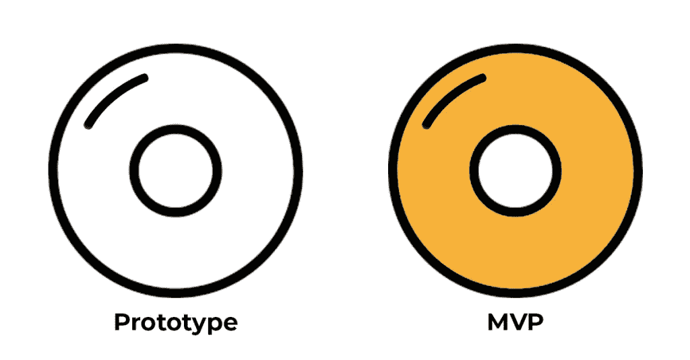
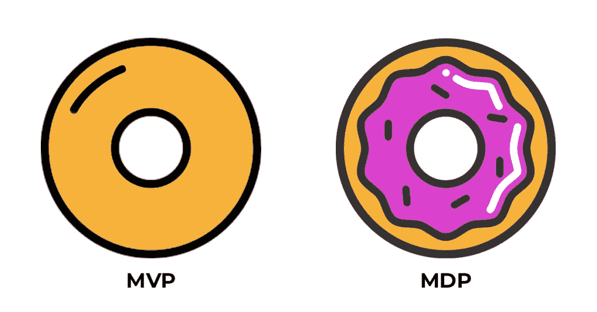

# MVP vs MDP =活力 vs 快乐。你真正需要什么？

> 原文：<https://medium.com/swlh/mvp-vs-mdp-viability-vs-delight-what-you-really-need-296b42df005d>

你在一个会议上与创业者谈论技术，术语“MVP”不断被讨论。你知道 MVP 代表最小可行产品，但是那个*真正的*是什么意思？

# 产品还是流程？

首先，值得注意的是“M”、“V”和“P”实际上代表什么——也就是“最小可行产品”，产品的版本只包含为早期采用者提供价值所需的功能。记住，这里的想法是让这些人愿意为你的产品花钱。一旦他们这样做了，你的产品开发将以用户反馈的形式开始从市场中学习。让这种反馈循环继续下去是很重要的，这样你的产品开发决策就基于客户的反馈——而不是直觉。

Prototype vs MVP

MVP 背后的想法源自 [Eric Ries](http://en.wikipedia.org/wiki/Minimum_viable_product) 的《精益创业》，所以让我们先从 MVP 的概念开始:

> *MVP 是一个新产品的版本，它允许一个团队以最少的努力收集关于客户的最大量的有效知识。*
> 
> [*–埃里克·里斯*](http://en.wikipedia.org/wiki/Minimum_viable_product)

有效的学习。最省力。听起来不太性感。让我们跳到 Techopedia，听听他们怎么说:

> *MVP 是仍然可以发布的产品的最精简版本。MVP 有三个关键特征:*
> 
> *具有足够的价值，人们愿意最初使用或购买它
> 展示足够的未来利益，以留住早期采用者
> 提供反馈回路，以指导未来发展*
> 
> [*Techopedia*](https://www.techopedia.com/definition/27809/minimum-viable-product-mvp)

好吧，一些营销上的考虑。听起来重点在于测试而不是构建。让我们回顾一下:

1.  你想让人们为此付出代价。
2.  你希望它能打动那些排队购买最新科技产品的人。
3.  您希望为您的客户提供一种向您提供反馈的方式，以改进 it 的发展。

# 迭代的概念

Eric Ries 称之为“构建、测量、学习、循环”。基本上，你必须测试一些东西才能把它做好。

MVP 背后的核心思想是有效的学习。作为一名企业家，你需要不断检查自己的假设，并在需要的地方做出调整。把 MVP 看作是暂时摆脱你顽固的企业家愿景的一种练习。

> 记住，市场不关心企业家。他们倾听顾客的心声。

确保你的愿景与现实相符，也就是“客户想要什么”这是你不再喜欢你的想法，而屈从于不那么温暖和模糊的客观现实的部分。

**提示:**数字是客观存在的。你应该跟踪指标，大量的指标——网站指标、用户指标、社交指标、销售指标、成本指标等。如果可以给它分配一个数字，你应该注意这个数字是如何变化的。

# 开发产品还是客户？

在应用领域，你希望你的产品在那些早期采用者手中，他们已经尽快了解了你想做的事情。这个团队一开始就会理解你的产品，并能够向不理解的人解释。他们已经想要你卖了。而且这些人不仅反馈最好，还做免费的口碑营销！

# 功能与优势

开始的时候你想让事情尽可能简单的原因变得越来越清楚了，不是吗？作为一名企业家，你已经有太多的假设去判断什么是机会，什么不是机会。一旦你开始构建一个产品，你将不得不做出一系列额外的假设，关于哪些功能应该被包含或者被省略。您不知道这些决策最终是否会产生您的客户真正想要的利益，但是您必须从某个地方开始。如果您能在构建产品的整个过程中检查这些假设，那不是很好吗？

MVP 能让你做到这一点。把它当成企业家的锦囊妙计。有了 MVP，你可以同时构建一个产品，测试市场，并对客户看重的特性做出灵活的假设。

如你所知，对客户来说更多的价值意味着对企业家来说更多的价值。

# 从测试功能到设计体验

自从 MVP 的概念首次出现以来，软件产品的市场已经发生了变化。客户不想购买设计不佳的产品，并期望新应用程序具有更好的功能。

企业只有一次机会留下第一印象。

这就是 UX 的用武之地。

如今，随着每个人都在谈论这个 UX 术语，科技领域似乎已经形成了一个更复杂的价值概念。随着应用程序变得越来越微妙——无论是在用户界面(UI)还是 UX 方面——现在，即使是早期采用者也需要数字产品的初级版本中的“哇元素”。唉，要是迭代和设计之间有一些中间地带就好了。

别担心，杰夫·高瑟夫——蓬勃发展的精益 UX 运动的思想领袖，《精益 UX:运用精益原则改善用户体验》的作者——已经找到了。他认为，将 UX 融入敏捷产品开发首先要理解为什么设计者对 MVP 不感兴趣，他指出了三个主要原因:

1.  MVP 不允许在不受限制的构思阶段，设计师可以将天马行空的想法应用到商业问题中。Jeff 称之为 BDUF(大设计先行)——一个来自软件开发“瀑布”学派的术语。在瀑布模型中，规划比迭代更受重视(与反“敏捷”阵营的观点相反)。
2.  MVP 迫使设计师与非设计师一起工作，并通过工程概念的镜头重新关注设计过程，这与设计师的自然方法背道而驰。
3.  “足以部署”的概念与基于实现健壮和完整体验的设计哲学是对立的。

记住，设计师和工程师创造价值的方式有着本质的区别——后者是迭代，而前者是构思。让我们更深入地探究一下这些阵营的驱动力。

因此，不难理解为什么一个 MVP——从定义上来说，缺乏这种 UX 元素——会发现很难在这样驱动的市场中推动价值(想想数字产品)。在 UXBooth 的一篇文章中，UXPin 的 Jerry Cao 提供了一些关于企业家如何忽略要点和未能正确管理 MVP 战略的见解:

> *也许思考 MVP 的最佳方式是布兰登·绍尔的纸杯蛋糕理论，它强调每一步的完整体验。就像一个纸杯蛋糕比一碗面粉更好(也更受欢迎)一样，确保 MVP 总是传达产品的价值。*
> 
> 杰瑞·曹

或者换句话说:你没有用产品开发来取悦客户；你用产品取悦他们。试着想想 MDP，而不是 MVP。

# 生存还是快乐？

在他的博客[创业搅拌机](http://www.startupblender.com/)中，连续创业者亚当·贝里提出了一个有趣的解决方案。进入“最低限度的令人愉快的产品”(MDP)。

MVP vs MDP

一个 MDP 就像一个 MVP 的“最小产品”，只有 MDP 的目标是优化 UX(喜悦)而不是上市时间。它保持了 MVP 的“只构建你需要的东西”的精神，同时稍微重新定义了“需要”。MDP 的目标不仅仅是从一开始就开始测试功能，而是吸引客户的一种方式。

那么快乐的公式是什么？根据他的经验，Adam 将其分为三个核心要素:

1.  **产品格式塔:**“格式塔”只是一个花哨的词，用来形容人们如何将事物理解为完整/不可约的概念。这是心理学中的一个概念，可以应用于不同的学科。亚当认为 UX 和功能性的正确结合是一种基本上美妙的，并且随着时间推移相对稳定的体验的来源。
2.  设计:在工程领域之外，将设计视为人们联系彼此审美感受的一种方式是很有用的。亚当进一步补充说，对于产品来说，这个元素应该以某种方式捕捉美感。
3.  **质量:**在这里，我们必须对 MVP 进行长时间的严格审查，并质疑他们实际上在早期采用者中激发了多少快乐。另一方面，MDP 根据更高的工艺标准进行迭代，也就是说，你的客户不只是获得了你的价值主张，他们在每个阶段都感受到了。

> *用户喜欢的产品。它们立即成为用户生活或工作的一部分。当一个产品令人愉快时，它就是有意义的。它以你期望的方式工作，体验非常令人满意。令人愉悦的产品被更快地采用，获得更好的口碑，创造更高的满意度。*
> 
> 亚当·贝里

# 那么 MVP 现在过时了吗？

MVP 方法是，当你设计你的产品开发时，你同时也在开发你的客户，并反复验证你的市场。这不是关于*什么，*而是关于*如何*。

MVP 不仅仅是一个产品。正如 UXPin 的 Jerry Cao 所说:

> *MVP 是最小的实验，它要么证明要么否定你对商业想法的假设。*
> 
> 杰瑞·曹

所以，不管你选择 MVP 还是 MDP 开发来测试商业想法和验证你的市场，只要记住，不要想原型，想过程。

*本文原载于*[*Ezetech*](https://eze.tech/)*[*博客*](https://eze.tech/blog/what-is-a-minimum-viable-product-mvp/) *并分享给 Medium 社区。**

*更多企业家文章，请注册我们的机器人。*

# *别忘了给我们你的👏下面！*

****

## *这篇文章发表在 [The Startup](https://medium.com/swlh) 上，这是 Medium 最大的创业刊物，拥有+369，518 名读者。*

## *在这里订阅接收[我们的头条新闻](http://growthsupply.com/the-startup-newsletter/)。*

**