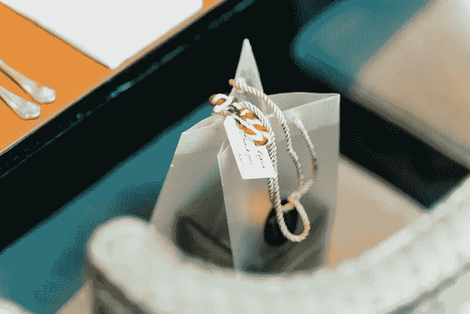

# 我的 100 美元决策测试规则

> 原文：<https://medium.com/swlh/my-100-testing-rule-for-decisions-6186d5594905>

基于数据的决策制定在过去十年中不断发展；我给自己提出的一个挑战是，在投入更多资金之前，我能否用 100 美元或更少的资金来测试任何东西:

> 我找到的答案是肯定的

这里是我最近做的一些 100 美元的测试例子和结果来支持这个假设。

## 为您的产品测试用户:

credit: [https://unsplash.com/photos/hrYmSD1xKxc](https://unsplash.com/photos/hrYmSD1xKxc)

*   你可以向你社区的人提供 5 美元或 10 美元的礼品卡，让他们试用你的应用一周，并填写谷歌调查。感谢[谷歌调查](https://medium.com/u/b0ba03d0c601#?modal_active=none)自从推出以来，我一直在使用它，它帮助塑造了从名称到功能的产品决策——这是一个了不起的工具，甚至帮助为第三方公司项目提供证据！

> 提示:确保选择一个小于默认 1000 的人口规模，以使最终成本低于 100 美元。

# 招聘数据

credit: [https://unsplash.com/photos/MoH4SkuqUm4](https://unsplash.com/photos/MoH4SkuqUm4)

*   这有点疯狂……我发现，在他们扫清了你最初的招聘路径后，用 100 美元作为测试激励，可以帮助你了解他们是如何花钱的。他们可能会带你出去吃午饭，当场测试一些东西，或者把它装进口袋……我发现这比你的整个招聘过程更能让你深入了解这个人。

# 设计选项

*   [Fiverr](https://www.fiverr.com/) 已经走过了漫长的道路，全世界的人才已经变得惊人，你现在可以以 5 美元的起价设计一个标志，应用程序屏幕或图标，太疯狂了！

# 工程

credit: [https://unsplash.com/photos/QBpZGqEMsKg](https://unsplash.com/photos/QBpZGqEMsKg)

*   这一个很难，谢天谢地，黑客马拉松一直在上升，参赛费用通常在 100 美元左右，所以如果有空间你想学习或看看代码是如何为特定用例开发的；100 美元和两天的周末真的可以加速你的进程。

> 你甚至可以成立一家公司！

**喜欢这篇文章吗？点击“掌声”推荐给其他感兴趣的读者！感谢**👍

## 这篇文章发表在 [The Startup](https://medium.com/swlh) 上，这是 Medium 最大的创业刊物，拥有 318，120 多名读者。

## 在这里订阅接收[我们的头条新闻](http://growthsupply.com/the-startup-newsletter/)。

