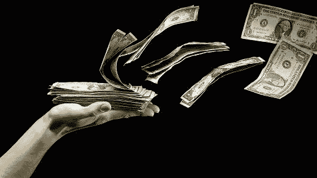
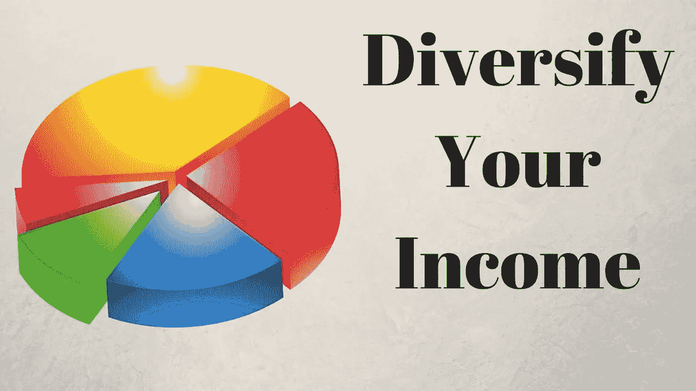
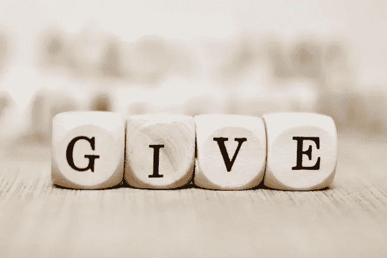
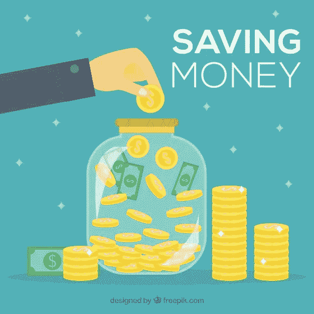
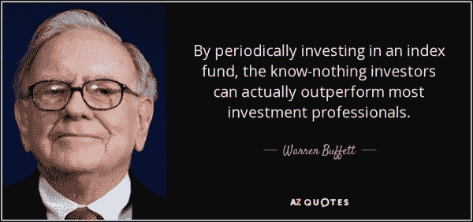
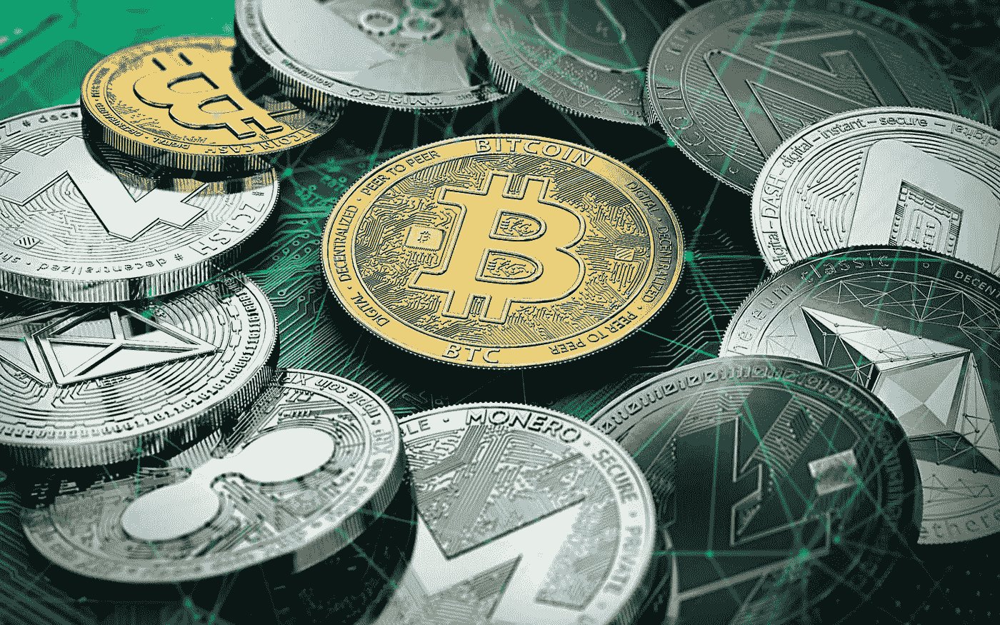

# 我的 3 个简单习惯，让你有一个安全的财务未来——自由职业者版

> 原文：<https://medium.com/swlh/my-3-simple-habits-for-a-secure-financial-future-freelancer-edition-972400bcab53>

*注意:本文讨论的方法、技巧和提示是我的观点，而不是财务建议。我自己也练习这些招数大约一年半了，在一个追逐梦想的自由职业者不稳定的金融世界里找到了一些稳定。在这里，我作为一个在这个领域有 5 年经验的音乐作曲家发言。一如既往，做好自己的本职工作。在进行任何投资之前，请咨询专业的财务顾问、经纪人或信托人。*

> 什么是自由职业者？
> 
> 自由职业者是自由职业者或不受商业实体合同约束的人。他们的收入主要来自企业或客户的委托作品、版税或销售。

# 请随意跳过接下来的四段

自由职业者朝不保夕的生活不适合胆小的人。除非你出生在一个富裕的家庭，并有一个安全网，否则实现“梦想”是非常艰难的，需要很多自律。

我们听过一些成功的故事，人们过着最低限度的生活，做着自己喜欢的事情赚钱。在光谱的另一端是那些已经崩溃和燃烧的人，他们不得不放弃他们的梦想。然而，有一群没人听说过的人:****我们中的绝大多数人**都在努力奋斗，希望获得一次重大突破，将我们的职业生涯推向天空。有些人在职业生涯中苦苦挣扎。其他人找到了爱和其他责任——这些都不是坏事，但是当你有一个家庭要照顾时，你的关注点就变了。我们听不到这个团体的声音，是吗？**

**为梦想而生活(或努力)有它的好处。你是自己的老板。你不用对任何人负责(当然除了客户)。你决定你的工作时间，甚至休息时间。最重要的是，你决定你的财务状况、退休和未来。**

**作为自由职业者，每一分钱都很重要，尤其是在我们零星收入的情况下。我们需要钱买食物，偶尔放纵一下，以及基本的生活费用。我理解“活在当下”的必要性。包括我自己在内的许多创意人员都虔诚地遵循这一准则——这也正是为什么我们中的许多人最终会陷入一种持续的困境，以达到收支平衡。但是我的人生观在 2017 年彻底改变了，在我开始养成这些习惯之后。**

**— — — — — — — — — — — — — — — — — — — — — — — — — — — — — — —**

**现在在下面的段落中，我们将讨论我已经养成的几个习惯。我的旅程变得更顺利，更没有压力，最重要的是，更有意义。不管你是刚开始，还是已经做了很长时间的自由职业者，这些习惯都是有帮助的。**

1.  ****了解我的支出****

****

****It is not your salary that makes you rich. It is your spending habits.** ~ Charles A. Jaffe**

**作为自由职业者，一个不言而喻的事实是，你要对自己的财务负责。实现财务独立很难，尤其是因为没有固定的薪水支票。相信我——钱比你想象的飞得快。我通过**列出过去 3 个月(当时)的每笔必要支出**并将总数除以 3 来开始这个习惯。时间越长，当然越好！Tada！现在我有了一些**魔力金额，我必须每月赚取以维持我的生活方式**。这个神奇的数字困扰着我醒着的时候，但是过了一段时间，我的恐惧变成了动力。
**基本开支是指经常性的账单、住房费用、食物、保险、交通、提高技能的课程以及最重要的税。***

**如今，财务跟踪应用程序绝对令人难以置信。有好的免费提供(一分钱一分货)。像钟表一样，记录下你的每一笔购买。相信我，当你意识到自己实际花费的金额时，你的支出会被铭刻在你的脑海里。你不必害怕你预计的开支。努力削减不值得的开支。**

**当我意识到我的开销时，我的生活已经永远改变了。我意识到我不需要星巴克的咖啡，我不需要优步之旅，我不需要那双多余的鞋子，我不需要那顿昂贵的饭来充饥。当然，我们不应该放弃让我们感觉良好的物质享受。继续读。**

**2.**将我的收入分成 4-5 份****

****

****Even a small amount of power can have a great effect when concentrated on a certain area.** ~ Satoru Iwata**

**收入可以是任何东西，从兼职工作和完成的项目到生日礼物或父母给的零用钱。我总是把我的收入分配到不同类别的基金中。以下是按重要性从高到低排列的类别:**

**- ***基本支出
-应急基金
-享乐基金
-储蓄
-投资和/或退休
-慈善*** *(奖金)***

**你想在每个类别中分配多少，很大程度上取决于你的“基本支出”有多大。**即优先级 *Uno*** *。如果你已经知道这些类别，跳到下一个习惯。我们将逐一讲解。我们已经在上面讨论了基本支出。
*储蓄和投资将在下一个习惯*中讨论**

****应急基金** 进入该基金的钱应该只用于意外惊喜——当你生病或受伤时的医疗费用、硬件故障(哦，我的…这是一个大问题)、需要更换的衣服——简而言之，该基金应该用于更换/修理你继续工作所需的任何东西。这包括你的幸福。**

**享受基金
自由职业者可能是一次孤独的旅程。我是一个隐士，但是有时候我需要和朋友出去玩或者和女朋友约会。必须有一个专用于享受物质享受的基金。我们毕竟是人。**

**想买那个新的塞尔达游戏吗？去吧！想去那家昂贵的餐厅吃饭吗？去吧！休假？去吧！剥夺自己生活中简单的快乐会对你的精神有害。只需留出一笔基金供你花在这些事情上。有时候(或者大多数时候)，这个基金里需要更多的钱。这是你必须牺牲一些其他类别的资金的地方。这里的关键是**意识到**你牺牲了多少。**

****慈善****

****

****If you can’t feed a hundred people, then just feed one.** ~ Mother Teresa**

**在我看来，这是非常重要的。我之所以称之为“奖金”类别，是因为对这一类别的贡献不一定涉及金钱。你的贡献可以是一个简单的给予行为——比如给与你有相同梦想的人时间，或者做志愿者！回到财务问题上——每一分钱当然都算自由职业者，但永远不要忘记，还有许多人没有基本的生存手段，更不用说追逐梦想了。如果你正在阅读这篇文章，这意味着你有超过 80%的人。**

**3.**攒钱建立我的第二份收入****

****

****Don’t save what is left after Spending, but Spend what is left after Savings.** ~ Warren Buffet**

**有了用于支出、应急和享受的基金，我还需要存些什么呢？**

**第二份收入，最好是被动的，是每个人都应该努力拥有的。第二份收入也将确保自由职业者可以专注于他/她的手艺。**

**作曲家和音乐家有一个非常特殊但被低估的优势:**音乐授权和版税**。版税也可以被视为一种投资！也就是说，把你的时间投入到增加你的被动收入上——这可以持续几乎一生，或者直到世界不再需要音乐内容。不确定从哪里开始？是时候做些研究了。这需要一整篇独立的文章来介绍。**

**作曲家们，别忘了我们创作音乐是为了让人们听！被动收入的另一个可能途径是你的公开销售。Spotify、iTunes、Bandcamp、CDBaby 都是你可以利用的。每月从版税和公开销售/信息流中获得数百美元的额外收入肯定会有所帮助(当然，前提是你清楚自己的总体支出)。还有，听说过 Youtube 内容 ID 吗？如果有人在 Youtube 上非法使用你的音乐，你可以赚钱。**

> ****内容 ID 如何工作****
> 
> **版权所有者可以使用一个名为 Content ID 的系统来轻松识别和管理他们在 YouTube 上的内容。上传到 YouTube 的视频会根据内容所有者提交给我们的文件数据库进行扫描。**
> 
> **版权所有者有权决定当 YouTube 上的视频内容与他们拥有的作品相匹配时会发生什么。当这种情况发生时，视频获得一个[内容 ID 声明](https://support.google.com/youtube/answer/6013276)。**

**然而，对于画家和平面设计师来说，不幸的是你没有版税等价物(据我所知)。但是**教学和/或 Youtube 教程**可能是你被动收入的来源。你会惊讶于有多少人想看你创作过程的预演。**

**我养成了将任何收入的 10%存起来专门用于投资的习惯。更重要的是，对待这些储蓄，就好像你再也见不到它们一样。这里还有一些你可以考虑的事情:**如果你还年轻的话，多存 10%再投资。对于年龄较大的自由职业者，将额外的 10%存入退休基金。努力围绕你的储蓄理财。你可能认为钱是用来花的，虽然你可能是对的，但投资你的储蓄会让你继续(舒适地)追逐你的梦想。如果你能成功地将你的收入分成上面讨论的 5 类，你就有能力存钱了！养成习惯#1 后，我意识到我可以把任何收入的 10%以上存起来！有时候，我甚至可以存下 50%的钱并投资——但 10%是必须的！！****

**再次重申，作为自由职业者，每一分钱的重要性。作为一名自由职业者，你通常没有任何积蓄——尤其是当你相应地分配收入的时候。但我相信这种存钱投资的习惯比前两种习惯更重要，这样才能在追逐梦想的同时保证你的财务安全。**

****投资****

****

****Wealthy people invest first & spend what’s left. Broke people spend first & invest what’s left.** ~ Unknown**

**这里的投资基本上意味着，一个让你的钱在睡梦中为你工作的计划或方案。**

**我有一个朋友，她把自己的积蓄投资到了房地产上，现在这些钱在她睡觉的时候——或者说在她实现梦想的时候——正在为她赚钱。我没有房地产领域的经验，无法对此发表太多评论。**

****

****股票市场**是存放一些资金的好地方——尽管它增长缓慢。股票市场的平均年回报率为 **7%。**沃伦巴菲特强烈推荐**指数基金。在我发现什么是指数基金后，我也开始推荐它们。随时谷歌指数基金！然而，股票市场需要一个经纪人和一笔可观的资金。我会暂时避免这种情况。
**在股票市场进行任何投资之前，请咨询专业的财务顾问、经纪人或信托人。*****

****

****Bitcoin is ‘better’ than currency.** ~ Bill Gates**

****投资加密货币**是我做过的最好的财务决定。加密货币市场可能是目前投资的最佳新兴市场。投资加密货币可以等同于在技术成为生活的一部分之前投资科技股。加密货币波动很大，但只要有正确的策略(和耐心)，你肯定能从中赚钱。投资加密市场最大的好处是你可以从 100 美元开始！**

> **如果你在 2013 年 1 月 1 日至 2014 年 1 月 1 日期间投资 100 美元比特币，你将获得 5800 美元(上涨 5800%)**
> 
> **从 2014 年 1 月 1 日到 2015 年 1 月 1 日
> 你会有 **$35** (下跌 65%)**
> 
> **从 2015 年 1 月 1 日到 2016 年 1 月 1 日
> ，你将拥有 **$176** (增长 76%)**
> 
> **从 2016 年 1 月 1 日到 2017 年 1 月 1 日
> ，你将拥有 **$211** (上涨 111%)**
> 
> **2017 年 1 月 1 日至 2018 年 1 月 1 日
> 你将拥有 **$1300** (增长 1300%)**
> 
> **2018 年 1 月 1 日到今天(2018 年 4 月 30 日)
> 你会有 **$67** (下跌 33%)**

**正如你所知，我是一个狂热的加密货币投资者/支持者。你越早进入加密时间线，你的钱就会越多。如果你的投资组合中包括替代币(除比特币之外的其他加密货币)，你的 100 美元投资可能会有更大的增长。更多关于秘密投资的文章将在以后的文章中发表！**

**这里的目标是让你的收入为你建立另一份收入！即使是自由职业者，也有办法实现财务独立，机会很多！我们只需要再深入调查一下。**

****退休****

**退休是一个需要讨论的大话题。在我看来，缴纳退休金被低估了，这是对你未来的投资。有一种误解，认为自由职业者没有像美国人的社会保障或新加坡人的中央公积金(简称 CPF)那样的自动退休储蓄计划(是的，我是新加坡人)。事实上，我们有！这是一项艰巨的任务，但如果你真的关心你的退休，你会找到一个方法！**

> **如果你是新加坡公民自由职业者，你可以选择缴纳自己的公积金。当你在 HDB 购买一套公寓时，中央公积金会有很大的帮助(可以说这比租用私人房产更便宜)——住房代表了或将代表你最大的一笔基本支出。因此，减少住房债务的成本，你可以减轻你的经济负担。**
> 
> **美国公民有**简化的雇员养老金个人退休或 SEP IRA** 。不幸的是，我不能再做任何评论了——但关键是自由职业者的退休基金确实存在！**
> 
> **我知道许多正在阅读这篇文章的人也生活在欧洲。不幸的是，我不知道在相应的欧洲国家有类似的社会保障。**

**— — — — — — — — — — — — — — — — — — — — — — — — — — — — — — —**

****结局注** 好吧！这是我长期以来养成的三个习惯。**

**1) **知道我的支出** 2) **将任何收入分成 4-5 类** 3) **储蓄以建立我的第二份收入**。**

**我花了 4 年时间才意识到这些习惯的重要性，但只花了 1 年时间就从中受益。希望这篇文章能帮助你意识到这些习惯，并启动你自己的研究来获得第二份收入！**

**这三个习惯对我有用，但对你可能没用。谈到财务规划，没有标准的解决方案。每个人都有不同的需求、责任和精神力量。想出一个适合你个人的计划。如果有必要，可以咨询信托人或财务顾问，但是作为一名自由职业者，每一分钱都很重要。**

******在进行任何投资之前，请咨询专业的财务顾问、经纪人或信托人。做好自己的尽职调查。*****

**— — — — — — — — — — — — — — — — — — — — — — — — — — — — — — —**

**在其他社交媒体平台关注我:
[推特](https://twitter.com/IZCrypto)
[Youtube](https://www.youtube.com/channel/UCrq04Mv5pAhKCilZROQ2jjg?)**

**— — — — — — — — — — — — — — — — — — — — — — — — — — — — — — —**

**Iliya Zaki 是 Moonwhale Ventures 的营销和社区经理。**

**Moonwhale Ventures 是一家咨询公司，为公司、中小企业或上市公司提供区块链应用，以提高价值链的效率，并通过 ICCO STO(令牌化)为业务扩张提供新的创新融资方式。**

*   **更多信息请访问我们的网站—[http://moonwhale.io/](http://moonwhale.io/)**
*   **在我们的各种社交媒体平台上关注我们。—
    [insta gram](https://www.instagram.com/moonwhalebv/)
    [Twitter](https://twitter.com/MoonwhaleBV)
    [LinkedIn](https://www.linkedin.com/company/moonwhalebv)**
*   **加入我们的电报全球集团—[**https://t.me/moonwhaler**](https://t.me/moonwhaler)**

****

## **这个故事发表在 [The Startup](https://medium.com/swlh) 上，这是 Medium 最大的企业家出版物，拥有 351，974+人。**

## **在这里订阅接收[我们的头条新闻](http://growthsupply.com/the-startup-newsletter/)。**

****