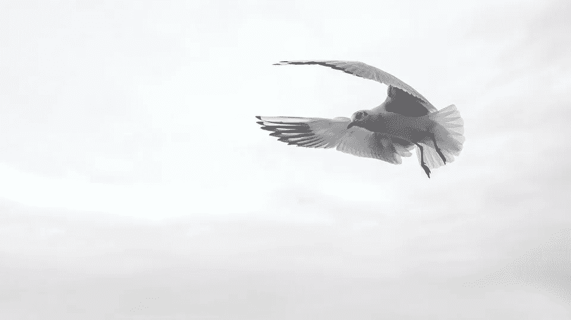

# 我的 30 天减少互联网使用实验

> 原文：<https://medium.com/swlh/my-30-days-reduced-internet-usage-experiment-1209f368e1a1>

[Felix_Broennimann/pixabay](https://pixabay.com/en/gull-wing-bird-sea-fly-venice-1635683/)

30 天前，我有两个减少娱乐性互联网使用的动机。首先，这是浪费时间。其次，这是一种干扰。

两者都是重要的动机。浪费时间是显而易见的，但是分散注意力也很重要。你可能一天只看十次手机，每次一分钟。一天加起来就是十分钟，看起来可能不算多。

但是每次看手机就注意力不集中。如果你需要 10 分钟才能再次集中注意力，你可能会因为注意力不集中而损失至少一个半小时。

如果你在脸书或新闻网站上看到的东西让你的头脑忙碌，那也是浪费时间。因此，我建议审计你的互联网使用情况，必要时减少使用。

首先，我想回顾一下我对每个项目的使用情况和目标水平。我也会回顾我是否成功。然后我会回顾我从这个实验中学到的教训。

如果你不想看我上网的细节，你可以跳到下面我的结论部分。我在这里报告它是为了给你一个如何进行类似实验的想法。

**私人邮件**

*   30 天前:每当我感到无聊的时候，就检查我的私人邮件。
*   目标:每天检查一次。
*   结果:成功

**比特币和股票市场价格**

*   30 天前:每当我觉得无聊的时候就检查它们。
*   目标:想出一个每周的游戏计划。每天查看一次价格。如果游戏计划需要，执行一个动作。
*   结果:实施每周游戏计划和被动订单。现在，我每天检查这些不到一次。

**推特**

*   30 天前:主要是在午餐时间。
*   目标:每天一次。查看通知并与我的博客读者交流。检查主页，最多滚动三页。
*   结果:甚至比目标更好。我每天查看通知并与我的博客读者交流一次。其他的我就不查了。

**新闻**

*   30 天前:主要是在午餐时间。
*   目标:完全没有必要。
*   结果:成功。

**MailChimp**

*   30 天前:这是一件自我的事情。我查看有多少人订阅、阅读和点击了我的电子邮件简讯的链接。
*   目标:每周检查一次，因为我反正每周发一次简讯。所以，我会马上把这款应用从智能手机上移除。
*   结果:我完全停止检查这些结果和其他统计数据，只有一个例外。那就是写一篇关于[我从中等统计](https://ideavisionaction.com/writing/8-blogging-lessons-i-learned-from-my-medium-stats/)中学到的 8 个教训的帖子。

**Instagram**

*   30 天前:我只关注四个人。他们不常发帖子。我不经常使用它。此时此刻这不是大问题。
*   目标:每天一次。这不是一个真正的问题，因为我现在只关注四个人。事实上，我打算马上把这个应用从我的智能手机上删除。
*   结果:移除了应用程序。我根本不检查。我一点也不觉得有这个必要。

**脸书**

*   30 天前:一天连检查一次都没有。
*   目标:每天一次，看看我的帖子是否被分享。如果是这样的话，与人民接触。
*   结果:我没有一天检查一次，我很好。这太奇怪了，在我开始写博客之前，脸书是我日常生活的一个重要部分。我几乎每天都要花半个小时在上面。我很高兴我已经改掉了这个习惯。我现在甚至都没想到。

**必应，必应新闻**

*   30 天前:查看他们主页上的每日图片和新闻。
*   目标:我喜欢他们主页上的图片。一天一次就可以。我会关掉他们的新闻，不再查看他们。新闻完全是分散注意力的东西，对我来说没有任何附加值。
*   结果:成功。

**播客**

*   30 天前:在健身房锻炼的时候。
*   目标:继续这个习惯。什么都不听会让我厌烦的。
*   结果:我也放弃了这个习惯。我最近只听了一个播客。也许，如果我遇到一些有用的东西，我可能会听，但大多数时候，在健身房锻炼时，我根本不想消耗任何内容。我只想休息一下。举重是一种让你停止思考的好方法。我用耳塞尽可能过滤掉嘈杂的音乐。

**Spotify**

*   30 天前:古典音乐和轻松的播放列表还可以，但有时，我会切换到流行音乐来振奋工作，但后来那些歌曲在一天的剩余时间里一直在我脑海中播放。
*   目标:摆脱所有乐观的流行音乐。那很可悲，但也太分散注意力了。古典音乐，轻松的音乐，轻松的流行音乐和摇滚都可以。
*   结果:成功。但现在，我也在考虑放弃一些原声音乐，因为有些音乐太好了，不容忽视，比如艾德·希兰。

**谷歌图片**

*   30 天前:有时候，当我无聊的时候，我会输入一个有趣的查询，然后查看谷歌图片。
*   目标:一点也不。完全分心。
*   结果:在最初的三个星期，这是一个成功，但后来我又陷入了这个习惯。

**YouTube**

*   30 天前:主要是在吃饭和有氧运动时。不幸的是，有时候，当我情绪低落，不想做其他事情的时候。
*   目标:添加信息视频以便以后观看。稍后仅观看手表中的视频。有氧运动期间观看或进行家庭维护是可以的。如果边吃边看就用计时器，因为我倾向于吃完饭后继续看。我会马上从我的智能手机上删除该应用程序。
*   结果:这个问题的性质改变了。现在，我开始看一个喜剧频道。我觉得这分散了我的注意力，对我没有好处。但我不会在这上面浪费太多时间。我通常在准备饭菜和其他手工任务时这样做。但这将是我接下来 30 天实验的一个目标。

**我的结论**

我的很多日常互联网使用只是习惯性的。我既没有感觉到这种需要，也没有从中获得任何形式的好处。

我能够放弃一些网站和应用程序，只是通过质疑它们的用途，并意识到它们的无用性。

有时候，从我的智能手机上移除应用程序就足够了，不用再检查了，就像 Instagram 的情况一样。

正如我在博客中所说的，[放下需要多长时间](https://ideavisionaction.com/personal-development/how-long-does-it-take-to-let-go/)，你不需要等待 21 天来放下一个习惯或信仰。

有时候，仅仅意识到一个习惯或信仰的无用就足以让它立即消失。

> ***智能手机或互联网上的分心不会给你的生活带来任何重大改变。***

仅仅意识到这个事实就足以让我放下很多杂念。

**咖啡因的影响**

我意识到我大部分的网络使用只是对压力的一种反应。压力从何而来？我相信大部分来自我的咖啡消费。

喝咖啡会导致身体和精神上的压力反应。一点点刺激可能有助于提高注意力。超过最佳量的任何东西都会引起太多的压力。

上个月，我买菜的商店停止出售我最喜欢的品牌，这足以激励我大幅减少咖啡消费量。

这样一来，我感觉更平和了。现在，我不需要不断分心。相反，我只想安心，根本不想有任何杂念。

在健身房举重就是一个最好的例子。以前，我发现在拍摄间隙没有任何分心的事情是无法忍受的。现在，我发现在片场之间的分心是无法忍受的，我把它作为休息和放松的机会。

我不说做这个做那个对你是好是坏。我只是尝试一些东西，看看什么最适合我，然后在这里报告出来。

**关注生产力**

我每天使用互联网的一部分是检查我的帖子和电子邮件通讯的效果。我意识到经常检查这些数据对我的写作没有任何好处。

对我的写作有什么好处？写作。就这么简单。

当然，偶尔检查一下我的统计数据并从中吸取教训可能会很有趣，但这种频率并不是每天都有。甚至不是每周。

我也必须承认，由于我的媒体简介正在聚集越来越多的观点和追随者。跟踪所有这些变得更加困难。这已经给了我足够的满足，我不觉得有必要检查我的统计数据。

此外，我也开始使用 [Steemit](https://steemit.com/@bbilgin) 。目前，我的 Steemit 用法对我来说很有成效。随着我的日常工作，博客和 Steemit，我的生产时间占满了我的一天，我甚至没有时间用互联网来分散自己的注意力。

有时，我甚至利用吃饭时间写评论或帖子。我知道这不是最健康的做法，但我只是举个例子来说明我没有太多的时间或动力来娱乐性地使用互联网。

**娱乐**

我发现娱乐大多是浪费时间。当我致力于一项具有挑战性的任务并完成它时，我感觉很好。

此刻看一个喜剧频道感觉很好，但它不能给人完成一项挑战性任务的满足感。

有一种观点认为娱乐是生活中必不可少的一部分。我并不完全拒绝这个想法。而是我要分配多少时间和精神带宽给娱乐。

YouTube 上有数百万的娱乐视频，这是一个滑坡。我现在不会打算完全退出 YouTube，但我会注意我对 YouTube 的使用。

我知道这不是一个可衡量的目标，但我觉得此时此刻我可以相信自己。

**结论**

我的一些互联网使用只是习惯性的，我能够通过意识到它是多么无用或者只是通过从我的手机上删除应用程序来戒掉它。

我使用互联网的很大一部分是一种压力反应。我可以通过减少喝咖啡来摆脱它，因为这是我压力的一个重要原因。

减少我娱乐性互联网使用的最重要原因可能是关注我的生产力。当我专注于生产力和完成工作时，其他分心的事情就没那么有吸引力了。

娱乐是我娱乐性互联网使用的一个重要部分。我可能会减少这种情况，但不要承诺完全消除它，因为目前这还不是一个大问题。

30 天后我会回顾这篇文章。如果到时候有什么重大的事情发生，我会再写一篇后续。不管是哪种情况，进行 30 天的实验并在 30 天后回顾结果都是非常有趣的。强烈推荐。

*阅读下一篇:* [*戒掉你的设备瘾的三个步骤*](https://ideavisionaction.com/personal-development/three-steps-to-quit-your-device-addiction/) *或者报名参加* [*每周简讯*](https://ideavisionaction.com/email-newsletter/) *。*

## 这个故事发表在 [The Startup](https://medium.com/swlh) 上，这是 Medium 最大的企业家出版物，拥有 302，119+人。

## 在这里订阅接收[我们的头条新闻](http://growthsupply.com/the-startup-newsletter/)。

