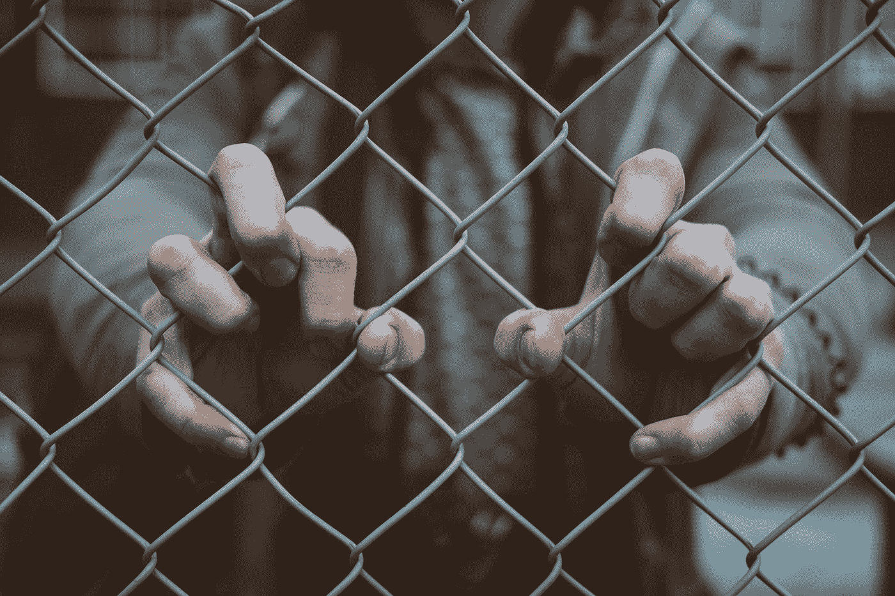

# 我在推特监狱的 48 小时

> 原文：<https://medium.com/swlh/my-48-hour-stint-in-twitter-jail-394f1bdfbe14>

Photo by [Mitch Lensink](https://unsplash.com/@lensinkmitchel?utm_source=medium&utm_medium=referral) on [Unsplash](https://unsplash.com?utm_source=medium&utm_medium=referral)

所以，我做了一个推特…或者说做了一个推特？无论如何，老实说，我几年前加入 Twitter，并没有真正关注过它。

我觉得社交媒体人和应用程序已经饱和了。Twitter 是我一直在回避的一个应用，因为我无法理解这一切的前提。还有，“推特”这个词让我傻笑。我就是不能..