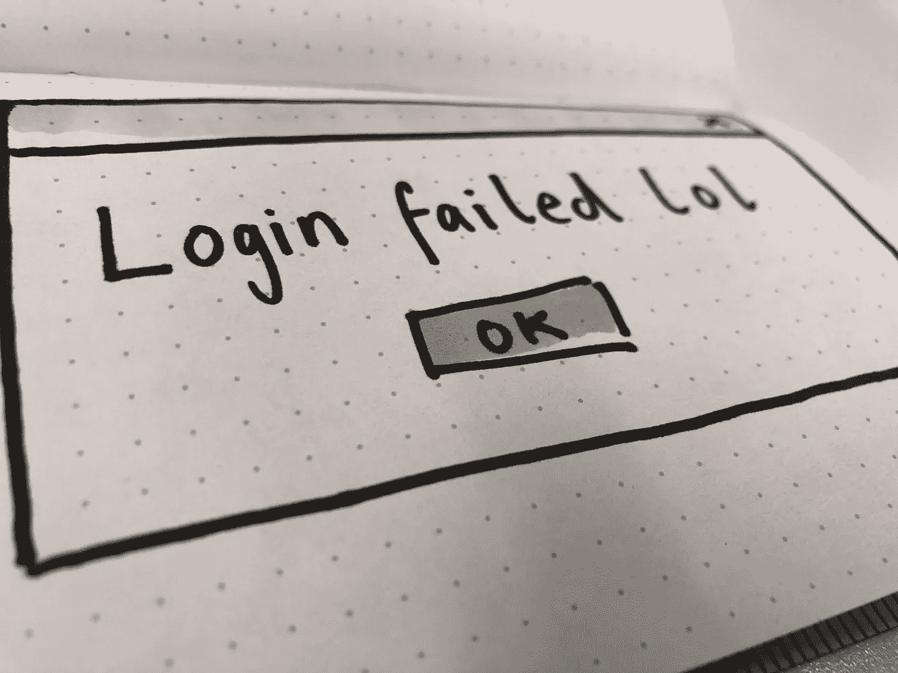

# 适用于没有 UX 作家的产品团队的 6 点缩微副本清单

> 原文：<https://medium.com/swlh/my-6-point-microcopy-checklist-for-non-ux-writers-634eb52b29c9>

At least it’s succinct…

不是每一个产品团队都有专人负责设计界面上的每一个单词。但不幸的是，这意味着你必须收拾残局。

*无论你在你的多学科团队中扮演什么角色(产品负责人、开发人员、视觉设计师、测试人员或其他)，你都拥有这种体验。这意味着你拥有帮助用户导航、使用和享受产品的文字。*

***半成品 microcopy 是半成品的设计，是半成品的意思。***

因此，如果没有人考虑，你应该自己尝试一下界面编写。你不应该觉得自己没有资格这么做。

我准备了一份清单，希望能有所帮助。在你的团队中传阅，把它加入到你的退出标准或完成的定义中，如果你注意到这些话没有发挥应有的作用，一定要大声喊出来。

# 缩微复制清单(简称)

1.  文案有用吗？
2.  简洁吗？
3.  是透明的吗？
4.  是人吗？
5.  文案在设计里吗？
6.  但是实际有用吗？

# 1.文案有用吗？

每一份 microcopy 都应该帮助用户完成一项任务——它是用来教育、解释和简化流程的。如果没有帮助，你应该质疑它为什么在那里。

以一条错误消息为例。这告诉用户完成他们的任务有障碍。所以它需要解释如何克服障碍并达到目标。这可能就像在失败的登录屏幕上提供一个“忘记密码”链接一样简单——而不仅仅是声明他们的输入不正确。

如果没用，就不需要。UX 的写作既关乎写作，也关乎无情的编辑。

# 2.简洁吗？

99%的情况下，你第一次尝试复制会使用太多的单词。所以嘲笑你记下和编辑的一切，就像没有明天一样。

像海明威应用程序这样的工具有助于保持你的文稿清晰明了。当然，这可能会抑制你的创造力，但它会帮助你立刻摆脱困境。

长单词和复杂的句子只会让你在学校(和老师)变得很酷。现实世界会发现你令人困惑或自命不凡。

一定要用主动语态，而不是被动语态。它不仅更有力，而且更有可能鼓励行动和帮助理解。海明威也能帮上忙。

简洁不仅能帮助用户更快地完成任务，还能让你的界面在不同设备间保持简洁而有价值。

# 3.是透明的吗？

*原因清楚了吗？*

记得当你还是个孩子的时候，你会质疑一切…

> “吃你的蔬菜”
> 
> *“为什么？”*
> 
> “因为它们对你有好处”
> 
> “*为什么？”*

从小，我们就质疑大多数事情。我们对未知感到不安。

互联网上充满了没有答案的问题。采取大多数形式…

> “给我你的电子邮件地址”
> 
> *“为什么？”*
> 
> “…”
> 
> “给我你的电话号码”
> 
> *“为什么？”*
> 
> “…”

当 UX 写得好的时候，与一个网站或产品互动应该感觉像是一场对话。当我们的界面让客户猜测时，感觉是片面的，会产生摩擦。

当你对自己的意图开诚布公时，客户更有可能与你合作。他们想知道你为什么收集他们的数据。他们想知道一个流程有多少个步骤。所以尽可能让他们了解情况。

# 4.是人吗？

你可能正在为“B2B”云平台编写功能最强大的 UX 软件，但你总是需要为屏幕另一端的人编写。从写作的角度来看，B2B 是一个误导性的、扯淡的术语。你总是在为用户写作，所以你应该确保你的文案听起来像是从一个人写给另一个人的。

使用简单的英语，假设没有现成的知识，避免任何复杂的行话，一般人不会使用。尽可能多地参加面试/测试会议，开始了解用户的谈话方式。

十有八九对你有用的一条规则是:如果你必须去查，就不要用它。

# 5.文案在设计里吗？

好，所以你的副本是透明的，简洁的和有用的，但这还不够。你需要考虑它与视觉和技术元素的关系。这就是为什么在设计过程的其余部分而不是之前或之后设计单词是如此重要。

假设你已经为一个表单域写了一篇绝对的帮助文案。后来决定，为了减少滚动，这个帮助副本将放在字段中。一旦用户开始输入信息，你精心制作的所有帮助都消失了，导致出错的风险增加。再好的词消失了也没用了。所以在草图阶段就要包含单词。

尽量不要用曲线代替单词。我花了很多时间用一支笔来确保视觉效果、文字和特征都从最早的可能点朝着一个共同的目标努力。

# 6.但是实际有用吗？

测试单词。您的团队可能没有足够的预算来进行正式的用户测试。甚至可能没有时间。但是总会有游击测试。给办公室里的人装窃听器，或者请他们喝杯咖啡，交换他们的想法和见解。即使他们严格来说不是你的目标用户，他们也可以帮助验证清晰性、层次性，以及该副本是否有助于或阻碍体验。

在和任何人说话之前，记得去尿尿。思考一下:

*   互动的目的…文案有助于用户完成他们的任务吗？
*   所有的单词都需要吗？或者你可以把它们删掉？用户在乎你所说的一切吗？也许你真的需要更多的单词来解决可用性问题。
*   有什么方法可以提供更多信息或更有帮助吗？用户还想知道什么？

围绕这一点组织您的对话，以验证界面的缩微拷贝是否符合您的目标。

记下用户的任何问题，如果是一个共同的主题，将答案放入第二次迭代中。

即使在发货后，也要经常查阅数据。复制更改真的可以帮助你更接近你想要实现的目标。

# 记住，每个人都有责任

我一直保持这一点，但我希望这个快速列表能让你更有信心将写作嵌入到你的过程中，不管你的主要技能是什么。雇人设计文字永远是最好的选择。当这不可能时，团队有责任确保他们不会被忽视。

## 这个故事发表在[的创业](https://medium.com/swlh)上，这是 Medium 最大的创业刊物，有 303，461+人关注。

## 订阅接收[我们的头条新闻](http://growthsupply.com/the-startup-newsletter/)。

