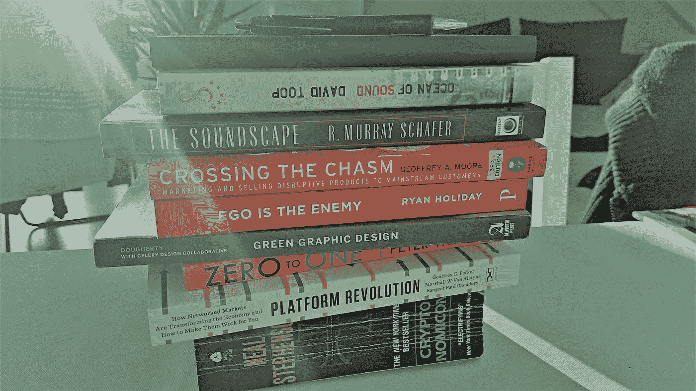
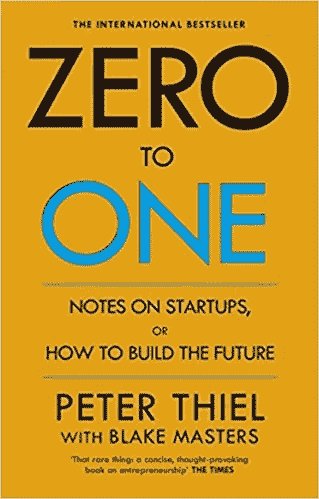
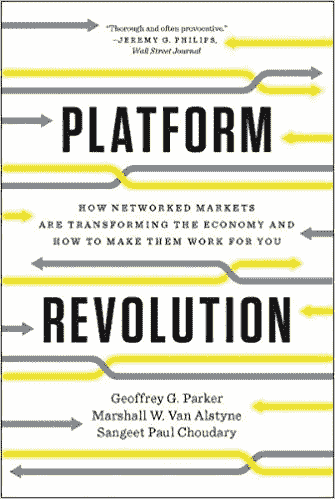
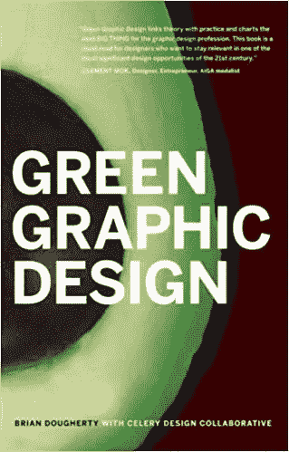
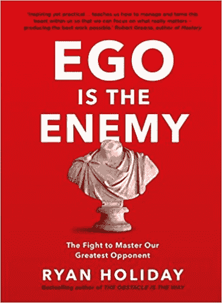
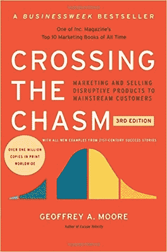
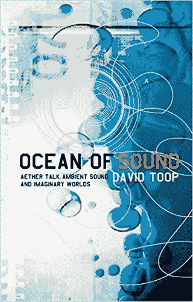
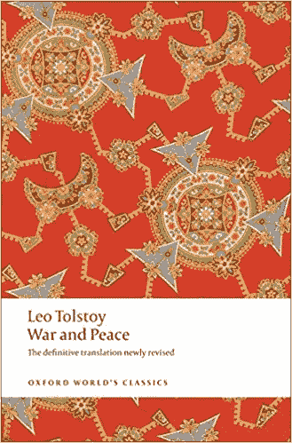
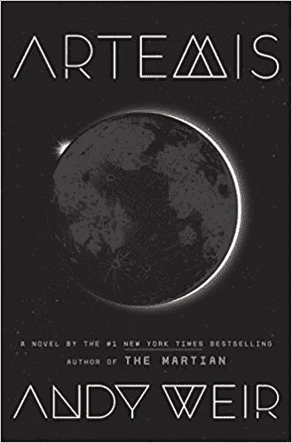

# 我今年前 8 周的 8 本增长知识的书

> 原文：<https://medium.com/swlh/my-8-knowledge-boosting-books-for-the-first-8-weeks-of-the-year-fc8bbcb07e55>

## 这是新的一年，到处都有两种类型的阅读清单:要么是上一年的最佳书籍，要么是下一年即将出版的最佳书籍。我只谈我想读的东西。

我读了很多书，我一整天都在花时间阅读，睡觉前，上下班路上等等。自然地，我的“待读”清单比我的“已读完的书”清单要长得多。(对于后者，我曾试图用 goodreads.com 追踪我所有的书，但现在我只是偶尔追踪一下。也许我们需要一个智能书架，知道上面有哪些书，并跟踪它们。)

在接下来的几周里，这里有一些我刚刚挑选的经典，一些重读的和一些更新的版本。

**非虚构:**

**0 比 1 被彼得·泰尔**

这似乎是过去几年中讨论最多的创业/企业家书籍之一(最初于 2014 年发布)，我非常期待阅读它。前提是，如果我们真的想创新，我们不能只是复制现有的东西，以别人的方式做事。我们需要做的是从无到有，然后在此基础上再接再厉。

**Geoffrey g . Parker，Marshall W. Van Alstyne，Sangeet Paul Choudary 的平台革命**

由一位正在建立学习平台的朋友推荐,《平台革命》讲述了一家公司如何在一种特定的价值主张中取得成功:不是通过购买和销售商品，而是通过建立一个各种各样的市场，以便将那些有需求的人和那些有提议的人联系起来。我的笔是削尖的，因为我期望从这支笔中流露出许多有趣的知识。

Brian Dougherty 的绿色平面设计

我的同事给我看了这本书，这本书可能有点另类，因为它已经有将近十年的历史了(2008 年首次出版)，而且有趣的是，它根本不是关于平面设计的(我知道，我也很困惑)。相反，作者描述了一种设计新的绿色产品的整体方法——绿色产品是完全以可持续、环境友好的心态构建的产品。他们关注生产、运输、客户互动的每一个步骤，以及做出积极改变所必需的选择。我浏览的第一页真的很有趣，我也期待这里有很多创新的潜力。

**自我是敌人由瑞安假日**

这本书实际上是在 medium.com 上阅读和写作的直接结果，我碰巧在我当地经销商(咳咳，书商)的英语书区发现了它。我真的不知道该期待什么——至少是一些关于我的自我是如何支持或破坏我的努力的新的心理模型。我们走着瞧，我会让你知道的。

杰弗里·a·摩尔的《跨越鸿沟》

另一本相当常见的商业书籍，到目前为止，我设法读完了第一章，然后把它放回书架，但我会再看一次。我最想知道的是，在一个发展和创新日益加速的时代，技术采用生命周期的模型是如何支撑的。

大卫·图普的《声音的海洋》

我邻居借给我一本关于“以太谈话、环境声音和想象世界”的书，因为我们最近有一次关于环境音乐的谈话。我以前接触音乐书籍的经验很少，但是各种音乐都是我生活中非常重要的一部分，我很好奇我会在这本书里发现什么。

**小说**

**列夫·托尔斯泰的《战争与和平》**

是的，我能听到你在我桌子上翻白眼。我明白了。在一本 150 岁、1800 多页的书中真的能找到乐趣吗？我们会看到的。到目前为止，它完全违背了我的期望。我以为我会发现的是关于俄罗斯贵族的晦涩部分的无休止的闲聊，但我迄今为止发现的更像是一部史诗肥皂剧，有许多有趣的时刻。是的，确实有很多角色，所以我们可以在网上找到一个家谱，然后把它放在书的后面。我绝对有兴趣看看故事如何发展。《我是如何遇见你妈妈的》和《战争与和平》有着相似的笑点！

**安迪·威尔笔下的阿耳忒弥斯**

还有人喜欢《火星人》吗？有趣的角色，有效的科学和流行文化参考？不喜欢什么。

关于安迪·威尔斯的第二部小说《阿耳忒弥斯》，人们的意见有点分歧。一些人期待另一个“火星人”并感到失望，另一些人想要完全新的东西，并在新书中发现太多他的第一本书。但是只有一个方法可以知道！

清单到此为止，让我们看看我是否能在二月份之前读完所有的书。

让我知道:你今年的清单上有什么？

## 这篇文章发表在 [The Startup](https://medium.com/swlh) 上，这是 Medium 最大的创业刊物，拥有 281，454+人关注。

## 在此订阅接收[我们的头条新闻](http://growthsupply.com/the-startup-newsletter/)。

