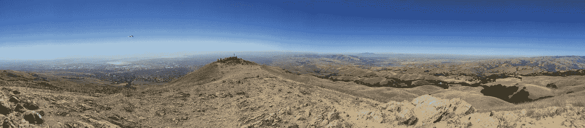
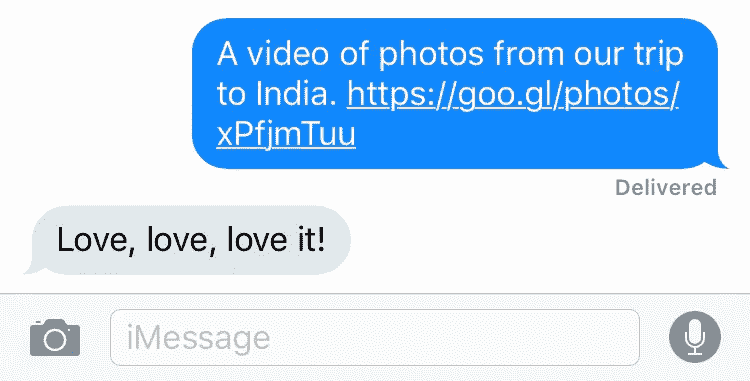
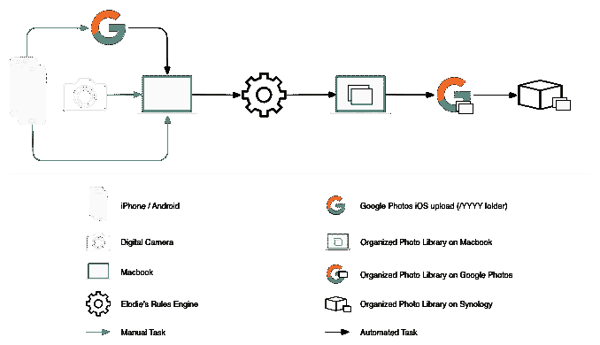
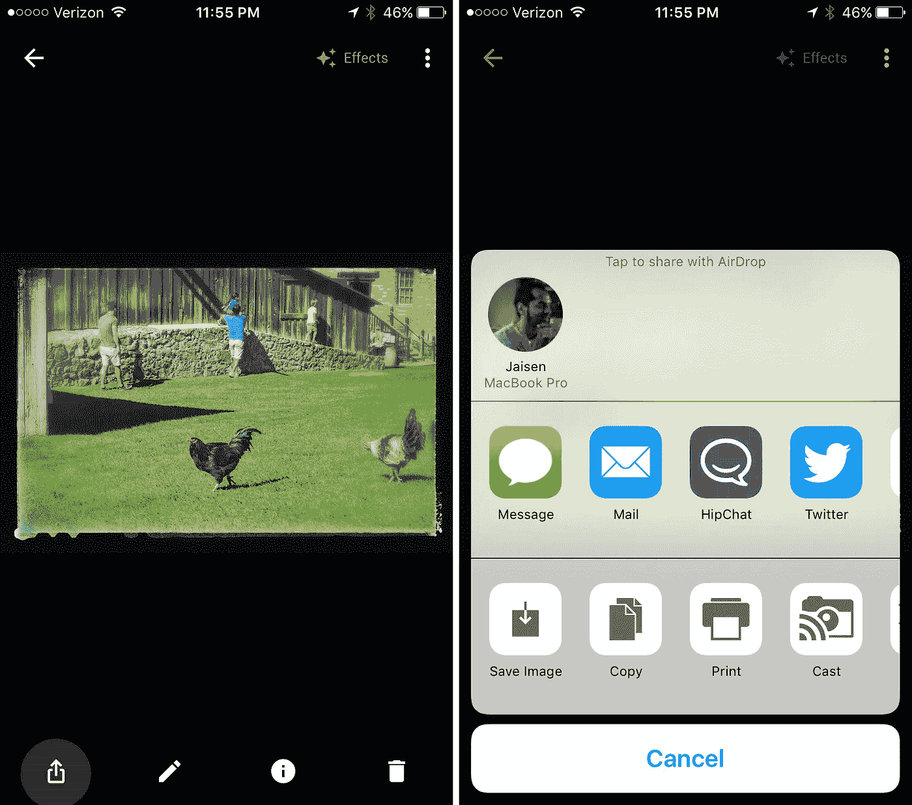
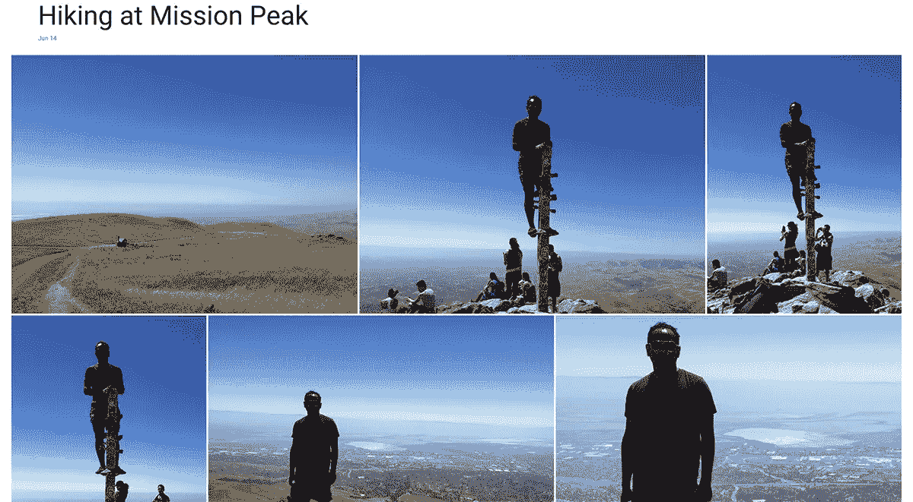
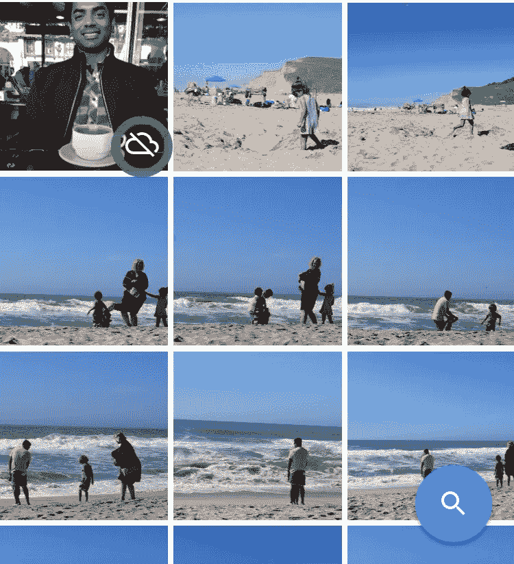
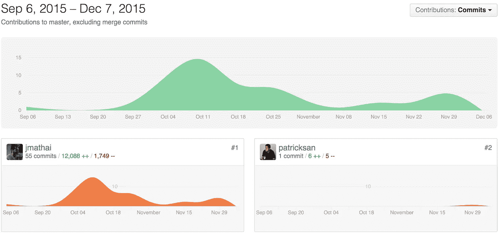

# 我使用谷歌照片和 Elodie 的自动化照片工作流程

> 原文：<https://medium.com/swlh/my-automated-photo-workflow-using-google-photos-and-elodie-afb753b8c724>

Summit at Mission Peak. Fremont, California

*下载* [*Elodie，EXIF 的照片管理应用*](https://getelodie.com) *我做的管理我的照片，并在这篇文章中轻松复制工作流程。也可以在 GitHub 上查看* [*开源命令行版本*](https://github.com/jmathai/elodie) *。*

*自从我写到这里，Google 相册和 Google Drive 已经* [*停止协同工作*](https://www.blog.google/products/photos/simplifying-google-photos-and-google-drive/) *。我现在用一个我为 Elodie 编写的* [*谷歌照片插件*](https://github.com/jmathai/elodie/tree/master/elodie/plugins/googlephotos) *来模拟这个变化之前存在的相同功能。*

这是一个关于两个完全陌生的人 Google Photos 和 [Elodie](/@jmathai/introducing-elodie-your-personal-exif-based-photo-and-video-assistant-d92868f302ec) 如何相遇并相爱的故事。这是我如何为我的照片和视频创建自动化工作流程的三篇文章中的最后一篇。你应该理解[为什么我想要一个自动化的工作流程](/@jmathai/understanding-my-need-for-an-automated-photo-workflow-a2ff95b46f8f)以及[我写的软件(Elodie)](/@jmathai/introducing-elodie-your-personal-exif-based-photo-and-video-assistant-d92868f302ec) 是如何实现的。

尽管我努力保持简短，这篇文章还是很长。我的工作流程中包含了很多方面，但我认为你会发现这是值得的。

我们开始吧，好吗？

## Google 相册帮助我查找、分享和体验照片

Google 相册很壮观；一些我不记得说过的关于另一个在线照片服务的话。最好的功能是搜索和助手。

分享我拍摄的或 Assistant 创建的照片和视频真的很简单。你可以分享照片本身，也可以分享适合视频的链接。

A video created by Assistant which I shared with Rachel. (URL modified)

搜索效果非常好。训练 Google 相册识别照片中的人几乎不需要任何努力，而且非常准确。这个团队在个人照片库上实现了搜索，值得称赞。

Assistant 是 Google 相册的一项功能，它会不断梳理您的照片，为您寻找有趣的东西。我让它制作拼贴画、动画 gif、全景图和电影。它创造的东西几乎总是很棒。收到“助手”已经为我创建了一些内容的通知仍然令人兴奋。[。这就是埃洛迪的用武之地。](https://medium.com/u/d8e76fc84359#9c76)

将 Google Photos 和 Elodie 结合起来意味着我将惊人的搜索、机器学习、人工智能和共享与我的整个照片和视频库的面向未来的存档结合在一起。

工作流程从一个手动步骤开始，其余的都是完全自动化的。第一个手动步骤可以自动化，但我更喜欢整理最终在我的库中的照片。这是工作流程的样子。

My automated workflow using an iPhone, Macbook, Google Photos, Elodie and a Synology.

这就是它的工作原理。我安装 Google Drive 桌面应用程序，并设置 [Google Photos 和 Google Drive 协同工作](https://support.google.com/photos/answer/6156103?hl=en)。然后我让 Elodie 把我的照片整理成*~/Google Drive/Google Photos*。至此，我所有的照片都可以通过谷歌照片访问了，这些照片都是 Elodie 整理的。

如图所示，我能够[将我整个照片和视频库的副本复制到我家里的 Synology](/@jmathai/introducing-elodie-your-personal-exif-based-photo-and-video-assistant-d92868f302ec#89e2)中，这样我就有了 3 个自动保持同步的照片库的分布式副本。

这很棒，但是还有一些高级的用途，让我的工作流程更加重要。

## 将 Google 相册助手的作品保存到我的图库

我提到助手根据我的照片创作了一些很棒的作品。缺点是它们在 Google Photos 应用程序之外不可用。除非我能把它们归档到我的图书馆，否则它对我来说没有什么价值；这是 Google 相册尚不容易支持的。

我最喜欢的助手作品是拼贴画和电影。幕后有很多聪明人。选择的照片总是好的，这导致我不断地想要保存回我的图书馆的创作。

A “stylized” photo created by Assistant being exported to Elodie using AirDrop.

Google 相册支持分享助手的作品。这意味着我可以将它们隔空投送到我的 MacBook 上，这将触发 Elodie 将照片或视频组织到我的库中。所有这一切都运转得太好了。

我非常高兴地发现，谷歌照片保留了它所用照片的日期和位置，并将它们放在了 EXIF。这种对细节的关注让 Elodie 能够将照片精确地组织到它们应该在的地方。

## Elodie 和 Google 相册中的相册

Elodie 允许您将文件夹中的照片分组到一个相册中。因为 Elodie 只理解 EXIF，所以她添加了一个自定义的 EXIF 标签。现在，当 Elodie 处理照片或视频时，它将被放在一个与相册同名的文件夹中。

Google 相册也有相册的概念(有时在 UI 中称为收藏)。但是这些相册并不存在于 Google 相册之外，你可能已经猜到这些相册对我来说没有什么价值。

最棒的是，Google Photos 非常了解文件夹结构，可以将文件夹中的照片组合在一起。您可以使用 Google 相册强大的可视化用户界面搜索或查看相册中的照片。分享的选项是存在的，但从来没有为我工作。我不知道这是不是一个 bug，但这在我能做的更大的事情中是很小的。

An album in I created using Elodie of a hike to Mission Peak which I can view through Google Photos.

## 使用 Google 相册将照片添加到我的图库

我更喜欢用隔空投送把照片从手机里取出来放到我的图片库里。原来我的笔记本电脑并不总是开着，也不总是在我身边。令人欣慰的是，Elodie 可以查看任意文件夹来触发她的规则引擎，Google Photos 可以确定地选择上传照片的位置。

这意味着我只需要让 Elodie 观看*~/Google Drive/Google Photos/2016*，我就可以像使用隔空投送一样使用 Google Photos 应用程序。制定的工作流程略有不同，但最终结果是相同的。请参阅前面的工作流程图，了解不同之处。

我可以从手机上获取照片和视频，并上传到我的笔记本电脑上，而无需靠近我的笔记本电脑。然后埃洛迪将它们组织起来。

## 替换我手机上的照片应用程序

The cloud icon on the top left photo indicates it isn’t synced.

用同样好或者更好的东西取代我手机上的照片应用程序，同时又不至于耗尽空间，这是我长久以来未实现的梦想。许多应用程序都承诺这样做，但我还没有做到，直到谷歌照片和 Elodie 的结合。

在 Google Photos iOS 应用程序的主视图中，它会将相机胶卷中的照片与 Google Photos 中的照片合并。缩略图上的小云图标表示它尚未同步到 Google 相册。

在那个云图标中隐藏着一些光辉。这变得有点棘手，因为我没有任何单一的方法将照片或视频放入我的库中。我可能会从我的相机胶卷中隔空投送它，或者通过谷歌照片应用程序上传它。无论哪种方式，它都是一个离线工作流程，调用我笔记本电脑上的 Elodie 将其移动到最终目的地。

我们以上面的截图为例。如果我把自己拿着拿铁咖啡的照片隔空投送到我的笔记本电脑上，Elodie 会把它整理到我的谷歌照片文件夹中。这张照片通过 Google Drive 同步，当我回到我的 Google Photos 应用程序时，云图标会消失；尽管我从未通过谷歌照片应用上传过照片。

我真的不能要求 Google 相册和 Elodie 一起玩得更好。

## 关于我的自动化工作流程的最终想法

在过去的十年里，我花了很多时间想出了一种方法来减轻拥有数万张照片的负担。当前的设置是我的圣杯。结果比我预期的要好一个数量级。

自从我两个月前开始使用她以来，Elodie 已经有了很大的进步，现在我认为她是不可或缺的。你可以在 Github 上找到 Elodie，帮我让她变得更好。

请务必阅读我在这个系列中的其他帖子。

*   [了解我对自动化照片工作流程的需求](/@jmathai/understanding-my-need-for-an-automated-photo-workflow-a2ff95b46f8f#.dmwyjlc57)
*   [介绍埃洛迪；您在 EXIF 的个人照片和视频助理](/@jmathai/introducing-elodie-your-personal-exif-based-photo-and-video-assistant-d92868f302ec)
*   [使用自动化照片组织和归档工作流程一年](/@jmathai/one-year-of-using-an-automated-photo-organization-and-archiving-workflow-89cf9ad7bddf#.97qsvo3cq)

Commit graph from Github.

 [## jmathai/elodie

### elodie -一个基于 EXIF 照片和视频工作流程自动化工具

github.com](https://github.com/jmathai/elodie)