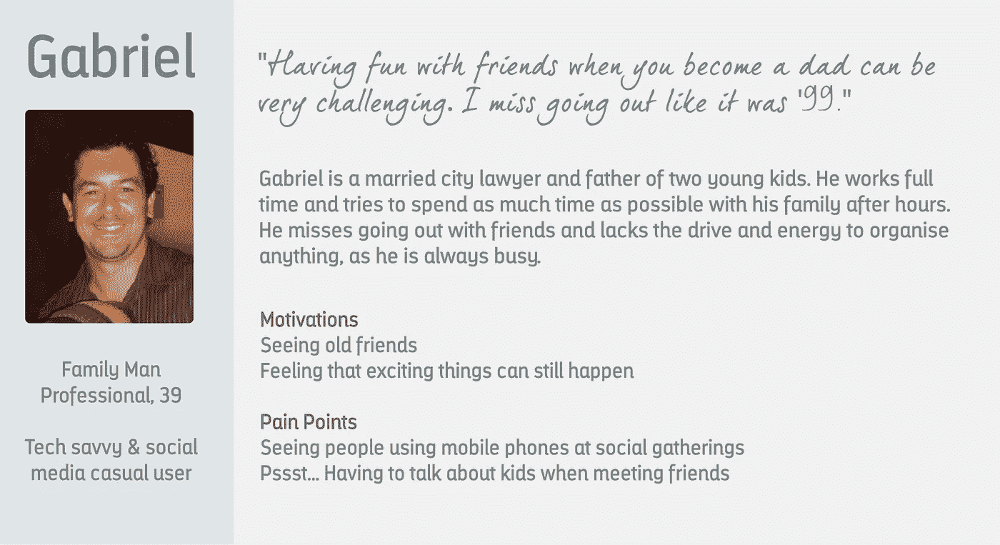
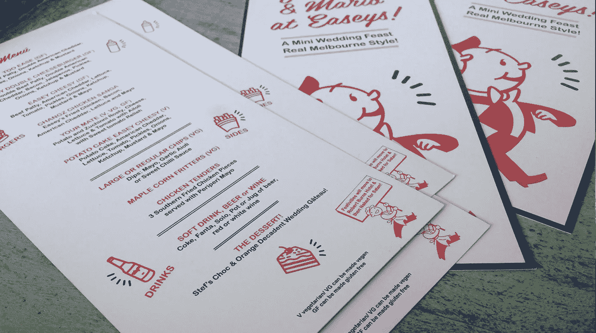
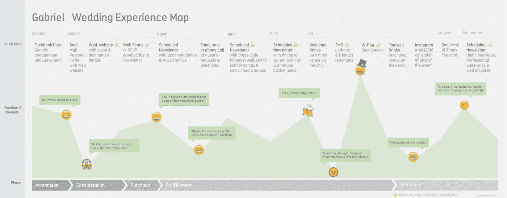
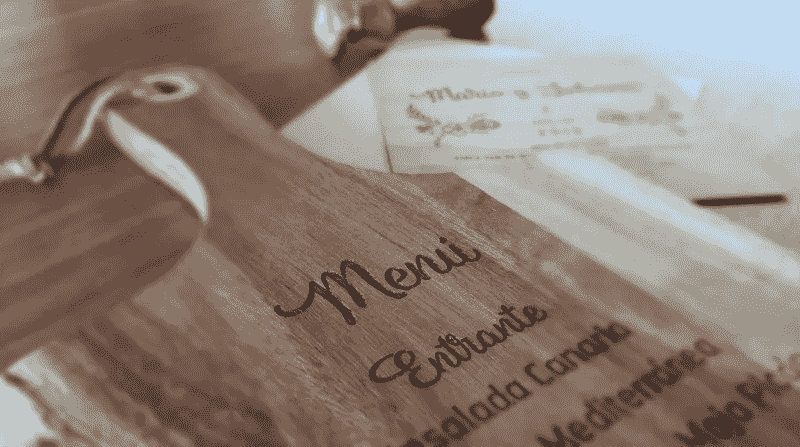
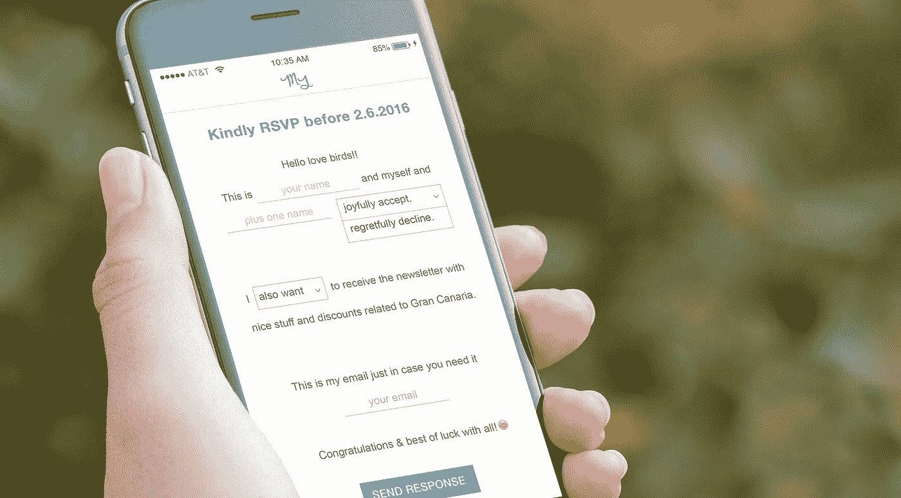
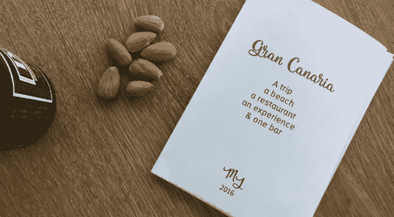

# 我盛大的 UX 婚礼

> 原文：<https://medium.com/swlh/my-big-fat-ux-wedding-cbd204f52cfe>

## 或者如何远离新郎新娘

A UX hat is better than a Groomzilla mask. ©Illustration Mario Quintana

作为一名拥有法律和视觉传达背景的 UX 设计师，我解决问题已经有一段时间了。

然而，很少有人能为解决另一种挑战做好准备:你自己的婚礼。

我也是这么想的。

我的搭档来自南非。我是西班牙人。我们在都柏林相遇，然后搬到墨尔本，最终决定在我的家乡加那利群岛结婚。

**“问题”:**在 10，000 公里之外组织一场愉快的多元文化婚礼，而不会倾家荡产或失去冷静。😬

## **UX 婚礼？**

我本可以让婚礼策划人帮我做这件事。它很贵，但是方便又省事。但是设计是一个有用的工具，可以给世界带来快乐。所以，如果你自己能给家人和朋友带来额外的快乐，为什么要让别人去做呢？

> "做对你来说重要的项目."
> 
> ~斯特凡·萨格梅斯特

斯蒂芬·萨格梅斯特提出了在设计时创造更多“快乐”的 [7 条规则](http://www.ted.com/talks/stefan_sagmeister_7_rules_for_making_more_happiness#t-490725)。遵守这些规则有助于远离 Groomzilla。

此外，当*家族中的一员*是设计师时，不应该有千篇一律的解决方案或设计债务。这将是一个设计挑战，所以**为什么不应用设计思维呢？**

为了采用这种方法并[“设计”正确的体验，并且“正确地”完成它，](/digital-experience-design/how-to-apply-a-design-thinking-hcd-ux-or-any-creative-process-from-scratch-b8786efbf812#.sryze0nup)设计师需要戴上 UX 的帽子，成为所有决策的把关人。

> *婚礼是新近以婚礼为中心的活动，但是通过应用一些基本的 UX 工具，设计师可以设计出让我们真正关心的人高兴的体验。*

UXers 有很多技巧可以发掘用户的需求，发现机会，提出解决问题的有效思路。这在策划婚礼时非常有用。

在我的旅程中，我使用了 UX 工具，制作了一些 UX 的人工制品:采访“用户”的问卷、人物角色、旅程地图、莫斯科分析和纸质原型等等。

如果你想打造自己的**大胖 UX 婚礼**的话，这里有一些你可以尝试的技巧和有思想的互动点

# **三个 UX 婚礼小技巧**

## 创建来宾角色的首要研究

生成性研究帮助定义用户的问题，同时收集关于它们的知识。玩得开心时，探索客人的需求、行为和背景至关重要。

> 目标应该是理解何时、如何以及设计什么来取悦你的“观众”。

UX 设计师的目标是尽可能感同身受，为用户提供相关的解决方案。然而，一些研究表明，同理心强的人往往是“自我中心的”。这意味着他们根据自己的偏好来预测和假设用户喜欢什么。

这在婚礼策划的背景下可能会有问题，因为传统上新人的*自我*起着很大的作用。毕竟，他们很可能非常了解客人。在研究和测试之后，大多数假设应该被验证和(如果必要的话)抛弃。剔除意见。寻找事实。

> “假设是有害的”。
> 
> ~ [Indi Young](https://twitter.com/indiyoung/status/798267341570183171)

通过轶事研究和访谈，设计师将确定创建人物角色的模式。正如乔·托斯卡诺所说，他们是“研究的化身”。这些人物角色定义了故事是关于谁的，设计师应该努力解决他们的需求并解决棘手问题。

我发现客人的社交媒体账户是挖掘他们在研究阶段分歧时的见解的一个很好的起点:

**脸书**向我展示了他们喜欢去的地方或他们去过的婚礼；
**Spotify** 给我看了他们目前听的；Pinterest 展示了他们想体验的东西。

Gabriel was our primary ‘user’ and one of 3 high level personas created. ©Mario Quintana

🎯专业提示: Jakob Nielsen 不断提醒我们[设计师不是用户](https://www.youtube.com/watch?v=gZeXyVJC-Jg&utm_source=Alertbox&utm_campaign=4420dd5d76-Optimize_Return_Visits_Users_Skills_2016_11_14&utm_medium=email&utm_term=0_7f29a2b335-4420dd5d76-40312753)。但是如果这是你的婚礼，你能做什么呢？力求尽可能客观。为了避免这一点，我建议在研究和创建你的人物角色时，把你的搭档和其他客人放在一起。

## #2 **定义最低可行婚礼**

人物角色有助于塑造一个最小可行的婚礼。家人和朋友会喜欢的最基本的婚礼。简单的莫斯科分析有助于对研究阶段获得的选项或想法进行优先排序和分类。在便利贴上写下你的想法，让一些客人帮你整理它们。我们必须始终考虑我们为之设计体验的人物角色。我们想提出的一些想法:

**必须**包括 Eurovision 和 Metallica 的热播；
**是否应该**在户外；
**可能在沙滩上，也可能在乡下；
**不会**老套，所以心形、柔和的颜色和花边细节都过时了。**

**🎯**专业建议:**如果可以，试着组织一次活动，或者在“大日子”前举办一场小型婚礼。在我们的案例中，一些客人无法前往西班牙。因此，在“大事件”之前，我们在墨尔本组织了一个小规模的庆祝活动。当我仔细倾听和观察客人时，这有助于测试想法和假设。这是我们“推出”最终“产品”之前的“测试”。**

****

**MVW Hit: choosing an informal venue. MVW Miss: Mobile phones interrupted the *magic* of the day. ©Mario Quintana**

## **#3 描绘游客体验**

**好的婚礼策划者会考虑在婚礼前*，婚礼中*和婚礼后会发生什么。这是一种全方位的方法——有更多的互动渠道——可以增加整体体验的价值。最低限度的可行婚礼变成最低限度的可行经历。*用户*体验设计，转变为*客户*体验设计。**

> **这种经历必须让人们兴奋，并留下永久的记忆。**

**地图代表了大局。一个关于人物角色如何达到他们的目标的故事:拥有一次美好的婚礼体验。该地图有助于识别痛点和改善旅程的机会(例如，何时或使用什么渠道发送相关信息)。**

****

**Journey maps helps to focus on users goals and to engage with collaborators. [Enlarge.](http://madebymario.com/wp-content/uploads/2016/12/Mario-Quintana_Journey-Map.pdf) ©Mario Quintana**

**为了更好地理解背景，设计师也应该和真实的人物角色一起旅行。这是游击测试的绝佳机会。与客人一起检查场地、餐厅和娱乐选择。我必须承认，在其中的一些会议上，我的共情能力和积极倾听技巧并不十分突出。归咎于香槟！**

**🎯**亲提示**:策划一些点子，用一个意想不到的惊喜，一个有[情感分量的高峰](https://www.smashingmagazine.com/2016/08/user-memory-design-how-to-design-for-experiences-that-last/)开始客客旅程地图。在我们的例子中，这是一个我们讲述订婚消息的跳伞视频。嘣。**

****

**My partner jumped first & showed the words “WE ARE…”. Then on my jump, I ended the sentence: …ENGAGED”**

# **五个深思熟虑的互动**

**罗伯特·霍克曼指出，“用户体验”是“一个人对一个网站、数字产品或服务的所有互动、印象和感受的总和”。包括人们对产品的评价或产品的外观。考虑到这一点，设计师应该特别注意所有的交互渠道和体验的品牌化。**

**经过多次反复，我创造了一个相关的和一致的婚礼身份。这为原型和接触点提供了信息。它也有助于设定基调，是与客人沟通的关键。**

****

**Consistency on touch points prevents design debt. ©Design Mario Quintana**

## **第一网站**

**如果你组织一场目的地婚礼，设计一个简单的网站来提供关于活动和地点的信息。希克定律说“每一个额外的选择都会增加做决定所需的时间”。因此，基于对客人的研究，为了减少决策疲劳，策划一些想法(要做的事情、参观、吃饭……)，成为 [*首席决策者。*](https://www.youtube.com/watch?v=rEbEhE-8nh8)**

**婚礼网站可以有点可预测性。那么，为什么不给 RSVP 注入一些个性，用一种吸引人的*自然语言形式*来吸引用户订阅时事通讯呢。在做决定时，人们更喜欢避免损失而不是获得收益。所以*为了向*推销加入*内容王*时事通讯的好处，使用退出策略。在我们的案例中，100%的客人都加入了名单。**

****

**Engaging short natural forms brings a smile in the mind. ©Design Mario Quintana**

## **第二大社交媒体**

**有助于降低成本并持续吸引顾客。当我在脸书上发布跳伞视频后，互动开始了。**

**你也可以组织脸书和 Whatsapp 群，在那里，服务人员可以在讨论各种选择时互动和联系，例如 Airbnb 住宿或一起租车。客人们还发现 Pinterest 墙对着装规范的想法很有用。**

## **#3 事件**

**不要让所有的互动都数字化。在家人和朋友可以互动的“大日子”前后组织活动。这将有助于打破僵局，形成更牢固的关系。**

****

**A printable -and shorter- pocket booklet for those who prefer an unplugged experience. ©Design Mario Quintana**

## **#4 惊喜惊喜**

**计划给你的客人惊喜。通过 Skype 和 Whatsapp，我和来自不同国家的 5 个人组织了一场快闪活动。这个惊喜增加了额外的乐趣，也是当天的亮点之一。我们重复了一遍——几杯酒后——客人们也加入了进来，这使得舞蹈更加精彩。当然，我们本可以做第三次，但正如约翰·齐藤所说，重复会扼杀体验的“乐趣”。**

## **#5 纪念品**

**对唐·诺曼来说，这段经历最重要的部分是结尾。听从他的建议，把设计寻罪天线调到高。📡确保纪念品唤起积极的回忆。我最终选定了一份时事通讯，其中包括:**

****集锦短视频**每个人都被精选；
**当天拍摄的嘉宾专业照片**(通过 Dropbox link)；
**婚礼播放列表。客人们下次听黑眼豆豆的时候可能会微笑，还会记得我们的快闪族！****

**通过使用 UX 方法和关注交互渠道，我们产生了嗡嗡声，鼓励了交互，最重要的是消除了人物角色的痛点。在 Gabriel 的案例中，我们限制了手机在大日子的使用，只允许近亲结婚的孩子使用。很激烈，我知道。然而，这两个想法都很受欢迎。**

# **UX 婚礼外卖**

## **#1 UX 设计师可以成为优秀的婚礼策划人**

**UXers 与婚礼策划者分享许多技能:同理心，创造力，沟通和谈判。你不需要创造复杂的全渠道用户体验。简单的用户旅程或高层次的人物角色足以将 UX 思维融入其中。这将防止设计一个*通用的每个人*和保持 Groomzilla 或 Bridezilla 在海湾。**

## **#2 分享您的愿景以改善体验**

**按照你想要的方式设计你自己的婚礼是很难避免的。但是对家人和朋友的期望保持敏感是值得的。**

> **"要做有重大影响的事情，你不能独行侠."**
> 
> **~ [朱莉·卓](/the-year-of-the-looking-glass/8-unintuitive-lessons-on-being-a-designer-ca7e97a572ee#.6k1l3intq)**

**设计师应该让愿意提供帮助的人围绕在自己身边。分享兴奋的喜悦是值得的。这将打造更牢固的债券，并节省大量资金！**

## **面对现实吧，有些事情不会按照计划进行**

**创造一个有弹性的体验，考虑所有可能发生的事情。不要放过任何一个机会。要足够敏捷，以便快速迭代，并为边缘情况做好准备。尽管在世界上气候最好的城市举办婚礼，天气还是出乎意料的寒冷？手边的外部加热器？检查过了！**

> **特别注意旅途中的“高峰”时刻。他们会让这段经历难忘，让“黑暗寒冷的山谷”被遗忘。**

**那就撤。放松点。放手吧。你为你的客人创造了美好的体验。别忘了这也是个派对。**

**你一定很开心。好好享受吧。**

**规划愉快！**

****

**PS:如果当天你的巅峰‘崩塌’了，早一点开酒吧晚一点关就好了。这可以抹去任何不幸的经历。😉**

**感谢阅读！**

***特别感谢他们的投入和启发* [*约翰斋藤*](https://medium.com/u/c57a1304a92b?source=post_page-----cbd204f52cfe--------------------------------) *，* [*托拜厄斯范施耐德*](https://medium.com/u/7ee29b787e9?source=post_page-----cbd204f52cfe--------------------------------) *，* [*乔 Toscano⚡️*](https://medium.com/u/999fc7f88fff?source=post_page-----cbd204f52cfe--------------------------------) *，* [*萨拉杜迪*](https://medium.com/u/86468cb1b0a9?source=post_page-----cbd204f52cfe--------------------------------) *，* [*丹内斯勒*](https://medium.com/u/409333d18adc?source=post_page-----cbd204f52cfe--------------------------------) *，***

## ***最后一件事…***

***如果你喜欢这篇文章，请点击💚按钮和传播❤️.这将意味着很多！***

*****文章首次发表于 www.shinesolutions.com****