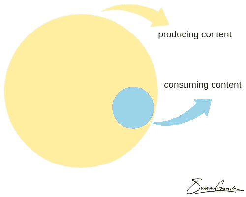

# 作为一名女性数字企业家，我最大的困难是

> 原文：<https://medium.com/swlh/my-biggest-struggle-as-a-female-digital-entrepreneur-b93cea162b11>

做一个真正的企业家和做一个数字企业家真的有区别吗？

我认为自己是一名**数字企业家**(也是一名*信息企业家)。*

如果你想了解我的旅程和生活的细节，你可以在我的媒体简介中找到许多文章，或者你可以简单地查看这篇:

 [## 我 21 岁了，我再也不会被雇佣了

### 从 15 岁开始，我就一直在工作，挣自己的钱，但是一个月前，我开始了我的第一份全职工作…

theascent.pub](https://theascent.pub/i-am-21-and-i-will-never-be-employed-again-52479440a793) 

**简而言之:**我在网上做生意。我的目标是真正成功地做到这一点。

事实上，我对教育和个人发展非常着迷——准确地说是对非正规教育，因为我讨厌世界范围内的正规教育体系。

 [## 教育的错误之处

### 我们大多数人生来就是有创造力的，但是在学校成长的过程中，我们失去了创造力和好奇心。在我看来…

medium.com](/writers-guild/the-wrong-thing-about-education-fc5244f0859f) 

我相信，如果你不喜欢某样东西，你应该走出去做点什么——尝试做出改变，即使是一个超级小的改变。

这就是我正在做的。

我正努力教育年轻人，努力教他们未来成功所需的关键技能。

现在，我的生意有两部分:

1️⃣和我的儿子 Philip Hofmacher 一起组织和主持研讨会。我们在周末为年轻的、**有动力的、**想成为自己最好版本的人出售和举办 7 小时的研讨会。

2️⃣:我们正在建立一个在线学院，并创建视频课程。为什么？因为这是我们扩大业务规模的唯一途径。

虽然我们目前实际上通过我们的工作室赚了最多的钱，但我仍然认为自己是一名*数字企业家—* 因为我的愿景是 100%独立(或者说*只依赖于我的笔记本电脑和互联网连接)。*

除了我们自己的数字学院，我还在像 Udemy 和 T21 这样的平台上出售视频课程。*如你所见——*我在 Medium 上写博客。

因此，很明显，我正试图建立几个不同的收入来源，同时瞄准一件事: ***教育人们，帮助他们成长。***

*为什么？*

因为我想独立，做我喜欢的工作，为尽可能多的人提供巨大的价值。

我想我不应该谈论创业本身——因为我的旅程才刚刚开始，有人可以告诉你更多关于创业和扩大业务以及利弊的信息——但我想分享一些相关的东西。

# 消费与创造的比率

Content consumption vs. creation

上周，我看到了一张与此类似的图表，它简单地表明了一位数字首席执行官应该在内容消费和创作上投入多少时间。我想我的版本比我看到的版本更极端一点，但信息很清楚:作为一名数字企业家，你必须确保你的大部分时间由**创造**组成，而不是消费。我必须承认这比听起来要难。每天我都会遇到大量非常棒的内容，我想把它们保存起来，以后再看。例如，我订阅了很多时事通讯，并收到了大量我喜欢的免费 pdf 下载，因为我总是认为我获得了交付的价值，可以用于我自己的博客帖子、视频或研讨会。但问题是这些信息没有尽头。我可以在互联网上浏览几十年，仍然会找到看起来很棒的内容和真正必要的内容。

但事实并非如此。至少在大多数情况下是这样。

在大多数情况下，创造一些东西(做你的生意)比消费别人的好内容更能让你受益。当然，你必须走上正轨，获得新的见解，但我知道，一个人必须真正限制消费。我不断地消费新的内容，但我想现在我可以坐下来，用我头脑中已经有的内容写 100 篇文章。

# 结果

🚀如果你想成为一名内容创作者，尤其是数字内容创作者，你必须意识到你如何分配你的时间。媒体消费算不算工作*是因为你得到了灵感和新想法，还是实际上是分心？*

这是每个人都必须自己发现的事情——在我看来，这并不容易。

你是内容创作者吗？

你是如何应对这场斗争的？你是在故意限制自己的消费时间吗？

## 这篇文章发表在 [The Startup](https://medium.com/swlh) 上，这是 Medium 最大的创业刊物，拥有+391，714 名读者。

## 在此订阅接收[我们的头条新闻](http://growthsupply.com/the-startup-newsletter/)。

