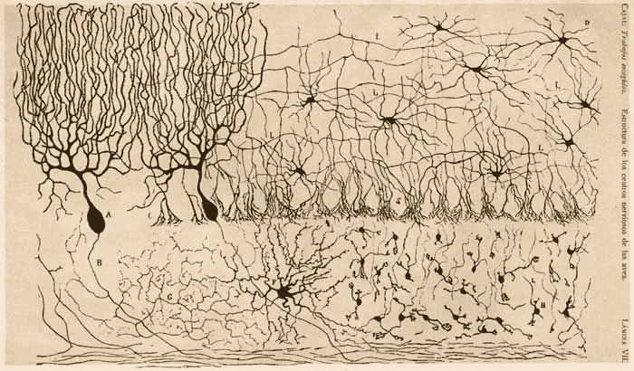

# 我对深度学习的深入钻研——作为一名医生我学到了什么

> 原文：<https://medium.com/swlh/my-deep-dive-into-deep-learning-what-i-learned-as-a-physician-ad81295c6e13>

Neurons depicted by Santiago Ramón y Cajal, courtesy of Nature.com

“你在做什么？”同事惊呼。我想知道，他认为我疯了，还是只是愚蠢？

我最近踏上了了解机器学习和深度学习的旅程。我们经常听到机器学习、人工智能和深度学习这些词，但我想知道这些过程背后的机制，并弄清楚是否有医疗保健的实际应用。

我参加了一门关于深度学习的课程，该课程涵盖了通过人工神经网络、复杂神经网络和递归神经网络进行的监督学习，以及通过自组织映射、波尔兹曼机器和自动编码器进行的非监督学习。通过本课程，我们使用深度学习库 Tensorflow 和 PyTorch 在编程语言 Python 中创建了模型。以下是我在这个过程中学到的。

## 不同的模式可以解决不同的问题

在参加这个课程之前，我已经听过一些流行词汇，也看过一些标题——“AI！机器学习！机器人来了！”…但实际上我不知道这些机制是如何工作的。我发现已经开发了许多不同的学习模型，每一个都有自己的目的。如果我们采取一种一般化的方法，可以说神经网络和深度学习是为了模仿大脑中的神经元和神经元连接而建模的。上这门课让我看到了用这些受神经科学启发的模型解决现实世界问题的不同方法。

例如，一个人工神经网络，在其最基本的层次上，将数字作为输入，通过隐藏层中包含的节点提供给它们，并提供预测的输出。当模型被训练时，该输出与地面真实值或实际值进行比较。通过算法，隐藏层中每个节点的权重或重要性被改变，并且模型再次尝试用调整后的权重来预测结果。例如，这可能有助于为疾病过程和鉴别诊断的概率创建预测模型。

另一方面，一个复杂的神经网络适合使用图像作为输入，通过一系列步骤将其转化为数字输入，可以输入到同一类型的系统中。这就是图像识别软件的工作原理，它可以应用于医学成像，帮助医生进行诊断。

随着您了解的越来越多，您会发现更多的模型，并且您可以想象每个模型如何满足不同的需求。可能性是巨大的，创造性的解决方案有令人难以置信的空间。

## 作为一名医生，专注于概念

一行又一行的代码——对于医生来说，有时这几乎和静脉曲张出血一样可怕。我在没有任何 python 经验的情况下直接进入了这个课程。在过去学习过 Javascript 之后，我发现对数据类型、对象和数组有一个基本的了解非常有帮助。然而，理解所有的细节被证明是困难的。

不仅代码令人望而生畏，算法和模型背后的数学也是如此。我相信你可以采取两种不同的方法。第一条路线是继续尽可能多的学习，成为深度学习的高手，之后再应用到医学上。虽然这是一个勇敢的目标，但我担心对大多数人来说这是不可能的，因为我们花了大部分时间来成为各自医学领域的大师。第二种，我认为更实际的途径，是利用你是医学领域专家的事实，然后专注于理解深度学习的概念，然后能够提出并应用解决方案到你的领域。

我相信后一种方法，尽管多少理解才是足够理解的问题是有争议的。我认为在发现阶段，当你学习不同的神经网络时，你会很容易想到许多不同的医疗应用。一旦你这样做了，专注于你需要理解的东西，以便将这些应用变成现实。如果代码和数学很难，尽量不要陷入困境或放弃，因为你总是可以与这方面的专家合作，他们花时间学习这一点，就像你花时间学习医学一样。

## 这是未来——成为它的一部分

不管你喜欢与否，人工智能、机器学习和深度学习都将进入医学领域。事实上，已经有一些应用程序在全球范围内开发出来了。例如，斯坦福大学的研究人员证明，深度学习算法可以像委员会认证的皮肤科医生一样准确地诊断皮肤病变为癌症。Alphabet 的生命科学团队和尼康正在使用算法来检测糖尿病患者失明的原因。在中国四川省人民医院，深度学习和图像识别正在开发中，以帮助缺乏放射科医生的地方。

我认为，作为医生，我们必须接受这项技术，睁大我们的眼睛，并应该掌握它们的机制和潜在的应用。作为我们领域的专家，我们处于最有利的位置，可以提出影响医疗保健和改善患者护理的伟大想法。所以来吧，开始吧。一点点的好奇心可以走很长的路。

## 这篇文章发表在 [The Startup](https://medium.com/swlh) 上，这是 Medium 最大的创业刊物，有 275，057 人关注。

## 在这里订阅接收[我们的头条新闻](http://growthsupply.com/the-startup-newsletter/)。

