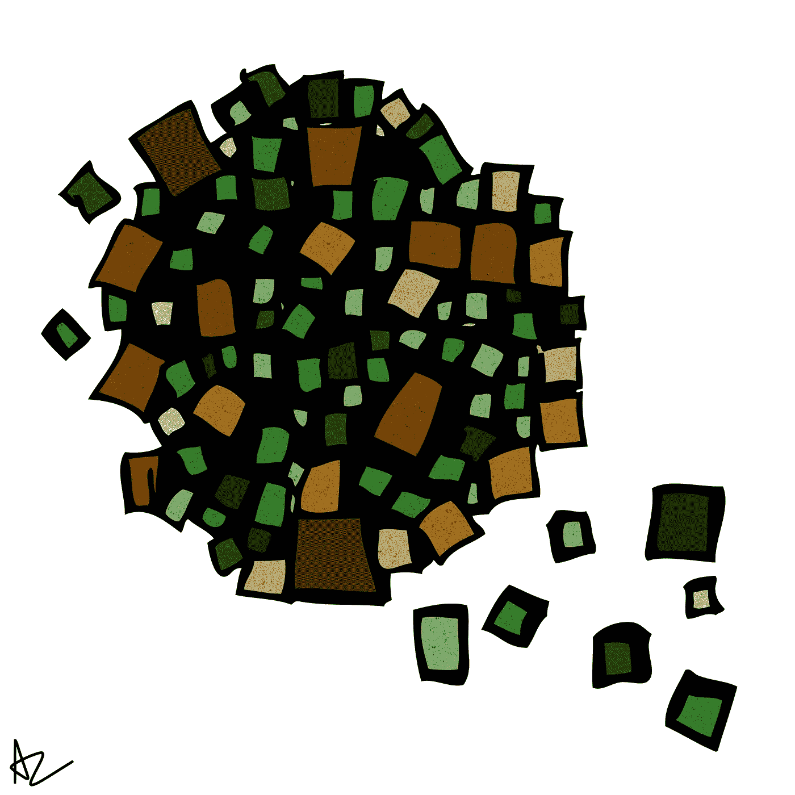

# 我对企业家的定义

> 原文：<https://medium.com/swlh/my-definition-of-an-entrepreneur-8d5d274794cb>

## 略论企业家精神。

对我来说，企业家(ENTs)是一个梦想家，一个积极进取的人，一个有雄心去创造比自己更伟大的东西的人。

尽管有风险，他们已经获得了打造*产品所需的商业头脑。这些风险可能是财务、情感和/或地域相关的。*

树人展示了许多特征:理论上，他们是**负责任的、有组织的、自信的、有创造力的、有动力的。** *(如果我遗漏了什么，请尽管回复。)*

他们看到机会，而其他人看到问题。ent 使用他们的知识和个人属性来收集信息，组装产品或服务，建立网络，并为社会的更大利益追求价值创造。

# 为什么要做企业家？

每天，越来越多的人考虑自己“开始做点什么”。互联网使得开发和培育新的商业理念比以往任何时候都更容易。

> 企业家精神从未像现在这样活跃和兴旺。

人们渴望成为树人有很多原因:掌控工作生活，积极影响社会，当然，还有获得可观的利润。

最重要的是，我认为人们已经厌倦了朝九晚五的单调工作。为了他们的幸福，人们需要更充实的工作。我们需要进一步缩小工作和娱乐之间的差距。

成为自我授权者的理由不胜枚举。

*然而*，不要让可观的上涨蒙蔽了你的双眼。就像他们说的，闪光的不一定是金子！

你不能简单地“转向”创业，然后期望过奢侈的、不用工作的 CEO 生活。如果你决定走这条路，就要比以前更加努力工作。这并不容易。

> 不确定性、长时间的工作和持续的艰苦战斗会给你带来很多压力。

不幸的是，大多数人都看不到这种“黑暗面”巨大的压力击垮了许多业主，这就是为什么超过一半的企业在头五年内倒闭。

此外，不要指望业内同行会支持你或告诉你该怎么做。当然，人们会鼓励你，但是无论如何，不会有牵手。

竞争从未停止。

你(和你的团队)必须在水中航行，找到一种区分和优化你的业务流程的方法。从一开始情况就对你不利。

这将是一次令人烦恼的旅程，你必须接受这一点。

# 谁能成为企业家？

*任何人*。是的，我真的相信任何人都可以成为自己的老板！

你不需要成为一个白种美国人。你不需要一个有钱的叔叔。你不需要导师。你必须有远见卓识，并强烈倾向于你的企业将如何为 T2 提供独特的价值。奉献和纪律也是关键。

最重要的是…

> **你需要动力和面对失败的无畏精神。**

***注意:任何人都可以实现这些事情。***

企业家精神基于目的、创造力和价值——这三个因素推动了追求。

成功取决于坚持、适应和成长的能力。永远不要让一本书的描述或专家的意见阻止你从**开始**。虽然企业家之间存在共性，但没有放之四海而皆准的方法。

按你的方式做。

***- AZ***

## 这个故事发表在 [The Startup](https://medium.com/swlh) 上，这是 Medium 最大的创业刊物，拥有 319，583+人关注。

## 在这里订阅接收[我们的头条新闻](http://growthsupply.com/the-startup-newsletter/)。

