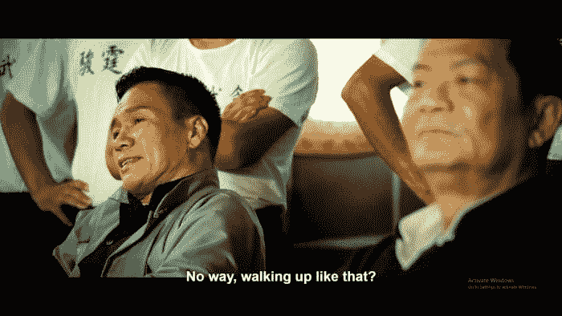
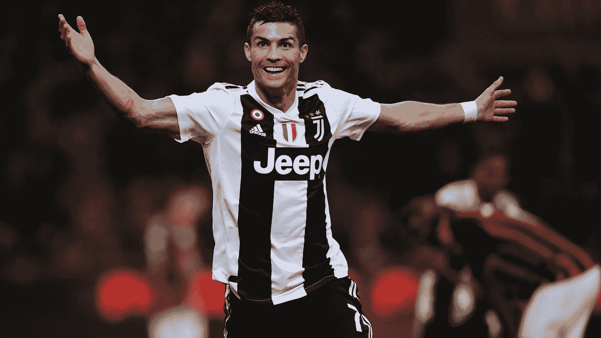

# 我在创业过程中寻找导师的经历

> 原文：<https://medium.com/swlh/my-experience-finding-mentors-in-my-entrepreneurial-journey-30827cb00d74>

从我开始创业之旅开始，就被多次告知要找导师。这是我从来不知道我必须做的事情。

从很小的时候，我就知道我必须和努力、勤奋和聪明的学生在一起，这样我才能变得像他们一样。最简单的方法就是和成绩好的人交朋友。但问题是，你最终会和性格相似的人交朋友，所以我没有学会如何与不同的人相处。

但是自从我开始工作，我就不再那样做了。在某种程度上，我以前工作中的一些老板或高管是我渴望成为的人，但在我职业生涯的最后几年里，随着他们的一些弱点对我越来越清楚，我对他们的渴望越来越少。所以作为一个人，就职业而言，我已经停滞不前了。

精神上，我一生都没有成长多少，因为我根本不知道我必须成长，更不用说如何成长了。我最近试着去教堂，尽管更多的是为了让我的女儿们上学。无论如何，我觉得它没有强烈地向我说话。

所以对我来说，寻找导师的想法非常有趣，因为它打开了一个全新的世界，我开始再次成长。

在过去的几个月里，我和许多人谈过话。

> 我认为认识到这一点的关键之一是，实际上有三种类型的顾问——导师、教练和顾问。

我的理解是**导师是那些曾经在你的位置上并取得成功的人。这些是你渴望变得相似的人，你可以简单地跟随他们的旅程。**

我不认为他们必须是镇上最富有的人，但他们应该是拥有相同价值观的人。

由于他们忙于自己的生活，你可能一个月或几个月才和他们聊一次。

最重要的是**找到真正高水平的导师，因为他们可以在更高的水平上看待事情** **，只有这样，他们才不会限制或更残酷地扼杀你的梦想**，我认为这在某种程度上几乎是犯罪。

> **“如果你周围的人不觉得你做的事情有点奇怪，也许还不够奇怪。”** —帕特里克·科利森

没有多少人会真正意识到，更重要的是，承认他们只是不理解某人的梦想，让他们自己的自我、自尊和现实来做这件事，打消那个梦想。

**你还必须证明你的导师是合格的，或者在更了解那个人之后，随着时间的推移，一旦你意识到你们并不真正匹配，就离开。**

总是有一种想要靠在容易的道路上和那个人一起走的冲动，但是过一会儿你会自然地克服它。这就像在你的创业旅程中想找一份工作，但你会知道这不是一条正确的道路，过一段时间后又回到你自己的道路上。

找到合适的导师其实是极其困难的。没有简单的出路，如果你真的想走这条路，那也不是你想要的。这可能就像找到一个人的配偶一样困难，而且我们中的一些人可能永远也找不到。

我认为很容易把教练和导师搞错。甚至教练有时也会误认为自己是导师，但他们所做的更多的是指导而不是指导。

我想教练的比喻类似于足球经理，他们从来没有踢过最高水平的比赛，但仍然成为了世界级的足球经理。

这些人会告诉你你的盲点、优势和劣势。你很难识别自己的东西，因为它是你性格中固有的。因此，教练更有可能获得报酬，因为他们需要与你密切合作，因为他们需要充分了解你，指出你做得对与错。

**文化差异**

不同的文化也有影响。

总的来说，我发现中国人真的很像功夫大师。

也许是年龄(他们一般都比较老)或者我们是如何长大的。中国人倾向于在不知不觉中传播更多的负面能量，所以学徒们在接受他们的建议时需要克服这一点。他们必须从消极中提取智慧。

虽然中国和西方的导师/教练都会展示他们的经历来证明他们的资格，但中国人往往更关注他们自己的经历和成功，而不是学徒的个性或特点。

大多数中国人传统上都是这样长大的，他们在某种程度上也是这样熬过来的，也许他们认为严格的测试对心智来说是必要的。

这可能会创建一个自然的过滤器，但我当然觉得这是一个相当高的障碍，也许没有必要。问题是，这种负能量是令人厌恶的，会建立自我和愤世嫉俗，从而影响学习。

我还认为，通过预先设置这个过滤器，它限制了学徒的多样性。也就是说，无法通过的学徒在正确的指导下可能仍然是优秀的企业家，但因为在道路的早期就有这种主观过滤器，他们已经被过滤掉了。在某种程度上，这就像一家伟大的公司在变得伟大之前就耗尽了现金。

中国的大师们都是有着良好意图的好人，但正是这种文化，也许是缺乏对心灵的理解，造成了这种负面影响。如果我们不能克服这一点，这本身就可能成为培养更多企业家的最大障碍之一，因为它阻碍了知识转移。

如果有一个选择，也许更容易接受西方的方式，除非中国的选择可以证明是明显更好的，这是很难证明的，直到你知道结果。

西方的方式一般更友好，更鼓励，也就是更积极。也许这也与如何看待失败有关，中国人认为这是丢脸，而西方人认为这是一个学习的过程。西方的方式也更具体地对学徒们说，把他们当作个人，他们想要什么，允许他们梦想，因此创造了更多的积极能量和接受。

我不知道这是文化、我们的成长方式、地理、人口还是社会现状，但我的拙见是中国有更多的教练和顾问类型的顾问。

**Youtube 导师**

Youtube 上也有很多优秀的导师，加里·维、雷伊·达里奥、丹·佩纳、拉塞尔·布伦森等等。有了这些多样性，我想任何人都可以找到能引起共鸣的人。这些人是我树立心态的桥梁。

我的意思是，在他们之前，当我看杰夫·贝索斯、埃隆·马斯克、彼得·泰尔等其他伟人的采访和视频时，我觉得有点疏远，不能真正理解他们在谈论什么，有时还会努力不睡着。因为这是在没有背景的情况下完成的，但现在有了更多的增长思维和更好的基础，我可以更好地理解他们来自哪里，并与我自己的想法联系起来。也许这是知识的复合开始生效。这就像在学校里，第一年的课程是为第二年的课程设置的。不幸的是，在实际的生活学习中，并没有这样的事情。每个人都从不同的地方开始，有不同的兴趣，不同的学习速度，所以只有你能发现你怎样学得最好。另一个问题是，我们并不真正被鼓励在大学毕业后学习。

我学到的另一件事是建立一个内部顾问委员会。这是由你在现实生活中尊敬的伟大人物组成的，在你的脑海中，你想象他们在会议室里，坐在长桌旁，你是主席，对你的生活提出建议。对我来说，举例来说，我已经招募了克里斯蒂亚诺罗纳尔多为我的健康，虽然我是绝望地失败到目前为止，我知道他会继续推动我做更多的练习。

无论如何，现代企业家精神已经好得多了。几百年前，作为一名企业家，你需要成为一名海盗或探险家，活着回到你的家人和孩子身边的可能性很小，更不用说拥有实际财富了。但是在这里，我只是在互联网的海洋中打字，当我想休息的时候给我的女儿一个拥抱，然而我害怕赚不到足够的钱来维持家庭收入。这真是一个不同的宇宙。

## 这篇文章发表在 [The Startup](https://medium.com/swlh) 上，这是 Medium 最大的创业刊物，拥有+405，714 名读者。

## 订阅接收[我们的头条](http://growthsupply.com/the-startup-newsletter/)。

