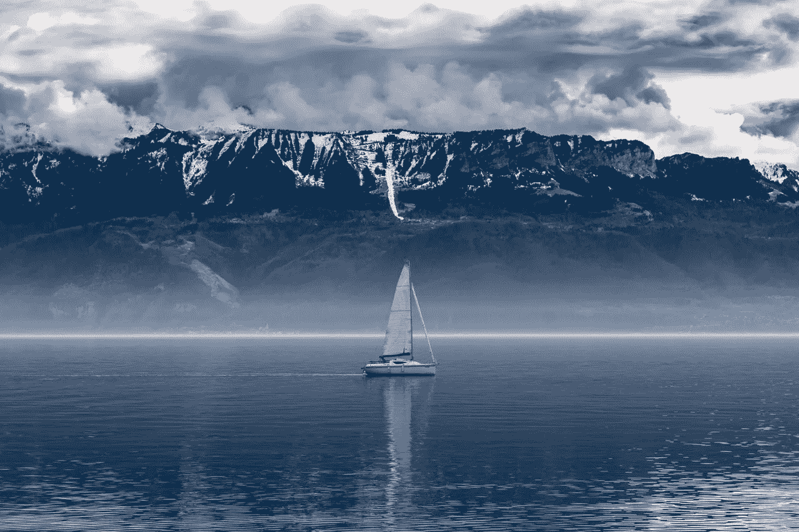
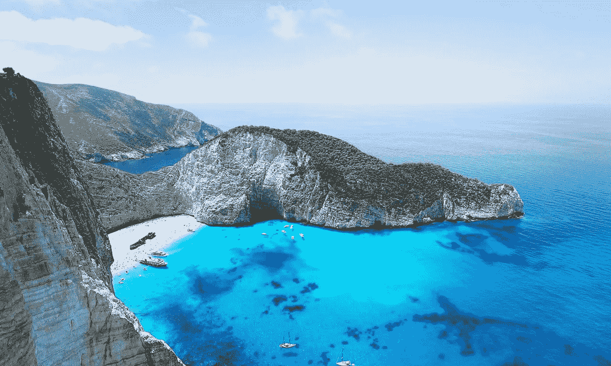
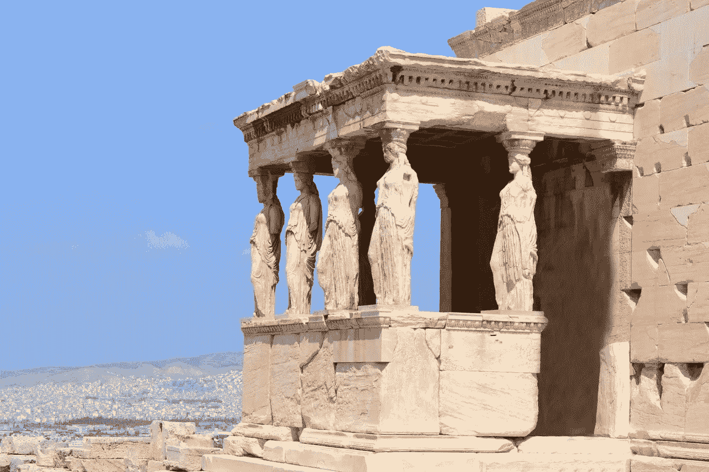

# 我最喜欢的激励我勇敢的希腊诗歌

> 原文：<https://medium.com/swlh/my-favorite-greek-poem-that-inspires-me-to-be-brave-2137adafb6f6>

2006 年春季学期，我在希腊雅典留学。这是我人生的一个重大转折点，它点燃了我 19 岁时对旅行的热爱。

在我上的一门希腊文化课中，我们必须记住下面这首康斯坦丁·p·卡瓦菲的诗。12 年后，这首诗继续激励我勇敢，享受旅程，面对恐惧，充实地生活。

当你出发前往伊萨卡
希望这是一次漫长的旅程，
充满冒险，充满发现。
莱斯特里戈尼亚人和独眼巨人，
愤怒的波塞冬——不要害怕他们:
只要你保持高昂的思想，
只要一种罕见的兴奋
搅动你的精神和身体，你就永远不会发现那样的事情。
莱斯特里戈尼亚人和独眼巨人，
狂野的波塞冬——你不会遇到他们
除非你把他们带进你的灵魂，
除非你的灵魂把他们放在你面前。

希望这次航行是漫长的。
愿有多少个夏日清晨，
你带着怎样的愉快，怎样的喜悦，
第一次走进港湾；
愿你在腓尼基的贸易站停下来
购买精美的东西，
珍珠和珊瑚、琥珀和乌木之母，
各种感官香水——
尽可能多的感官香水；祝你参观许多埃及城市，从他们的学者那里收集大量知识。

永远记住伊萨卡。到达那里是你命中注定的。但是一点也不要急着赶路。
最好能持续几年，
所以当你到达这个岛的时候你已经老了，
一路上你会变得富有，
不要指望伊萨卡会让你变得富有。

伊萨卡给了你奇妙的旅程。没有她，你不会出发。她现在已经没有什么可以给你了。如果你发现她很穷，伊萨卡不会骗你。你将会变得如此聪明，如此富有经验，到那时你将会明白这些伊萨卡是什么意思。

— *卡瓦菲*

你有没有最喜欢的诗歌、文章或引语来作为灵感的来源？请在下面告诉我，我很想听听！

❤什

你准备好最终将你的旅行梦想变成现实了吗？ [*今天就注册我的简讯*](http://eepurl.com/dylLZf) *，我会发给你开始环游世界、过上你一直梦想的生活所需的前三步！*

如果你喜欢这篇文章，请吧👏并分享给你的朋友。记住，你最多可以鼓掌 50 次——这对我真的很重要。

*我很乐意在*[*insta gram*](https://www.instagram.com/strategicstephtravels/)*，* [*脸书*](https://www.facebook.com/StrategicStephTravels) *，*[*Twitter*](https://twitter.com/StrategicSteph)*，或者*[*LinkedIn*](https://www.linkedin.com/in/stephanielhuston)*上与你联系！❤*

## 这个故事发表在 [The Startup](https://medium.com/swlh) 上，这是 Medium 最大的创业刊物，拥有 303，461+人关注。

## 在这里订阅接收[我们的头条新闻](http://growthsupply.com/the-startup-newsletter/)。

