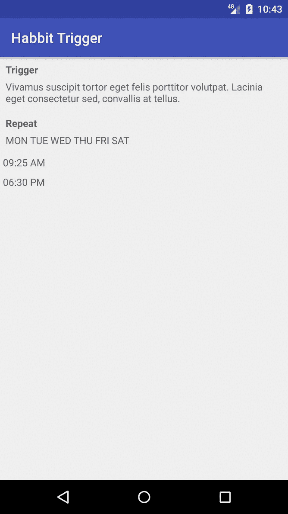
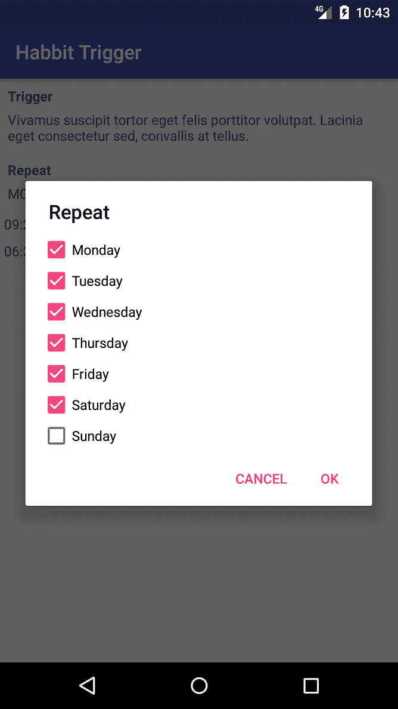
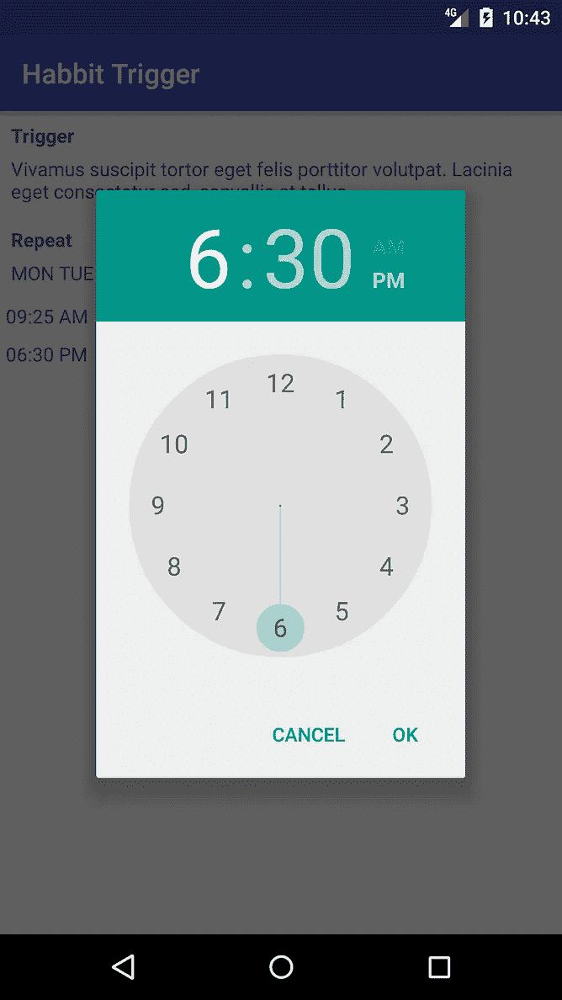

# 我的第一次申请和它是如何失败的

> 原文：<https://medium.com/swlh/my-first-idea-execution-ecd1a1642e99>

保持高效的最好方法之一是随着时间的推移养成良好的习惯。然而，没有持续的提醒，我很难跟上新习惯。

我没有找到一个能定期提醒我采取行动的应用程序。我尝试过的关键词包括“警报”、“常规”、“触发”和“习惯”的组合。因此，我开发了名为“习惯触发器”的应用程序，这是一种定期提醒用户的闹钟，在一周的选定日期、一天中的首选时间或指定间隔内(如每 2 小时)提醒用户。

我学习编码的通常方法是阅读一两本书，然后开发一些演示来更加熟悉从书中获得的概念。这个过程花了一个月，我才开始编写自己的软件。更糟糕的是，有时我从来没有利用过我所学的东西。

> 不是你知道什么；而是你用你所知道的去做。

这一次我的方法不同了。我遵循基于生产的学习——旨在应用所学知识的学习方法。换句话说，我同时学习和开发了一个产品。

我从编写描述用户如何与我的应用程序交互的用户故事开始，然后继续模拟用户界面。第三天，我买了本书“ [Head First Android](https://goo.gl/C8ndHD) ”，浏览了前几章，大致了解了 Android 的工作原理。此后，我一头扎进去，用我所掌握的松散知识进行编码。

随着开发的进行，我经常被卡住。我在谷歌上搜索解决方案，大多数给我的都是陌生的术语。我再次谷歌或转向这本书，以了解更多关于他们的信息。

我花了 5 分钟到 2 天的时间从一个问题中解脱出来。然而，我并不觉得这样做是浪费时间。花在搜索上的时间产生了我的应用程序中的代码，这是知识的真正用法。这比我的老方法好多了，我学到的东西可能永远也用不上。

我在第九天完成了**原型**的 30%。

Day 9: 30% Prototype ([GitHub](https://github.com/NERDYLIZARD/HabbitTrigger))

在第 10 天的中间，当我在和问题搏斗的间隙休息的时候。我谷歌了关键词“重复报警”。第三个结果是一个执行类似想法的[应用](https://goo.gl/uuyt85)的谷歌 Play 商店链接。该应用程序有 10，000 到 50，000 次下载，128 名用户给了 4.2 分。此外，它有一个优雅的用户界面，包含所有类似我最初的想法的功能。

到最后，我中止了我的项目，成了“[重复报警](https://goo.gl/uuyt85)”的粉丝。我感到有点难过，因为我不是执行这个想法的人。然而，我很高兴这个想法正在影响着人们。

吸取的教训是，在尝试之前，我们不需要知道所有的事情。同时学习和应用我们所学的东西会更有效率。此外，我们应该在卷起袖子之前彻底研究产品的市场机会。

**出发前:**您实施第一个应用程序的体验如何？

如果你喜欢我的笔迹，这里还有一些:

 [## 为什么初级程序员应该使用“Git”

### Git 是新手学习类固醇的四个原因

medium.com](/@bouasavanhhop/git-as-the-newbies-learning-steroid-963a2146220b)  [## 如何用有声读物治愈失眠

### 有声书助你睡个好觉，醒得更聪明

medium.com](/the-post-grad-survival-guide/how-audiobooks-cure-my-insomnia-bfd583bf85e1) 

## 这篇文章发表在[《创业](https://medium.com/swlh)》上，这是 Medium 最大的创业刊物，有 281，454+人关注。

## 在这里订阅接收[我们的头条新闻](http://growthsupply.com/the-startup-newsletter/)。

