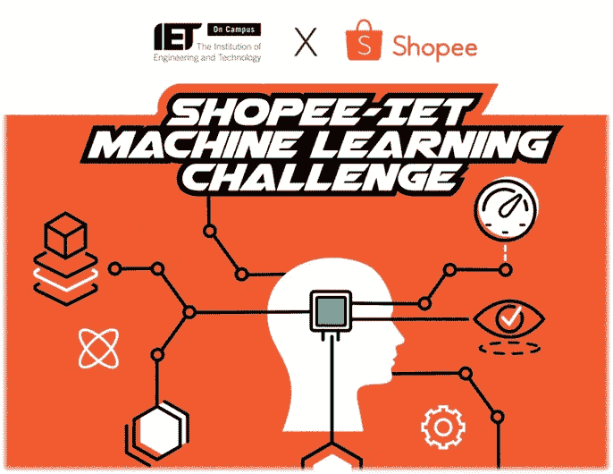
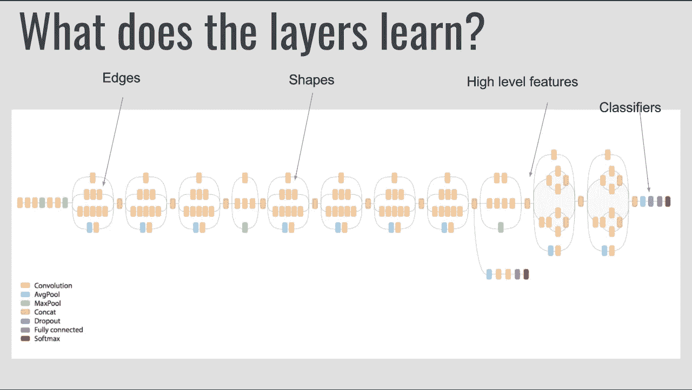
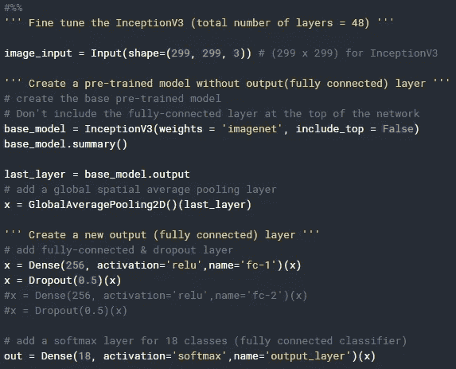
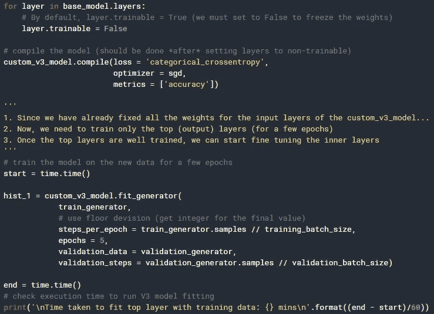

# 我的第一次 Kaggle 竞赛——图像分类

> 原文：<https://medium.com/swlh/my-first-kaggle-competition-image-classification-501f7eaf4f92>

## 为了建立可以预测输入图像的分类的模型

**第一个误区** — [Kaggle](https://www.kaggle.com/) 是一个举办机器学习竞赛的网站。我相信这种误解让很多数据科学初学者——包括我——认为 Kaggle 只适合数据专业人士或有多年经验的专家。事实上，Kaggle 提供的不仅仅是竞赛！

Kaggle 上有如此多的[开放数据集，我们可以简单地从玩我们选择的数据集开始，并在过程中学习。如果你是一个对数据科学毫无经验的初学者，并且可能想在加入之前参加更多的在线课程，请三思！Kaggle 甚至为你提供一些基础而实用的](https://www.kaggle.com/datasets)[编程和数据科学课程](https://www.kaggle.com/learn/overview)。此外，您可以随时在 [Kaggle 讨论](https://www.kaggle.com/discussion)中提出您的问题，以便向活跃的数据科学社区寻求建议或澄清任何数据科学问题。

脸书创始人兼首席执行官马克·扎克伯格在哈佛毕业典礼上的演讲中分享了一段真正启发了我的话

> 你只需要开始。
> 
> —马克·扎克伯格

开始并迈出第一步一直是做任何事情之前最难的部分，更不用说取得进展或提高了。

有很多在线资源可以帮助我们开始使用 Kaggle，我将在这里列出一些我认为非常有用的资源:

1.  [使用 Kaggle 开始(并指导)您的 ML/数据科学之旅——为什么以及如何进行](https://towardsdatascience.com/use-kaggle-to-start-and-guide-your-ml-data-science-journey-f09154baba35)

2.[机器学习从零到英雄](https://towardsdatascience.com/machine-learning-zero-to-hero-everything-you-need-in-order-to-compete-on-kaggle-for-the-first-time-18644e701cf1)

3.[数据科学 A-Z 从零到 Kaggle 内核大师](https://towardsdatascience.com/data-science-from-zero-to-kaggle-kernels-master-f9115eadbb3)

在接下来的部分，我希望与你分享一个初学者在他的第一次 Kaggle 比赛中的旅程(和他的团队成员一起)以及一些错误和教训。你可以[在这里](https://www.kaggle.com/chloekexin/da-machine)查看代码。这些部分分布如下:

1.  竞争的背景和数据
2.  方法
3.  结果
4.  最后的想法

让我们开始吧，我希望你会喜欢它！

# 1.竞争背景和数据

在我的第一篇关于 Medium 的帖子——[我从物理到数据科学的旅程](https://towardsdatascience.com/my-journey-from-physics-into-data-science-5d578d0f9aa6)中，我提到了我和我的团队成员——[**罗伟鸿**](https://www.linkedin.com/in/lowweihong/) **、** [**崇科信**](https://www.linkedin.com/in/kexinchong/) **、**和[**Onn**一起参加了由****](https://www.linkedin.com/in/ling-wei-onn-452957147/) ****[Shopee](https://shopee.sg/) 和(IET)工程技术学院举办的[首届 Kaggle 机器学习竞赛](https://www.kaggle.com/c/shopee-iet-machine-learning-competition)我们在旅途中玩得很开心，我确实从他们身上学到了很多！！****

Shopee 给了我们 18 个类别的商品图像，我们的目标是建立一个模型，可以预测输入图像到不同类别的分类。

太好了。现在我们已经了解了上下文。让我们继续我们的图像分类预测方法——这是 ***有趣(我是说最难)*** 的部分！

## 用于分类的一些图像

Different Images for Classification

正如您从图像中看到的，一些图像中存在一些噪声(不同的背景、描述或裁剪的文字)，这使得图像预处理和模型建立更加困难。

在下一节中，我将讨论我们解决这个问题的方法，直到构建我们定制的 CNN 模型。

# 2.方法

[(Source)](https://unsplash.com/photos/oVpn10bqxkc)

每当人们谈论图像分类时，**卷积神经网络(CNN)** 就会自然而然地出现在他们的脑海中——毫不奇怪——我们也不例外。

我第一次接触 CNN 时，知识和经验都很少， **Google** 是我最好的老师，我不得不强烈推荐这本由[阿迪特·德什潘德](https://www.linkedin.com/in/aditdeshpande/)撰写的简明而全面的 CNN 简介。高水平的解释打破了 CNN 一度令人生畏的结构，变成了我能理解的简单术语。

## 图像预处理

图像预处理也可以称为[数据增强](https://keras.io/preprocessing/image/)。

Generate batches of tensor image data with real-time data augmentation that will be looped over in batches

在将图像输入模型之前，数据扩充步骤是必要的，特别是对于给定的 [不平衡且有限的数据集](/nanonets/how-to-use-deep-learning-when-you-have-limited-data-part-2-data-augmentation-c26971dc8ced)。通过对图像进行不同的变换、缩放和剪切范围来人为扩展我们的数据集，我们增加了训练数据的数量。

## —第一个错误—

我相信每一种方法都来自于背后的多次尝试和错误。因此，在展示我们的最终方法之前，让我们先谈谈我们的第一个错误。

**我们开始尝试从零开始构建我们的 CNN 模型**(没错，就是这样！)来查看 CNN 模型基于训练和测试图像的表现。我们不知道大多数人很少从零开始训练 CNN 模型，原因如下:

1.  数据集不足(训练图像)
2.  CNN 模型很复杂，通常需要几周甚至几个月来训练，尽管我们有集群机器和高性能 GPU。
3.  成本和时间不能保证和证明模型的性能

幸好[转学](https://machinelearningmastery.com/transfer-learning-for-deep-learning/)来救我们了。

## 迁移学习

那么……迁移学习到底是什么？

[**迁移学习**](https://machinelearningmastery.com/transfer-learning-for-deep-learning/) 是一种机器学习方法，其中为一个任务开发的模型被重新用作第二个任务的模型的起点。在我们的例子中，这是一种[方法](https://adeshpande3.github.io/adeshpande3.github.io/A-Beginner's-Guide-To-Understanding-Convolutional-Neural-Networks-Part-2/),采用预先训练好的模型(之前已经在大型数据集上训练过的网络的权重和参数),并用我们自己的数据集对模型进行“微调”。

太好了。由于 Keras 中有如此多的预训练模型可用，我们决定分别尝试不同的预训练模型***(vgg 16、VGG19、ResNet50、InceptionV3、DenseNet 等。)**并选出最佳型号。*

**

*[Inception V3 Google Research](/@14prakash/transfer-learning-using-keras-d804b2e04ef8)*

*最终我们选择了 [**InceptionV3 模型**](https://keras.io/applications/#inceptionv3) ，权重在 [ImageNet](http://image-net.org/) 上预训练，准确率最高。*

**

*为无休止的评论道歉，因为我们想确保每一行都是正确的。*

*乍一看，这些代码可能有点令人困惑。让我们通过下面解释的逻辑来进行分解，使事情变得更清楚:*

1.  *我们首先使用之前导入的预训练的 InceptionV3 模型创建了一个基础模型。为了以后的定制目的，在神经网络的顶部移除了完全连接的最后一层。*
2.  *然后我们添加了一个 [**全局空间平均池层**](https://alexisbcook.github.io/2017/global-average-pooling-layers-for-object-localization/) ，原因可以在这里找到[。](https://www.quora.com/What-is-global-average-pooling)*
3.  *之后，我们创建了一个新的**全连接输出层**，接着是一个**脱落层**用于正则化目的。*
4.  *最后，我们为 18 个类别(18 类图像)添加了一个 **softmax 层**，并且**将基础模型与创建的新输出层**相结合。*

**

*在这个阶段，我们冻结了基础模型的所有层，只训练新的输出层。*

*这就是迁移学习的美妙之处，因为我们不需要重新训练整个组合模型，因为基础模型已经被训练过了。*

## *微调组合模型*

*一旦顶层训练好了，我们就微调内层的一部分。*

**

*可选地，通过选择和训练顶部的 2 个先启块(组合模型中 249 层之后的所有剩余层)来实现微调过程。训练过程与以前相同，只是包括的层数不同。*

*是的，我们结束了！*

# *3.结果*

***最终准确率为 78.96%。***

*我们尝试了不同的方法来微调超参数，但无济于事。*

*当所有的结果和方法在比赛结束后揭晓时，我们发现了我们的第二个错误…*

## *—第二个错误—*

***我们没有使用叠加法的集合模型。***

*所有顶级团队的共同点是他们都使用集合模型。*

*相反，我们分别训练不同的预训练模型，只选择最佳模型。这种方法间接使得我们的模型在只使用一个模型测试数据时不够健壮，并且容易过度拟合。*

# *4.最后的想法*

**

*[(Source)](https://unsplash.com/photos/JSF-PcnsFx8)*

*尽管比赛时间很短，但我从我的团队成员和其他团队那里学到了很多东西——从理解 CNN 模型，应用迁移学习，制定我们学习其他团队使用的其他方法的方法。*

*这个过程并不容易。学习曲线很陡。学习之旅充满挑战，但同时也很有收获。我非常期待另一场比赛！😄*

*感谢您的阅读。*

*如果你喜欢这篇文章，请随意点击那个按钮👏帮助其他人找到它。*

*一如既往，如果您有任何问题或意见，请随时在下面留下您的反馈，或者您可以随时通过 [LinkedIn](https://www.linkedin.com/in/admond1994/) 联系我。在那之前，下一篇文章再见！😄*

## *关于作者*

*[**阿德蒙德·李**](https://www.admondlee.com/) 现在的使命是让每个人都能接触到数据科学。他正在帮助公司和数字营销机构通过创新的数据驱动方法，利用可操作的见解实现营销投资回报。*

*凭借其在高级社会分析和机器学习方面的专业知识，Admond 旨在弥合数字营销和数据科学之间的差距。*

*如果你想了解更多关于 Admond 的故事、数据科学服务以及他如何在营销领域帮助你，请查看他的 [**网站**](https://www.admondlee.com/) 。*

*你可以在 [LinkedIn](https://www.linkedin.com/in/admond1994/) 、 [Medium](/@admond1994) 、 [Twitter](https://twitter.com/admond1994) 、[脸书](https://www.facebook.com/admond1994)上和他联系。*

* [## 阿德蒙德·李

### 让每个人都能接触到数据科学。Admond 正在通过先进的社交分析和机器学习，利用可操作的见解帮助公司和数字营销机构实现营销投资回报。

www.admondlee.com](https://www.admondlee.com/) 

## 这篇文章发表在 [The Startup](https://medium.com/swlh) 上，这是 Medium 最大的创业刊物，拥有+ 379，528 名读者。

## 在这里订阅接收[我们的头条新闻](http://growthsupply.com/the-startup-newsletter/)。

*