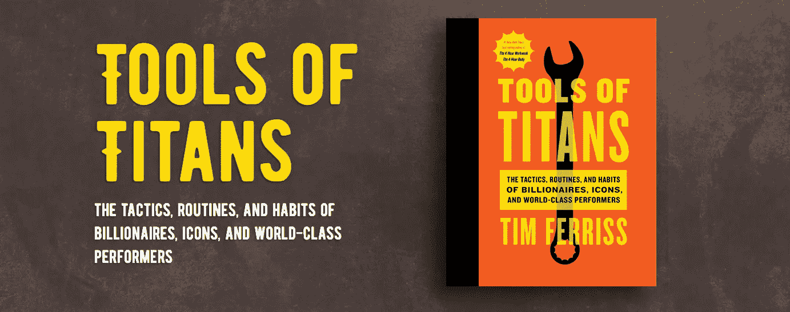
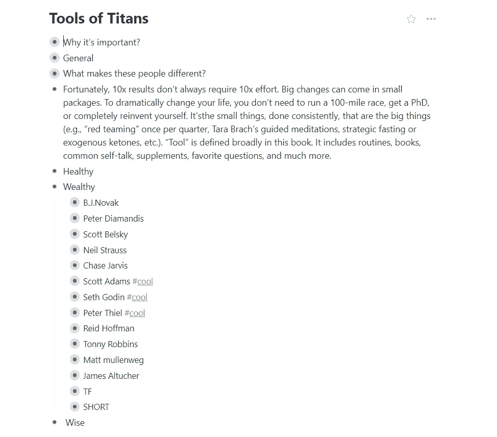
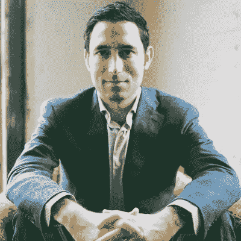
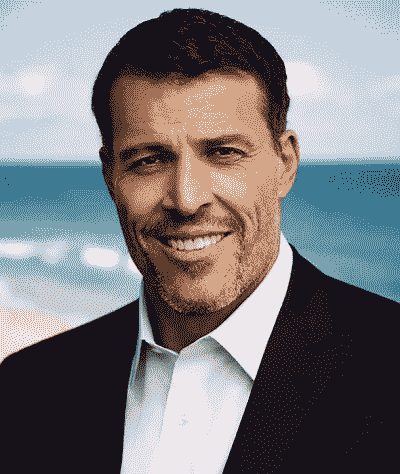
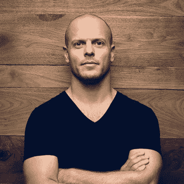
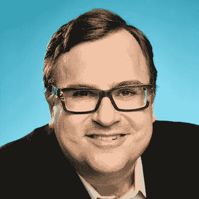

# 我的《泰坦的工具》一书的亮点

> 原文：<https://medium.com/swlh/my-highlights-on-tools-of-titans-book-cfe454e1c04c>

Screenshot from [original site](https://toolsoftitans.com/)

L ong 短篇小说——[泰坦的工具](https://toolsoftitans.com)作者[蒂姆·费里斯](https://medium.com/u/56d3bc91794f?source=post_page-----cfe454e1c04c--------------------------------)是目前我最喜欢的书。我无法形容它有多酷。因为我的职业，我总是尽量减少信息噪音，尽快到达边缘。我相信 80/20 法则总是有用的。所以，当我考虑下一本书该读哪本时，我会非常小心地做出选择。就目前而言，任何一本新书都无法与这本书抗衡(个人观点)。

蒂姆在每个播客中都做得非常出色。他邀请各行各业非常有趣的客人。他是采访大师。这就是为什么他的播客本身非常有趣。从我的理解来看，*这本书——是播客的衍生品。当你读这本书的时候，你会错过一些你可以在播客中找到的智慧。*

> 这本书和我的其他书一样，是我收集的供自己使用的高效能秘诀的概要。蒂姆·费里斯

这本书我已经读过两遍了。恐怕这篇文章会给人留下不好的印象。我写这篇文章主要是为了让自己能够容易地找到最有用的信息。

这本书由三部分组成:健康、富有、智慧。**本文仅涵盖** **富裕阶层** **部分**。在本书的上下文中，“富有”的含义远不止金钱。它延伸到丰富的时间，关系，等等。

> 由于我记忆中的教训，我的生活在各个方面都得到了改善。但这只是冰山一角。大多数珍宝仍然保存在数千页的文字记录和手写笔记中。最重要的是，我渴望有机会将一切浓缩成剧本。
> 
> 所以，我留出了整整一个月的时间来复习(老实说，也是 *pain au chocolat* )，为自己整理终极悬崖笔记。它将是所有笔记本的终结。一些能在几分钟内帮助我，但却能读一辈子的东西。(TF)

我已经在[工作流程](https://workflowy.com/s/tools-of-titans/qsuLLpLVW9itTycV)中构建了我的亮点。

Structured highlights from the book

# 第一部分:心态

我相信改变一切的不是生活窍门，甚至不是策略。这可能是错误的。心态才是王道。如果你有“正确”的心态，你会自动回答数百个问题。

Photo from [Wikipedia](https://en.wikipedia.org/wiki/Peter_Diamandis)

在采访彼得·迪亚曼蒂斯的过程中，你可能会发现很多精彩的引言:

*   当 99%的人怀疑你时，你要么大错特错，要么即将创造历史。
*   我认为问题是金矿。世界上最大的问题就是世界上最大的商机。
*   我认为我们需要训练人们如何改变世界。

> 你的梦想是什么？

*   **如果有人给你 10 亿美元，除了派对和法拉利之外，你会怎么花？** *想一想。我花了 30 分钟才得到至少一个合理的答案。*
*   你能把自己置身于一个最大限度地接触新思想、新问题和新人物的环境中吗？
*   当你增长 10%时，你就在和所有人竞争。每个人都想扩大 10%。当你想变大 10 倍时，你只能靠自己。
*   你将如何扰乱你自己，你如何试图扰乱你自己？

Photo from [Twitter](https://twitter.com/scottbelsky)

斯科特·贝尔斯基的一些智慧:

*   地图、得力助手、计划的危险在于，你最终可能会按计划过你的生活。如果你这样做了，你的潜力不可能超过你的期望。
*   有时候，你需要停止做你喜欢的事情，去培养最重要的事情。
*   我试着从过去中学习，而不受它的启发。
*   在错误的环境中，你的创造力会打折扣。
*   广告牌:“这不是创意，而是让创意发生。”
*   每一次成功几乎都是失败。

> 年轻的创意头脑不需要更多的想法，他们需要对他们已经有的想法承担更多的责任。

尼尔·史特劳斯

> 你可能犯的最大错误是接受你那个时代的规范。

*   不要害怕做你没有资格做的事情。丹·卡林
*   ...我要做的工作甚至还没有被发明出来…有趣的工作是你编造出来的。克里斯·扬

金钱总是可以再生的。时间和名誉不能。

Photo from [Mercury News](https://www.mercurynews.com/2017/12/06/win-bigly-scott-adams-dissects-trumps-persuasion-skills/)

斯科特·亚当斯

> 失败者有目标。赢家有系统。

这包括选择一些项目和习惯，即使它们在外界眼中会导致“失败”，但会给你带来可转移的技能或关系。换句话说，随着时间的推移，您选择了允许您不可避免地“成功”的选项，因为您构建了可以延续到后续项目的资产。

*关于压力管理的多样化。如果我有一百个朋友，我不会担心失去一个朋友，但如果我有两个朋友，我真的会担心。我不会担心因为我的一个老板要解雇我而丢掉工作，因为我在各地的报社都有成千上万的老板。*

如果你想要一个普通、成功的生活，并不需要太多的计划。只要不惹麻烦，去上学，去应聘你可能喜欢的工作。但是，如果你想要非凡的东西，你有两条路可走:1)在一件特定的事情上成为最好的。2)在两件或更多事情上变得非常优秀(前 25%)。[……]资本主义奖励既稀有又有价值的东西。你**通过组合两个**或更多的“好货”让自己变得稀有，直到没有人拥有你的组合。……在你的技能组合中，至少有一项技能应该涉及沟通，无论是书面的还是口头的。这可能就像学习如何比世界上 75%的人更有效地销售一样简单。这是一个。现在再加上你的激情，你有两个，因为这是你可以很容易投入足够精力达到前 25%的事情。

Photo from [Mumbrella](https://www.mumbrella.asia/2017/06/conversation-seth-godin-man-created-permission-marketing)

[塞思·戈丁](https://medium.com/u/f9ac9806e153?source=post_page-----cfe454e1c04c--------------------------------)

你比你想象的更强大。据此行动。

"信任和关注——这是后匮乏时代的稀缺品."

我们不能在竞争中胜出。

你追踪的东西决定了你的镜头——仔细选择

> 做一个徘徊的概括而不是一个有意义的具体没有错，但是不要期望做出你[希望]做出的改变，如果那是你做的。

[彼得·泰尔](https://medium.com/u/9cf92d7ac2b7?source=post_page-----cfe454e1c04c--------------------------------)

> 因此，如果你计划在你的生活中做些什么，如果你有一个十年的计划来实现它，你应该问:为什么你不能在 6 个月内做到这一点？

Photo from [Mikedillard](https://mikedillard.com/make-keep-grow-money-tony-robbins/)

“先生，你在监狱里是怎么熬过这么多年的？”——“我没有活下来，我做了准备。”纳尔逊·曼德拉回答托尼·罗宾斯的问题。

> 生活总是为我们而发生，而不是我们。

“有压力的”是“恐惧”的更贴切的说法

失败者反应，领导者预测。

你一贯做什么？

如果你让你的学习导致知识，你就成了一个傻瓜。如果你让你的学习导致行动，你会变得富有。吉米·罗恩

> 你生活的质量就是你问题的质量。

你痛苦的原因是你只关注自己。人们告诉我，‘我没有那样痛苦。我担心我的孩子。我的孩子没有成为他们想要成为的人。不，这些人难过的原因是他们觉得他们辜负了他们的孩子。还是关于他们…痛苦来自三种思维模式:失去、更少、从不。"

> 状态->故事->策略

这个世界不需要你对说“不”的解释。 [蒂姆·费里斯](https://medium.com/u/56d3bc91794f?source=post_page-----cfe454e1c04c--------------------------------)概括[詹姆斯·阿尔特彻](https://medium.com/u/cac1bc5422de?source=post_page-----cfe454e1c04c--------------------------------):“我不再做解释，当我开始像‘哦，对不起，我来不了’这样做解释时，我会抓住自己。那天我约了医生……我只是说，‘我不能去。希望一切都好。”

我不觉得人们一定会骗人。只是意识到每个人的**都有自己的议程**。即使是音乐杂志也不会因为他们热爱音乐而采访你，对吗？他们每天都在说‘我们需要广告费，我们需要点击率……麦克·信田

挫折是一种期待。[路易斯·冯·安](https://medium.com/u/c927248f70f5?source=post_page-----cfe454e1c04c--------------------------------)

“你意识到你永远不会是房间里最好看的人。你永远不会成为房间里最聪明的人。你永远不会成为受教育最多、最精通的人。你永远无法在那样的水平上竞争。但是你可以一直竞争下去，成功真正平等的一面是努力工作。你永远可以比下一个人更努力。”凯西·奈斯塔特

如果你走出去，开始制造噪音和销售，人们会找到你。销售包治百病。你可以谈论你的商业计划有多好，你会做得多好。你可以编造你自己的观点，但你不能编造你自己的事实。**销售治愈一切**。戴蒙德·约翰

Photo from [Aubreymarcus](https://www.aubreymarcus.com/blogs/aubrey-marcus/tim-ferriss)

蒂姆·菲利斯

旅行不仅仅是为了改变外在，而是为了重塑内在。

你在做你唯一有能力做的事情吗？你觉得自己在这个世界上应该做什么？你能被取代吗？

长寿远非板上钉钉。几乎每个人都在准备好之前死去。

如果我没说“当然！”关于某件事，我说不。

我愿意接受当前生活质量轻微和暂时下降 10%来换取高概率的 10 倍回报，无论投资回报是以现金、时间、精力还是其他形式。

我所有最大的胜利都来自于利用优势，而不是弥补劣势。

第一个原则是，一定不能忽悠自己，自己是最容易忽悠的人。

我们越是把经历和现金价值联系在一起，就越觉得钱是我们生活所需要的。我们越是把金钱和生活联系在一起，就越是让自己相信我们太穷了，买不起自由。

# 第二部分:战略

策略是你在计划一周或一月时可能会用到的东西。他们与现实有着直接的联系，在得到反馈后正在改变。

*   如果你有一亿美元，你会造出什么对别人没有复制价值的东西？Valve 的联合创始人
*   “你能把自己置身于一个最大限度地接触新思想、新问题和新人物的环境中吗？接触捕捉你“洗澡时间”的事物[彼得·迪亚曼蒂斯](https://medium.com/u/deedc76c1c2?source=post_page-----cfe454e1c04c--------------------------------)
*   我关闭了许多项目，包括我们流行的任务管理应用程序和令成千上万客户失望的**。但这样做可以让我们的团队专注于打造一款产品，最终让**接触到全球数百万**有创造力的人。斯科特贝尔斯基**
*   **如果你把时间花在错误的事情上，这就是你向你认识的人表达和投射的东西，你不会成为人们成长的源泉，你会成为人们毁灭的源泉。[特雷西·罗斯·迪努齐奥](https://medium.com/u/a71bc3b21095?source=post_page-----cfe454e1c04c--------------------------------)**
*   **放大你的优势，而不是修复你的弱点。法国南部（French Southern Territories 的缩写）**
*   **与众不同，而不仅仅是更好:我从安迪·沃霍尔、让·米歇尔·巴斯奎特那里得到了很多启示…因为他们是黑客…他们中的一些人在创造艺术。他们在玩的时候重新发明了这个游戏。蔡斯·贾维斯**
*   **“我的整个职业生涯都被告知:你必须专攻，专攻。我“专门”追求我感兴趣的东西。我谈了很多动作运动，但我也谈到了时尚、霹雳舞和各种不同的文化东西。我制作过电视节目，拍摄过商业广告，做过广告宣传，创建过创业公司，还[制作了]第一款将图片分享到社交网络的 iPhone 应用。在历史上，我会被称为外行，但能够接触所有这些东西[就是]发现它们最终会相互影响。”蔡斯·贾维斯**

**塞斯·戈丁**

*   **创造价值的总是困难的部分[塞斯·戈丁](https://medium.com/u/f9ac9806e153?source=post_page-----cfe454e1c04c--------------------------------)**
*   **如果你产生了足够多的坏主意，一些好主意就会出现[塞斯·戈丁](https://medium.com/u/f9ac9806e153?source=post_page-----cfe454e1c04c--------------------------------)**
*   **“我给人们指出最多的博客帖子叫做‘第一，十个’，这是一个简单的营销理论，它说:告诉十个人，展示给十个人，与十个人分享；十个已经信任你，已经喜欢你的人。如果他们没有告诉任何人，那就没那么好了，你应该重新开始。如果他们真的告诉了其他人，那你就完了。”塞斯·戈丁**

**如何创造伟大的东西**

*   **我的建议是，只要有可能，问问你自己:我能逃脱的最小可能的足迹是什么？值得我花费时间的最小的项目是什么？**我能为之或为之做出贡献的最小群体是什么？**因为最小是可以实现的。最小的感觉有风险。因为如果你选了最小的却失败了，现在你真的搞砸了。**
*   **我们想挑大的。无限是我们的朋友。无限是安全的。无限给了我们一个藏身之处。因此，我想鼓励人们去寻找小东西。在一个人们可以找到你的地方。与一个部落，一个没有很多救生艇的群体进行某种互动。"**

**我在生活中几乎什么都不量化**

**我认为几乎一切都是后天形成的，而不是天生的，这让人很不舒服…**

*   **“下一个比尔·盖茨不会建立一个操作系统。下一个拉里·佩奇或谢尔盖·布林不会做搜索引擎。下一个马克·扎克伯格不会创建社交网络。如果你在模仿这些人，你就没有向他们学习。”[彼得·泰尔](https://medium.com/u/9cf92d7ac2b7?source=post_page-----cfe454e1c04c--------------------------------)**
*   **所以我认为，每天都要反思和思考‘我如何变得不那么有竞争力，才能变得更成功？’”[彼得·泰尔](https://medium.com/u/9cf92d7ac2b7?source=post_page-----cfe454e1c04c--------------------------------)**

****

**Photo from [Twitter](https://twitter.com/reidhoffman)**

**雷德·霍夫曼的采访**

*   **里德用“我完全愿意接受”来回应侮辱，然后继续前进。关于**
*   **"我的语言的限制意味着我的世界的限制."(这是我的世界。)**
*   **我逐渐认识到，商业战略的一部分是**解决最简单的**、**最容易、最有价值的问题**。事实上，做策略的一部分是为了解决最简单的问题。在这些价值最高的活动中，哪一项对我来说是最容易做的？**
*   **里德的首要原则是速度:“为了跑得快，我预计你会出现一些脚下失误。“我可以接受 10%到 20%的错误率——在特定情况下，我会做出不同的决定——如果这意味着你可以快速行动的话。”**
*   **“你如何知道你的项目团队中是否有一流的人才？如果他们不接受你给他们的策略，你就知道了。他们应该根据对细节的了解程度，对计划提出修改建议。”**

****最佳投资者的四个共性**(采访托尼·罗宾斯)**

1.  **“那些人的每一个人都痴迷于不赔钱。我的意思是，这种痴迷程度令人难以置信。”关于理查德·布兰森:“他对每个企业的第一个问题都是，‘不好的一面是什么？“我该如何保护自己不受伤害呢，”就像他和维珍航空公司合作时——创办一家航空公司要冒很大的风险——他去找波音公司谈判达成一笔交易**
2.  ***不对称的风险和回报*:“他们每个人都痴迷于不对称的风险和回报……这仅仅意味着他们希望用最小的风险获得最大的收益，这就是他们生活的意义。[他们不相信他们]必须为巨大的回报承担巨大的风险。说，‘我怎么才能没有风险，却获得巨额回报？’因为你不断地问一个问题，并且你相信[有]答案，所以你得到了答案。"**
3.  **“当人们认为他们有一个平衡的投资组合时，股票的波动性是债券的三倍。所以当你 50/50 的时候，你真的是 90/10。你真的面临着巨大的风险，这就是为什么当市场下跌时，你会被生吞活剥…无论你投资什么资产类别，我向你保证，在你有生之年，它都会下跌不少于 50%，在某个时候更有可能下跌 70%。这就是为什么*你绝对必须多样化*。**
4.  **“我发现的最后一点是:几乎所有人都是真正的给予者，不仅仅是表面上的给予者……而是对给予充满热情……这是真的。”**

**[马特·莫楞威格](https://medium.com/u/45af3b7db7a9?source=post_page-----cfe454e1c04c--------------------------------)**

**不要做一只狗——想想“如果”?**

**“从 WordPress 的早期开始，我们总是会想:‘好吧，如果我们今天做 X，那么明天，一年后，十年后会有什么结果？’我想到最多的比喻——因为很简单——就是狗追车。如果狗抓住了汽车，它会做什么？他对此没有计划。所以我发现在企业家方面也是如此。人们不会为成功做计划。"**

**不要试着找时间。安排时间。诺亚·卡根**

**招聘得好——“谁？”往往比“什么”更重要[诺亚·卡根](https://medium.com/u/f644ebba8f33?source=post_page-----cfe454e1c04c--------------------------------)**

**每当你的规模扩大三倍时，你公司里的每一件东西都会坏掉。[菲尔·利宾](https://medium.com/u/720570ab09bd?source=post_page-----cfe454e1c04c--------------------------------)**

**问正确的愚蠢问题通常是你能做的最聪明的事情。亚历克斯·布隆伯格**

**做倾听的沉默。塔拉·布拉赫**

**战术是伟大的，但是战术变得商品化了。拉米特·塞西**

**蒂姆·菲利斯**

*   **要做大，就要瞄准小目标(如果可以的话，也要瞄准技术)——1000 个真正的粉丝。**
*   **在开始任何合作之前，问自己“他们的动机是什么，他们的动机的时间表是什么”总是明智的。他们如何衡量“成功”？我们结盟了吗？”如果你在玩长线游戏，不要在噱头上做短期孤注一掷的赌注。经常会有来自那些考虑下个季度升职的人的压力，而不是你 1 到 10 年的职业生涯。**
*   **当我向纽约市出版商推销每周 4 小时工作制时，被拒绝了 27 次。**幸运的是，你通常只需要一个出版商，一个主要投资者，一个 x。****
*   **如果你懂原理，你就能创造战术。如果你依赖易腐战术，你总是处于劣势。**

**欲速不达。**

*   **选项 A:你可以浪费 30%到 50%的时间说服一些小赞助商提前承诺，然后在每集 3 万的下载量上停滞不前，因为你忽略了创意。如果你陷入粗略的联盟交易的世界，事情会更糟。**
*   **选项 B:你可以玩长线游戏，等待 6 到 12 个月，直到你达到临界量，然后每集下载 30 万次，每集下载次数超过 10 次，与大得多的品牌合作，这些品牌有能力随着你的成长而扩大规模。欲速不达。在这种情况下，它可以轻松地在每年 5 万美元和每年 100 多万美元之间做出选择。**

# **第三部分:套路**

*   **彼得·迪亚曼蒂斯总是回顾他的三次“胜利”这类似于我做的 5 分钟日志下午回顾。法国南部（French Southern Territories 的缩写）**
*   **每天，[雷德·霍夫曼](https://medium.com/u/974d6573e9dc?source=post_page-----cfe454e1c04c--------------------------------)在一个笔记本上记下问题，他想让他的大脑通宵工作。下面加粗是我的，因为我认为措辞很重要。注意“可能有”而不是“有”，等等。:“什么样的关键因素可能是解决方案的限制因素，或者可能是解决方案的属性，我可能拥有什么样的工具或资产？**
*   **"除非你的潜意识有所要求，否则永远不要睡觉."—托马斯·爱迪生**
*   **一周五天，我在睡觉前和醒来时阅读我的目标。围绕健康、家庭、事业等有 10 个目标。，有有效期，我每 6 个月更新一次。戴蒙德·约翰**

**要找到更多关于常规的信息，请听蒂姆·费里斯秀的[整集](https://tim.blog/2018/06/04/the-tim-ferriss-show-transcripts-morning-routines-and-strategies/)。同样[托尼·罗宾斯](https://medium.com/u/95c55dec121a?source=post_page-----cfe454e1c04c--------------------------------)也非常相信 routins 的价值。你可以在他的网站上找到更多的信息。**

# **第四部分:生活窍门**

**在短期痛苦到来之前，把长期目标写在日历上(如果可能的话，提前付钱)，以防自己反悔。在高能量状态下做出承诺，这样当你处于低能量状态时就不会打退堂鼓。法国南部（French Southern Territories 的缩写）**

**如果可能的话，总是把钱捐给慈善机构，因为这可以让你和远远超出你工资级别的人交往。法国南部（French Southern Territories 的缩写）**

**关于脱离 funcs。这要追溯到'**为什么我认为这很重要？“看我已经走了多远了。彼得·迪亚曼蒂斯****

**当你抱怨时，没有人想帮助你。[特雷西·罗斯·迪努齐奥](https://medium.com/u/a71bc3b21095?source=post_page-----cfe454e1c04c--------------------------------)**

**如果有人这么快就说“是”，说明你要求的还不够。[切斯·贾维斯](https://medium.com/u/a2ecbb1eb6e2?source=post_page-----cfe454e1c04c--------------------------------)**

**如果你不能产生 10 个想法，那就产生 20 个**

**“如果(你)就是想不出 10 个点子怎么办？魔术是这样的:如果你想不出 10 个点子，那就想出 20 个…你给自己的压力太大了。完美主义是想法肌肉的敌人…它是你的大脑试图保护你免受伤害，防止你想出一个令人尴尬和愚蠢的想法，可能会让你遭受痛苦。**

**P.S .我推荐阅读[一书原著](https://toolsoftitans.com/)。因为上面的引用只是我自己的解读和亮点。一篇文章可能对你没用，但书肯定有用。**

****

## **这篇文章发表在[的《创业](https://medium.com/swlh)，这是 Medium 最大的创业刊物，拥有+391，714 人关注。**

## **在这里订阅接收[我们的头条新闻](http://growthsupply.com/the-startup-newsletter/)。**

****