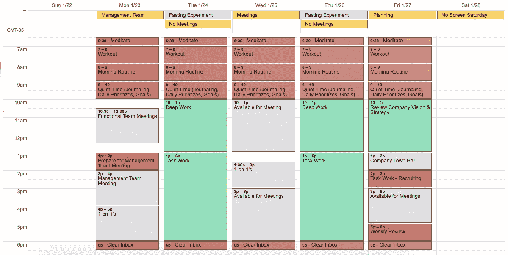

# 我作为初创公司 CEO 的理想工作周

> 原文：<https://medium.com/swlh/my-ideal-work-week-as-a-startup-ceo-5d3a4bd8ccc7>

## 我一天中最重要的四个小时

每三个月，我都会检查我的日程表，删除那些低效的会议。这个过程让我能够积极主动地**控制**我的时间，而不是对我的日程表做出反应。

如果你离开开放空间，人们将开始在你的空闲时段预订时间。所以，在你最重要的事情上，划出你需要取得进展的时间是很重要的(麻省理工)。

Y Combinator 的这篇文章围绕着“[创业公司 CEO 的第二份工作](https://blog.ycombinator.com/the-second-job-of-a-startup-ceo)”启发了我如何度过我的时间。它谈到了从实干家到公司建设者的转变。

我理想中的工作周是这样的:我有 50%的时间参加计划外的会议，这让我可以思考并专注于“深入”的工作。这只有通过建立一个伟大的领导团队才有可能。

我的日历——我可以 100%控制我的日程安排，如下所示:

*   **周一**:这是我和领导团队开会的地方。我发现这很有效，因为我们可以在本周早些时候作为一个团队进行同步。它也清空了一周剩余的会议。
*   星期二星期四:如果可以的话，这两天我可以集中精力做更深入的工作。(这几天我也在试验[间歇性禁食](http://jamesclear.com/the-beginners-guide-to-intermittent-fasting)。)
*   **周三:**又是一天，我要召开会议。这些会议可能包括候选人面试、投资者会议或团队会议。
*   星期五:我会花大部分时间来计划星期五。这包括制定公司愿景和战略，并以每周回顾结束。
*   **周六**:“无屏幕周六”是我从[蒂姆·费里斯](http://tim.blog/2016/03/29/deloading-phase/)那里采纳的一个想法。我不用笔记本电脑，只用手机看地图和通过短信与朋友联系(不用应用程序)。

以下是我每周遵循的不同惯例。

我的大脑和能量水平就像煤气罐。它在一天开始时充满，随着我一天中做更多的决定而耗尽。

我喜欢在一天开始的时候关注最困难的事情。它可以防止决策疲劳和一整天的成就感。

*   早上:我给自己时间让*醒来*，这样我就不会感到不知所措。我的日常工作通常包括某种形式的锻炼、写日记和安排一天的优先顺序。值得注意的是，我每天晚上睡 7-8 个多小时。
*   **深度工作:**我把它分为战略性工作和创造性工作。战略工作包括找出问题的解决方案。创造性的工作包括写作和让我的好奇心漫游未来。
*   任务工作:这包括我一周内优先考虑的项目的行动步骤。可以是与招聘相关的事情，为董事会会议做准备，或者对工作进行反馈。

当然，也有这样的例子，我的时间表被打乱，打乱了我理想的一周。在这种情况下，我会尽最大努力把早上 6 点到 10 点之间的时间作为我集中注意力的神圣时间。

这些年来，我明白了你从计划一周中获得的优势将会在长期内带来回报。你的日历中会有更少的随机会议，有更多的时间关注最重要的事情。

在我看来这是双赢。

*→以后想收到我的消息，订阅我的* [*月报。*](http://newsletter.mikekarnj.com)