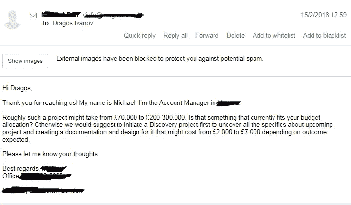

# 我的 2018 年 SaaS 创业之旅——第一部分

> 原文：<https://medium.com/swlh/my-journey-of-building-a-saas-startup-in-2018-part-one-9dadb931f392>

我有一份很好的工作，是一名移动软件开发人员，我并不富裕，但我有一份稳定的收入，一个很好的姐姐，一个很棒的女朋友和两个健康的父母，他们非常支持我选择做的一切，即使他们离我很远。

为什么我要开始这段旅程呢？这段旅程将会扰乱我的生活，在接下来的几年里会有很多起起落落。

如果你们不知道我在建造什么，请在这里阅读我的第一篇文章

我不确定这是不是每个创业者的定义，但我会告诉你“我的为什么”。

# 为什么我要建立 Netcrumb？

它是发自内心的东西；那是激情，那是建造某种东西并将其释放给世界的渴望。我没有一天不想拥有自己的事业。

我在 Google Play 上有几个应用程序(都是免费的)，当有人给我留下评论说这对他们帮助很大时，我很高兴。

我对创建 **Netcrumb** 如此兴奋，以至于我晚上睡觉时都无法断开连接，而且我几乎无法入睡，因为我在想我可以在我已经构建的基础上添加什么功能。

我知道这是不对的，但我认为每个企业家都有这一点。

当他们去一家商店时，因为一些朋友告诉他们那里有最好的橙汁，他们不能完全享受他们的饮料。

企业家想的是那家商店赚了多少钱。他/她能找到更好的方法来制作橙汁吗？你知道我的想法…

当然，每个人都想赚钱，这是最终的目标，但在此之前，其他的成就让我们开心。

每个企业家都有远大的梦想。即使他们开始只是一家咖啡店，他们仍然梦想几年后在世界各地拥有 100 家咖啡店。

> 我一直有想法。这对每个人来说都是一场噩梦。想法太多。

我的朋友可以确认我对某件事兴奋的次数，然后我会放弃它。

即使这十年我还是造了几样东西。我不能说它们中的任何一个是成功的，因为没有一个带来任何收入(可能在 100 美元以下),考虑到我发布这些的时间，我会说它们有些失败。

现在回到我脑海中所有的想法，我不认为他们是一个。

就像在婚姻中一样。

当你向你的女朋友求婚时，你知道你将和她共度余生。

想法也一样。我有很多，但没有一个能让我“嫁”给它。没有什么能让我感受到我在上面写的关于 **Netcrumb** (这是一个相当大的宣言。我肯定这让我女朋友嫉妒了。)

我想说的是，当完美的想法来临时，你会感觉到，这就是我去年发生的事情。

# 这一切是如何开始的

那可能是 10 月或 11 月，我浏览着不同的页面，像往常一样，想法在我的脑海中流动，直到有一个想法出现。

所有这些在 Linkedin 上给我发信息的招聘人员，他们一遍又一遍地发送相同的信息，我不确定他们是否有什么东西或者是点击诱饵。

不要误解我，我对招聘人员没有任何意见，他们在我的职业生涯中帮助了我很多，我要感谢他们。但是像任何行业一样，有些人比其他人做得更好。

好吧，Dragos，但是这些和 Netcrumb 有什么关系？

这听起来可能很疯狂，但我现在建立的想法是从这里开始的，我转向了。

就在我有了这些想法之后，我给一些招聘人员的朋友发了信息，我问他们为什么不为他们的每份工作制作漂亮的登陆页面。

在谈论这个的时候，他们告诉我这不是一个大问题。招聘人员面临的问题是人们如何制作他们的简历。

有几天，我脑海中有一个想法，如何帮助人们创建他们的简历，但大量的软件可以做到这一点，当然，我放弃了这个想法。

在这一点上，我仍然认为，即使招聘人员的反馈不是最好的，为工作创建优秀的登录页面也是非常好的。我知道，有时候我很固执。

几天后，在还在思考如何创建这样一个服务后，我告诉自己。

> “为什么只有招聘人员？如果有人能在几分钟内为他们创建一个漂亮的登陆页面会怎么样？为什么要花几个小时或几天来建立一个网站，而大多数时候 CSS 和 HTML 是相同的，只是一些颜色，字体，设计和文本不同。代码都差不多？”

你猜怎么着？我记不清具体是哪一天了，但是当我看到它的时候，我正在做我通常的**产品搜寻**日常访问。它是那天的第一名，和我的想法一样，它很漂亮，是我到那天为止见过的最好的网站建设者。

我不确定我是否应该说出它的名字，因为不知何故它是一个竞争对手，但最终，它是一个伟大的工具，我想让我的 web 应用程序变得更好。我不关心比赛。这个网络应用叫做 **Launchaco** 。

*我首先想到的是“这真是一个奇怪的巧合”。*

当我认为我找到了我想要实现的完美想法时，其他人启动了它。后来我发现这是 Launchaco 的第二个版本，他们在一年前发布了这个产品。

> 我说，现在怎么办？我怎样才能造出比这更好的东西？我为什么要这么做？有什么方法可以让我做得不同吗？

几天来我一直有这些想法，直到我意识到一件事。

Wordpress Dragos 怎么样？你在 Wordpress 上创建了很多网站，所有和你合作过的构建器都非常难用。

如果你可以制作一个 Wordpress 主题生成器，它可以用一个漂亮的响应设计立即创建一个网站，而不是搜索一个主题，安装它，学习使用他们的生成器等等。

事情就是这样开始的。

我有这个想法和我脑海中的一切。

# 接下来发生了什么？

我已经开始寻找潜在的竞争对手，检查所有的建筑商，看看他们是如何工作的。

没有人做我想做的事。

我开始与人们交谈，他们分享了关于如何建立 Wordpress 网站的相同想法:你可以购买一个主题，安装并尝试定制它(你也需要一些设计技能),或者你可以雇佣一个为你做所有事情的开发者。

预算的差异很大。

第一种方式很便宜，可能 100-200 美元加上主机和域名，第二种方式很贵，一个简单的 Wordpress 网站可能超过 1000 美元。

我知道我的想法会成功，接下来我想知道的是:“我能验证它吗？”

我需要推出什么样的最低可行产品，才能测试我所有的假设，并得到其他用户的确认？

答案来得相当快。我开玩笑的。我花了几天时间。

我决定建立一个 web 应用程序来证明我脑子里的一切。

当然，第一版不会有所有可用的特性，也远非完美，但我希望它能带来价值。我未来客户的反馈会让它变得令人惊叹。

现在我有了一个想法和一个决定，我需要开始实际的产品工作。

# 我有什么选择？

我自己建或者花钱请人来建。

我是一名 Android 移动开发人员，这意味着我的技能与 Java——Android 有关，但这两者不是我构建项目所需的。

我可以学习构建 **Netcrumb** 所需的所有其他编程语言吗(Javascript 和 PHP)？当然，我可以，但是要花多少时间呢？也许 1-2 年，我仍然不够好，不能提出这样的申请。

所以我选择了第二个选择。雇佣其他人来做这件事，我会尽我所能帮助他们，我知道。

这个决定很容易，但是我没有足够的钱来买这样一个应用程序。

我开始计算产品的第一个版本要花多少钱。

首先，我想到了所需的小时数，然后是市场上的小时费率。

我计算了一下，如果我找到一些每小时工作 40-50 美元的开发人员，那么我最多需要 30，000 美元。

# 我做了什么来得到这笔钱

我调查过贷款，发现了一家名为[维珍的初创企业](https://www.virginstartup.org/)。他们提供高达 25，000 英镑的 6.2%固定利息，你欠公司 100%的债务，但你必须每月还款。这种贷款只提供给英国的初创企业，并附带免费的辅导支持和其他重大福利。这是一个不错的选择，但获得 25k，然后每月支付 500 英镑左右的想法有点太冒险了。我以为这将是我最后的选择。

接下来，我申请了加速器。我是无意中发现的，是给罗马尼亚企业家的。我仅有的东西只是一个想法，但他们说他们会资助想法和现有的业务。如果他们选择了你，他们会给你 25000 欧元，买下公司 7%的股份。他们可以再给你 10 万欧元来购买公司的另外%的股份。

我为我的申请准备了几天，但显然，他们没有选择我。他们决定只挑选现有的企业。

当这一切发生的时候，我兴奋地和我姐姐谈论我想要创造的东西。我告诉她我想怎么做，我在解决什么问题。她可能看到了我眼中的激情，因为一个月后她对我说，她想帮我建造这个东西，并获得公司的一定比例(10%)的股份，一旦我可以，就退还她的钱。

好消息。我知道我必须找到一些开发商。

# 我如何找到帮助我创业的团队

我自己也是一名开发者，我从来不认为找到一个代理或一些开发者来为你制作一个 web 应用程序有那么难。我可以想象这对一个没有这方面知识的人来说有多难。

## 我做了什么？

首先，我想雇用单独的开发人员来开发应用程序，最后，我会将它连接起来，但这是一个坏主意。

我需要一个小的代理机构，没有很高的费用，可以帮助我建立我的 MVP。

我开始寻找 Upwork，因为如果我通过 Upwork 工作，那么他们会努力做得很好，因为没有人希望看到糟糕的评论，我看了又看，找到了乌克兰和俄罗斯的代理机构，价格符合我的要求。

我找到了一些代理机构，我在谷歌上搜索了一下，这样我就可以直接联系他们了，但最终，我还是通过 Upwork 找到了他们。

我收到了一些电子邮件，甚至 Skype 电话，但他们大多数人不明白我想要建立什么，或者他们的报价对于我解释的我想要的是巨大的。我甚至估计为 20-30 万英镑。

他们中的很多人不再回复我的邮件，他们可能认为我不是认真的，但这就是生活。

当我在做这些事情的时候，一个伟大的罗马尼亚开发者邀请我在脸书上喜欢一个新的页面。他和另一个很棒的人一起开了一家新的开发公司。

我是在他去都柏林做软件开发工作两年前遇见他的，但现在他回到了布加勒斯特。

我给他发了一条关于脸书的信息，我们讨论了。我把我的想法告诉了他，然后我和他以及他的搭档在 Skype 上通了几次电话，他们准确地理解了我的计划。他们知道我想要建造什么，在接下来的几天里，他们给了我大约 19，000 欧元的估价。

后来，我们在 3 月 30 日签了合同，但实际上是 16，000 欧元，因为我从产品的第一个版本中删除了一些功能。

我知道这并不多，我也知道在伦敦或旧金山，这可能会让我花费 10 万英镑或更多，但这只是一个开始，我非常肯定，如果他们能帮我打造我想要的产品，我会给他们带来更多的工作和更多的收入。

我暂时不想透露他们的公司名称，但如果他们为我做了出色的工作，那么你会发现的。

我们签了三个月的合同，但我知道发布测试版需要 4-5 个月。

如果你想在我建立我的 SaaS 创业公司时跟随我，并成为第一个知道 Netcrumb 何时发布第一个版本的人，那么请在下面的表格中订阅。

在下一部分，我将写下我们在第一个月做了什么。

## 这篇文章发表在《创业公司》杂志上，这是 Medium 最大的创业刊物，有 320，131+人关注。

## 订阅接收[我们的头条](http://growthsupply.com/the-startup-newsletter/)。

