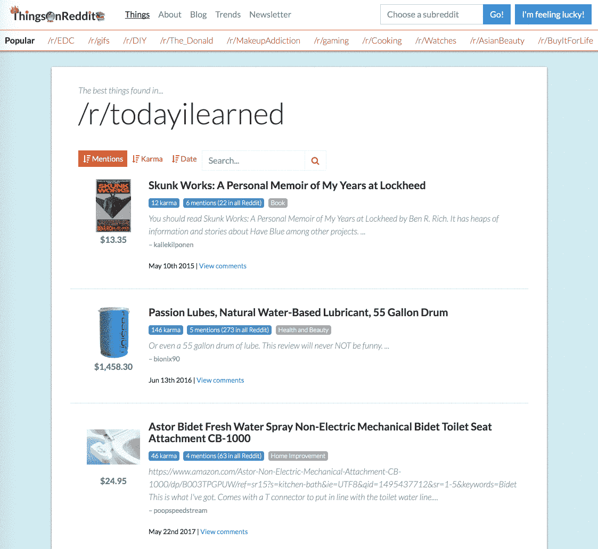

# 我开启亚马逊联盟的旅程

> 原文：<https://medium.com/swlh/my-journey-to-unlocking-amazon-affiliates-202faf99a098>

Photo by [Olga DeLawrence](https://unsplash.com/photos/1jbxXN4OkMM?utm_source=unsplash&utm_medium=referral&utm_content=creditCopyText) on [Unsplash](https://unsplash.com/?utm_source=unsplash&utm_medium=referral&utm_content=creditCopyText)

从属节目是惊人的。你所要做的就是把人们引向其他人的神奇产品，然后砰的一声，你就能分到一杯羹。许多网站都有联盟计划，比你想象的要多。这个空间中的一个庞然大物？亚马逊。亚马逊有各种各样的商品可以推荐，也有可靠和值得信赖的声誉，很容易让人们购买亚马逊的商品。

然而，亚马逊已经变得越来越难以被他们的联盟计划所接受。他们现在有一份[14867 字的文件](https://affiliate-program.amazon.com/help/operating/policies)详细说明了联盟计划政策。我建立了一个网站，获得了大约 30，000 次浏览，400 美元的收入，然后当亚马逊拒绝了我的申请后，这个网站一夜之间就消失了。如果这种情况再发生一次，直到我最终被这个项目接受。事情是这样的。

# 它是如何工作的

首先快速概述一下亚马逊联盟计划是如何运作的。注册亚马逊联盟计划很容易；你只需要在这里创建一个账户:[https://affiliate-program.amazon.com](https://affiliate-program.amazon.com/)。这个*并不意味着*你可以开始收获这个项目的好处。所有赚到的钱都会被追踪，如果你被接受，你会得到那笔钱，如果没有，那笔钱会被删除，没有如果，和但是。创建帐户后，您将获得一个附属标签，附加到您的亚马逊产品上，这样它们就可以记入您的帐户。

例如，如果你的标签是`thingsonreddi-20`，你可以简单地添加一个 URL 参数来标记你的标签:[https://www.amazon.com/dp/B008M5U1C2/?tag=thingsonreddi-20.](https://www.amazon.com/dp/B008M5U1C2/?tag=thingsonreddi-20.)有其他方法来标记一个 URL，但是如果你正在生成你自己的 URL，这是最简单的。

应用程序很简单。当你注册会员账户时，它会问你一些简单的问题:

1.  您计划在哪些网站/移动应用程序上使用您的代销商标签？
2.  你的网站是关于什么的？
3.  什么主题最能描述你的网站？
4.  你打算卖什么类型的商品？
5.  你的网站或移动应用是什么类型的？(思考:博客、比较购物等)

唯一自由回答的问题是你如何描述你的网站。这很重要，但不要撒谎，因为检查的人会去你的网站自己发现。

一旦你完成了你的申请，你必须等待它被处理。它不会被立即处理。为了让你的申请被审查，你必须做 3 个合格的销售。

# 第一次迭代

我不知道自己想要建立什么，在 IndieHackers 上看到一个名为 [HNBooks 的成功联盟网站后，我注册了一个亚马逊联盟账户。他们获得了 300 美元的被动收入。这似乎很容易，我的第一个想法是创建一个名为 LensRadar 的网站，让人们可以轻松有趣地比较相机镜头。这是我在亚马逊联盟账户申请中提出的，并没有想太多。](https://www.indiehackers.com/businesses/hacker-news-books)

我很快对这个想法失去了热情，并有了一个新的想法:如果我把 Reddit 上的每个 Amazon.com 链接聚合起来，并通过 subreddit 进行组织，会怎么样。被提及次数越多，排名就越高。就这样， [ThingsOnReddit](https://thingsonreddit.com/) 诞生了。我花了大约一周的时间建立了一个 MVP，并将其发布在 HackerNews 上。

当我看到头版时，我激动不已:

登上 HN 之巅，看着访问者涌入你的网站，这种感觉无与伦比。

我已经准备好赚那笔钱了。那时我已经独立生活了几个月，还没有挣到一美元。我很快意识到，根据分析，我可能会得到相当多的推荐。

亚马逊联盟网站每 24 小时才更新一次他们的分析，但这并没有阻止我每 5 分钟刷新一次页面。

最终结果出来了，我一天之内赚了 300 美元，转换率很高。第二天，我意识到我必须将我的应用程序更新到我的新站点，并描述它做了什么。

我焦急地等待我的申请被审查。你大概能猜到接下来发生了什么，否则我不会写这篇文章。

什么！

是的，他们审查了我的旧申请，查了根本不存在的 lensradar.com。

我刚注册了一个账户，它就不见了。我无法登录；我看不到我以前的分析。

我马上新建了一个账号，投诉支持。他们理解这个问题，并说他们会重新提交并附上一个说明。第二天，我收到一封电子邮件，说不可能审查已关闭的申请，我必须重新开始。

这是在 ThingsOnReddit 上工作时最令人沮丧的经历之一。

# 拿两个

已经有一些关于 HN 和印度黑客的评论质疑我是否会被这个项目接受。

作为回应，我在我的网站上添加了一个博客，并张贴了一些我从做这个练习中学到的有趣的花絮。例如，你知道关于/r/基督教最受欢迎的书籍之一是*“上帝和同性恋基督徒:支持同性关系的圣经案例”*

我花了更长的时间来审查我的申请，因为我的网站流量开始直线下降。当我最终完成截止日期时，这是我得到的结果:

没有足够的独特内容。很难不在这一点上有点醒悟。

# 第三次最有魅力

所以第三次，我终于得到了我的认可。一个半月后。申请亚马逊合作伙伴计划很大程度上是一个黑匣子，我不能说是什么让我被接受，但我会检查我对我的网站所做的改变，以及我在申请中使用的措辞。希望你能以此为数据点建立自己的联盟网站。

# 主推产品

我先静下心来，创作了一些原创内容。我没有创造很多，但我确实为一些我自己买的或者阅读 Reddit 评论收集一些见解的流行商品写了评论。然后，我的登陆页面就展示了这些东西以及它们的自定义评论

# 不太激进的亚马逊链接

该网站的最初版本积极地将用户与 Amazon.com 联系起来。我显著地改变了信息流的工作方式，这样用户会在网站上停留更长时间，并且只有在他们明确想要的时候才会被导向亚马逊。其思路是:用户(和亚马逊的评论者)更有可能看到其他 Redditors 对该产品的评论，为网站增加价值和原创内容。

**在**之前

Send users directly to Amazon.com

**在**之后

Send users to relevant Reddit comments

“对亚马逊的看法”现在微妙多了。

# 博客

这次我加了更多的帖子；当我第二次提交申请时，我只有一个帖子。我会向任何试图获准加入博客的人推荐。亚马逊联盟计划资源中心有题为“开博客的五个理由”的文章，这向我表明这只能帮助你的应用程序。

# 应用程序

在整个过程中，我看到许多网站似乎和我做着同样的事情，并且获得了批准。我希望我知道他们在申请中写了什么。对于那些试图获得批准的人，以下是我写的:

> *ThingsOnReddit 在 Reddit 上发现独特的产品。主页上有一个精选商品的手工列表，以及找到你要找的商品的最佳子目录。例如，如果你正在寻找家里的东西&厨房，你可能想结帐/r/咖啡。实际的列表是可排序和可搜索的，并为你提供其他用户对 Reddit 评论中的项目的评论信息。除了显示评论，许多产品都有自定义的书面评论，总结其他 redditors 说过的话。评论每天都在增加。ThingsOnReddit 还提供了一个趋势页面，允许用户在不同的图表显示中看到什么样的东西被发布到 subreddit。最后，ThingsOnReddit 提供了一个博客，我可以在这里搜索最好的项目，找到最有见地的评论，或者发布关于 Reddit 上发现的项目的有趣内容。*

# 经验教训

概括地说，我将列出我在整个过程中学到的一些经验。

*   **运气和随机性** —我有很多理由相信亚马逊将申请审核过程外包出去。我的申请在太平洋标准时间晚上 11:16，凌晨 1:05 和凌晨 3:57 收到了电子邮件回复。基于这一点，我猜这些正在被地球另一边的人处理。根据你得到的人，你可能会得到不同的决定。
*   **不就是不**——做出的决定没有上诉的余地。他们所说的是最终的，支持不能帮助你。你只需要再试一次。
*   **原创内容**——这种原创内容的想法有些令人恼火，因为它太模糊了。以一种新颖的方式聚合产品的概念难道不是原创吗？我能给的最好建议是不断添加评论(或类似的)并突出它们。这似乎是他们要找的东西。
*   一般来说，人们不喜欢你在网站上使用联盟链接。对此要坦诚。如果你想被录取，你需要做足够的销售来确保申请被审核。

# 我现在在哪里？

现在我被批准开始通过亚马逊联盟赚钱，我已经赚了第一笔 11 美元。我专注于让用户访问网站。我每天接待大约 10-15 名访客，流量还在慢慢增加。

我正在努力提高我的谷歌搜索排名，这样当有人用谷歌搜索“最佳 reddit X”时，我的网站就会出现在第一页。这是我在谷歌页面排名的搜索控制台图表:

我还使用[trackreddit.com](https://www.trackreddit.com/)在有人在 Reddit 上提到“最佳 X”时通知我，这样我就可以对这个网站发表评论和留言。

祝你好运，并希望你得到批准！

## 这个故事发表在 [The Startup](https://medium.com/swlh) 上，Medium 的出版物有超过 256，410 人关注。

# 订阅[在此获取头条](http://growthsupply.com/the-startup-newsletter/)。

