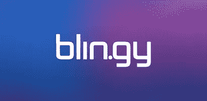

# 我的移动增强现实初创公司倒闭了，所以你的不会

> 原文：<https://medium.com/swlh/my-mobile-ar-start-up-died-so-yours-doesnt-have-to-77ffc04ed64d>

在直播的几个月里，Blin.gy 获得了超过 100 万的下载量，但是如果你不是 10 到 13 岁的孩子，我敢肯定你没有看过它。现在你肯定不会了。因为我的移动 AR 创业公司死了。这就是为什么你的不需要？

# **第一次尝试**

Blin.gy 是我们早期应用 Chosen 的一个支点，它试图将性能竞赛空间游戏化。(想想观众作为评委竞争的移动美国偶像平台。见我的 [**中型**](/@DavidCHhyman/it-s-a-new-musical-dawn-it-s-a-new-musical-day-9f7cf03b61ce) 发布会。)

通过我们与 Ellen Degeneres(她持有我们的股份，并将我们的应用程序整合到她的节目中)一起努力建立 Chosen 并获得了一个看起来非常棒的营销机会，我们获得了大量关于我们用户的数据，以更好地了解应用程序的哪些部分正在工作。

(ee 选在 Ellen… )

早期最明显的教训是，那些作为表演者使用应用程序的人在保留指标上大大超过了那些作为观众或评委参与的人。推动 SnapChat 和 Musical.ly 等应用的是同样的力量:我们的文明似乎无止境地渴望使用移动工具作为自我表达和分享的工具。

虽然我相信试图将观众变成法官的概念，但试图用我们坐拥的现金破解这一代码，是一个比找出如何改善我们的自我表达工具并让它成为表演者更好的地方更有风险的提议。

*选择的早期外卖:*

*   *在你放弃任何股权或为你希望成为的大规模漏斗付费之前，确保你已经建立了一个具有高留存指标的应用程序。如果你没有建立一个更好的捕鼠器来留住用户，你的顶线安装是不重要的。*
*   *全力以赴快速破解留存密码。购买尽可能少的用户，以获得最少的必要数据，从而达到预测未来性能指标的统计意义..你所有的注意力都在这里。如果超过 40%的用户在安装后的第二天(d1)会回来，超过 20%的用户在 30 天后(d30)会回来，那么你就走在了一条非常好的道路上。如果你的数字在南边，你就不能把视线从这个球上移开。*
*   警惕名人的牵线搭桥或与吹嘘自己社会关系的潜在大型经销商的任何交易。与寻找应用安装的直销商相比，这些交易对品牌建设者更有利。名人或分销合作伙伴越大，他们每个追随者的转化率就越差。

# **枢轴**

带着对我们改善自我表达工具的期望路径的了解，我们对过多的 AR 风格应用程序产生了新的看法，这些应用程序基于面部检测和跟踪来创建视觉效果(例如，给你一张兔子脸或允许抛射彩虹呕吐)。虽然这些应用程序将幻想叠加到现实上，但我们认为将现实叠加到幻想上会很新颖且与众不同。

我们的目标是将用户实时叠加到他们选择的背景上，只需要他们的手机。不用说，这真的很难做到。尽管这些面部变形工具只需要近似你的眼睛、鼻子或嘴巴，我们需要准确地知道你的身体与背景的边缘，没有绿色的屏幕！我们的支点来自我们现有的投资者的额外资本，他们继续相信这个团队。(谢谢 DCM，铑，坎伯兰！)

我们很快就达到了最低基线。然而，让它正常工作是非常困难的。几周变成了几个月。我一直把原型放在我女儿的手里，并得到一致的反馈，说它还不够好。我们需要一个过渡步骤，让用户站在一堵纯色的墙前，以便将他们与背景区分开来。这是他们从视频整合中获得好结果的唯一途径。

要求孩子们像这样多做一步真的很难。我担心它飞不起来。但是只剩下四个月的现金，我们别无选择。我必须进入市场，获得牵引力，并找到风投。压力大？你打赌！

*预发布 Blin.gy:*

*   *每件事都至少需要你计划时间的两倍。如果你没有两倍于工程师预测的运行率，加上上市和迭代所需的时间，就不要前进。*

就在发射前，我们的工程师有了突破。他们上过机器学习的速成班，用谷歌的 Tensorflow 训练人工智能引擎。我们把孩子们带进来，让他们站在绿色屏幕前，来训练我们的算法，并且接近拥有一个轻量级的推理机，可以与手机上的图形处理器一起工作。我们还需要几个星期，也许几个月的时间来优化。但是我们没时间了。我们不得不接受这个尴尬的过渡步骤。

我们迫切需要伟大的保留指标和一些日常活跃独特的早期增长——在几乎没有成本的情况下——展示产品的病毒式粘性。因此，我们与 Musical.ly 有影响力的人合作，他们同意创建“blin.gies ”,并将它们上传到 Musical.ly，与他们的数百万粉丝分享。

成功了！我们以低于 0.10 美元的价格安装了 100 多万次。这些视频是完美观众的完美目标。相对于 Instagram 和 YouTubers，Musical.ly 上的影响者仍然被大大低估。考虑到 Musical.ly 不允许嵌入外部链接，如 app store 链接，这一转换就更加惊人了。所有用户看到的都是我们在视频上的水印，于是他们自己安装了这个应用。

*(看 Blin.gy 在行动！…)*

因此，我们开始获得用户，但这里是橡胶很快遇到了道路。如果没有不理想的中间背景检测步骤，许多用户看到的视频质量低于一流。这当然对我们的保留指标有很大的影响。我们需要 40%的首日回报率，而现在接近 25%。

时钟一直在滴答作响。

# **疯狂的比赛**

银行里只剩下 60 天的现金，我需要找一家风投公司给我们一份投资条款清单，这样我们就能从现有投资者那里获得一座桥梁来完成交易。我们别无选择，只能带着次优的保留指标和未完成的产品去风险社区。我们必须推销我们的计划，用更好的技术来改善指标——一旦我们的机器学习得到完善，产品像魔法一样工作。

我们安排了 18 次风投会议，然后艰难地上路了。

反馈令人大开眼界，而且大体相同:

“真正伟大的技术和远见。但是这怎么变成平台呢？'

一遍又一遍，就好像他们都有一个集体的思想。我们的反击是 Instagram 和 Musical.ly 一开始是工具，后来变成了平台。他们的反驳:“对于每一个成为平台的工具，大多数都不是。你的会怎么样？”我们没有令人信服的答案。

滴答滴答滴答。

只剩下一个痛苦的举动。出售技术和/或团队。尽最大努力收回投资。将我们 18 次风投会议的销售模式改写为潜在收购者的销售模式。

许多世界上最受欢迎的科技公司都出席了会议。其中一个人让我们一周又一周地用我们的机器学习技术为他们建造原型，要求我们达到更高的标准来证明改进。

我们被告知我们被收购了。我在特拉维夫的工程师被空运过来接受为期一周的密集盘问。我们和我们的潜在追求者开了 20 多次会，所有的迹象和话语都说“是的！是啊！是啊！”爱和钦佩，救赎，以及即将到来的胜利的气息。你试着保持冷静，控制你的期望。但你也控制不住自己。我在警告我在特拉维夫的团队不要开始在加州找住的地方，同时，我也开始做白日梦了。

一周后，一封随意的电子邮件被发送，说他们通过了。没有给出原因。现在，我们银行里还有两周的现金。足以裁员和支付遣散费。游戏结束。

*最后的收获:*

*   控制你的期望，保护你的心灵。把期望值定得低并超越比把期望值定得不切实际的高并受到伤害更容易。你知道“直到钱存进银行”这句话吗？嗯，我已经让一个投资者把他们的钱从我们的银行账户里取出来了。所以相信我说的话。
*   *对你正在做的事情要有坚定的信念，这样你才能有弹药和能量坚持到底。这需要巨大的努力，而且只有当你完全致力于这个愿景时才会实现。我仍然沮丧地相信我们的愿景。*

向一座山发起冲锋却永远也不能到达顶峰是不容易的。但是你确实通过所有的艰苦工作增强了你的耐力，希望你从攀登那些高度中获得新的视野和清晰。这对心脏也有好处。有时候失败的痛苦可以激励你接受下一个挑战。

## 这篇文章发表在《T4》杂志《创业》(The Startup)上，这是 Medium 针对企业家和创业公司的领先出版物。

# 你可以订阅[在这里获取头条](http://growthsupply.com/the-startup-newsletter/)。

