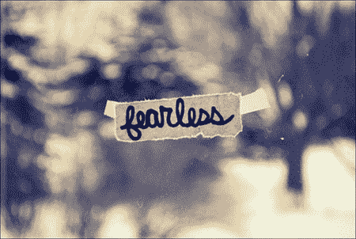
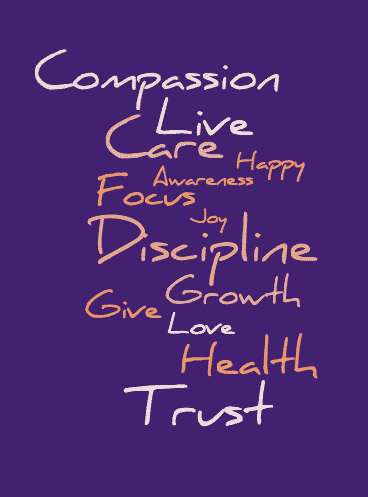

# 我的新年仪式:一个词的意图

> 原文：<https://medium.com/swlh/my-new-year-ritual-a-one-word-intention-db074d64b10b>

今天对我来说是反思的一天，我经常被问到新年的目标。在过去的三年里，我一直在尝试一种不同的新年仪式:为一年设定一个词的目标，而不是具体的目标。

设定具体的个人目标会限制我。我感到封闭，因为任何与我的目标不一致的事情我都会不予理会，因此，我不会对眼前的新机会敞开大门。虽然我仍然为我的事业设定目标，但我在个人层面采取了不同的策略。

一个词概括了我的年度目标。它故意非常抽象，充当北极星和指路明灯，帮助我在旅途中做一些小决定。这就像是今年的一个主题，有很多空间和创造力让我把它带到生活中，但现在感觉是对的。成功是由我自己决定的，我会检查自己的感受。

# 我的意图

三年前，我开始了这个仪式，将**发现**设定为我 2015 年的目标。这是我在新年前几天洗澡时想到的，当时，我不知道它会如何显现，但当时感觉很对。接下来的一年里，我发现了新的地方，独自度假旅行(第一次)，更多地了解自己(对一些正念练习感兴趣)和新的友谊。

次年，我的意图是**能源**。这主要表现为创造性能量，我对即兴表演、舞蹈产生了兴趣，开始了定期的日志练习，并开始了这个博客。由于这个意图，新形式的创造性能量进入了我的生活。去年，我的意图是**自由**，确切地说是我思想的自由。我的正念练习(冥想、瑜伽等。)加深了，这一年来我越来越意识到什么时候我的思想感到自由，什么时候没有，以及如何为自己培养一种更大的和平与平静的感觉。

今年，我的意图是**无畏**。我不知道这将如何出现在我的生活中，这是有趣的部分！我有一张空白的画布，想怎么画就怎么画。

# 你的意图的灵感

在过去的两年里，我的父母和姐姐都和我一起参加了这一仪式，我们每个人不仅设定了一个目标，还相互分享，找到相互支持和鼓励的方法(当我们记得的时候)，或者只是谈论它(我们大约每个月在晚餐时谈论一次)。在过去的一年里，几个朋友也制定了一个意向，这是一个更深层次联系的好方法。

以下是我生活中的一些人设定的目标，并与我分享。

到目前为止，你可能已经想出了 2018 年的目标。如果没有，暂停一会儿，不要想太多，注意会出现什么。选择一个你觉得和它有强烈联系并为之激动的词。这是你未来旅程的燃料。

现在，这里是我的一些实践，让你把目标放在第一位:

*   在年初(即现在)和每一两个月写一次日志
*   与我亲近的人分享(现在也包括你)
*   快速的每日反思，用一句话记录我的意图在一天中是如何出现(或没有出现)的
*   让这个词在我周围的物理空间中可见

既然你知道了我的意图，我很想听听你的。新年快乐

库纳尔

— -

*库纳尔·古普塔是* [*极地*](http://www.polar.me/) *的创始人& CEO。关注他的领导力博客*[*find focus . today*](http://findfocus.today/)*。在 Polar，Kunal 领导着一个才华横溢的团队，用技术改变媒体出版业。他热衷于领导力和在现代寻找焦点。在*[*LinkedIn*](https://ca.linkedin.com/in/kunalfrompolar)*，*[*Medium*](/@findfocus)*或*[*Twitter*](https://twitter.com/kunalfrompolar)*上与他联系。*

## 这个故事发表在 [The Startup](https://medium.com/swlh) 上，这是 Medium 最大的企业家出版物，拥有 277，994+人。

## 在这里订阅接收[我们的头条新闻](http://growthsupply.com/the-startup-newsletter/)。

