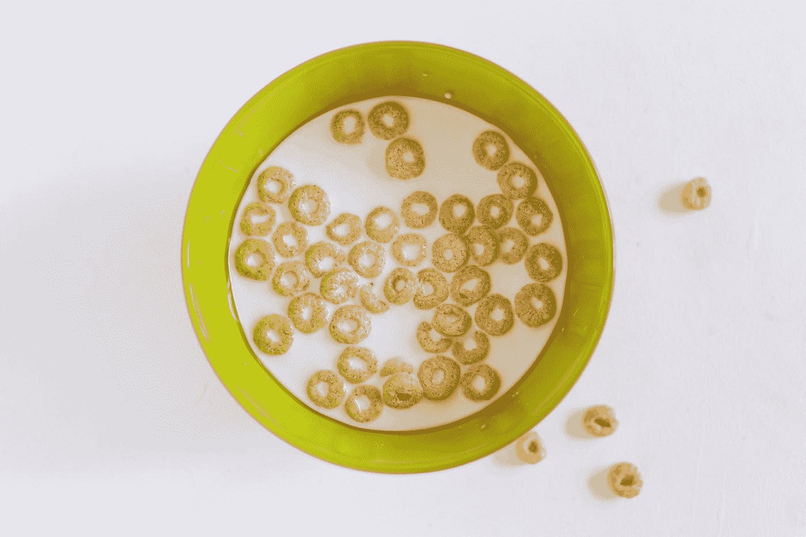

# 我的个人品牌是吃麦片和喝橙汁

> 原文：<https://medium.com/swlh/my-personal-brand-is-eating-cheerios-and-drinking-orange-juice-aab131154086>

“Bowl of Cheerios cereal in milk” by [freestocks.org](https://unsplash.com/@freestocks?utm_source=medium&utm_medium=referral) on [Unsplash](https://unsplash.com?utm_source=medium&utm_medium=referral)

> 简而言之，我们培养了整整一代认为自己应该出名的人。但是出名并不是人们想象的那样。对名声的渴望，而不是对实际成就的渴望，正在腐蚀我们的文化动机。”
> 
> **~雷吉的博客**