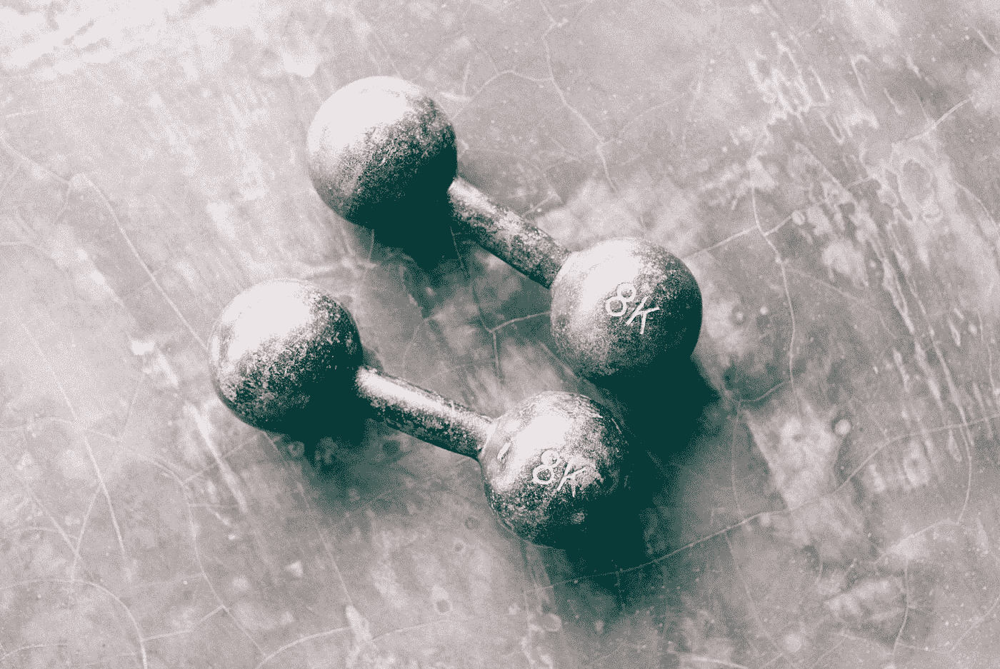

# 我与锻炼的关系(或缺乏锻炼)

> 原文：<https://medium.com/swlh/my-relationship-or-lack-of-with-exercise-3ca8e98426ea>

这篇文章是我的“31 天每天写作系列”的一部分，也是第三篇文章。点击这里阅读昨天的文章 [*。*](/swlh/waking-up-early-and-cultivating-my-morning-routine-48504ed0b708)

今天，当我阅读昨天的文章时，我注意到我提到了 ***练习*** 。

这促使我进一步思考我与锻炼的关系，以及为什么是这样。

我希望在这篇文章中，我的诚实能引起你们中一些人的共鸣，他们也有过和我相似的经历。

## 开始

当我还是个孩子的时候，我总是很活跃。在学校参加体育运动，后来参加职业体育运动。

运动从来都不是一件苦差事。这从来都不是我必须强迫自己去做的事情。很有趣。令人振奋。在某些方面，我感到自由。

这是一种释放我当时压力的方式。

但是，当我还是个孩子的时候，除了上学，我没有真正的责任。我生活中需要的一切都为我准备好了。

所以这是一个奇迹，为什么现在，我老了很多，我对运动或锻炼没有同样的感觉。

## 现在

现在，我回想起有多少次我告诉自己“星期一将是我去健身房的一天”，我意识到如果我把这些话加在一起，它比我实际去健身房的次数还要多。

我真的没有借口。

我的公寓里有一个健身房，离我的床不超过两分钟的路程。

一个小时只占我一天的 4%,那么当锻炼的好处如此明显并深入人心时，我为什么不能把自己一天中的 4%都拖到那里呢？

# 寻找原因…

我告诉自己不去健身房的理由:

*   我没有足够的时间
*   今天是星期三，我不能在星期三开始，我必须等到星期一
*   我刚吃过饭，如果我现在去健身房，我会生病的
*   我度过了艰难的一天，我最不想做的事就是去健身房

我从不去健身房的真正原因？

我不想被打扰。

把它写下来真的很伤人，因为“有很多借口的我”仍然会证明我下周一会去健身房。

但事实并非如此。

现在，我准备承认这一点。我已经准备好接受这个事实，以前，我没有一个“为什么”，但这将会改变。

我经常思考“为什么”。

为什么我要做我的工作？

为什么我要和我交谈的人交谈？

为什么我吃我吃的食物？

在很大程度上，这些问题的答案归结为享受。我努力做尽可能多的令人愉快的事情。在很长一段时间里，锻炼并不是那样。

但是我已经准备好接受这个事实，也许我不喜欢去健身房，也许我不喜欢在下雨刮风的时候去跑步。

但也许有我喜欢的运动或锻炼，我准备去发现。

到目前为止，我今年的清单上有:

*   拳击
*   抱石
*   蹦床

如果你曾经遇到过我这样的情况，除了增强意志力，你还能找到什么有效的方法呢？在下面留言。

如果到目前为止你已经阅读了我在这个系列中的任何文章，我感谢你在我的旅程中陪伴我。如果这是你的第一篇我的文章，那么为什么不看看我以前的文章。

 [## 早起，培养我的晨间习惯

### 这篇文章是我的“每天写 31 天系列”的一部分，是第二篇文章。看昨天的文章…

medium.com](/swlh/waking-up-early-and-cultivating-my-morning-routine-48504ed0b708)  [## 我是一个作家，但是我从来不写…

### 白天，我是个作家。

medium.com](/swlh/im-a-writer-but-i-never-write-bd862f3bbce5) 

如果你喜欢这篇文章，给我一些掌声，这样其他人也可以喜欢它！:)