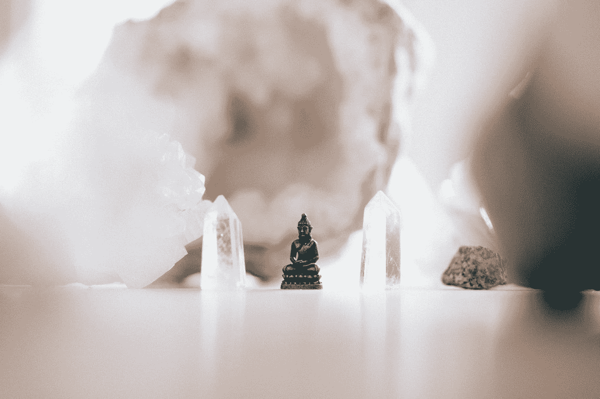

# 我与灵性的“磨合”

> 原文：<https://medium.com/swlh/my-run-in-with-spirituality-912df5ea0bee>

Photo by [Samuel Austin](https://unsplash.com/@samaustin?utm_source=medium&utm_medium=referral) on [Unsplash](https://unsplash.com?utm_source=medium&utm_medium=referral)

首先，我不是一个高度宗教或精神的人。我是一个*“做你自己”*的人——我相信别人和他们的信仰体系，我鼓励每个人庆祝他们想庆祝的任何事情。我有什么资格评判？

其次，我来自一个非常精神驱动的家庭。我的祖母读茶叶，我的母亲看到精神和用来导致降神会，我的妹妹看到和感觉精神在她身边。我的…