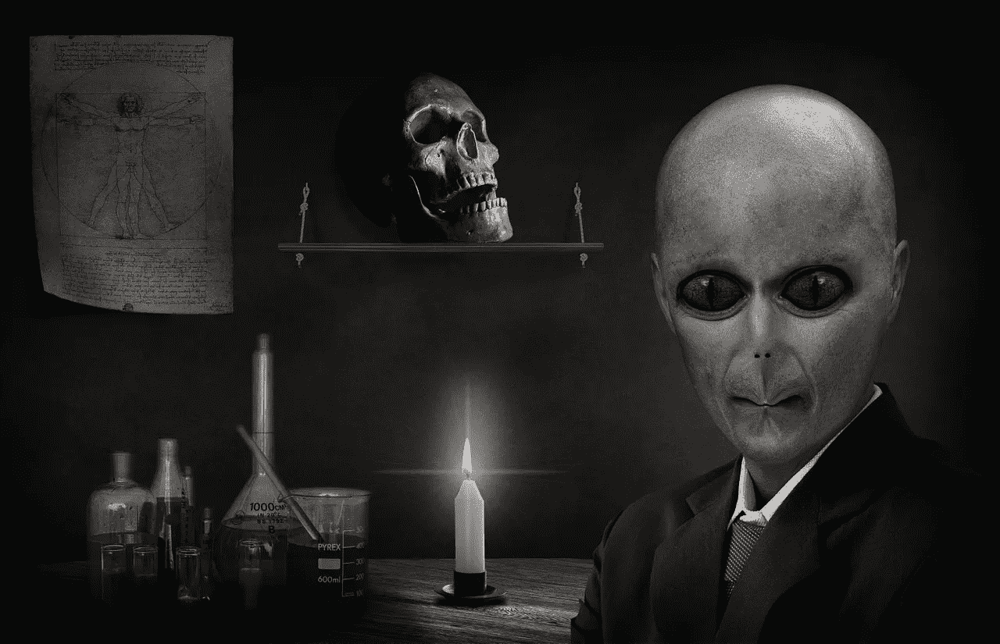

# 我成功的秘诀

> 原文：<https://medium.com/swlh/my-secret-recipe-for-success-968cd14c7db0>

不，我们都不是万能的。光明会也不行。

[Comfreak/pixabay](https://pixabay.com/en/alien-reptilian-portrait-politician-560710/)

在某个地方，在一个点着蜡烛的黑暗房间里，十二个老白人用他们低沉、邪恶、机械的声音放声大笑。他们的人工智能全球精神控制系统识别出我的副标题暗示光明会不是万能的。

是的，他们是光明会的大师。他们对我们的世界拥有绝对的权力，他们与 Neoptolemus 的星系间秩序的普遍骑士身份有关，Neoptolemus 对整个宇宙拥有绝对的权力。

光明会的人工智能精神控制系统正在 24/7 筛选我们所有的思想，识别可能威胁它们的思想种子，并有效地用亚原子阿尔法粒子波中和那些种子。

人工智能精神控制系统被编程来报告十二大师感兴趣的思想。在这种情况下，它知道我愚蠢的字幕会让它的主人发笑。所以才被报道出来。

**这就是我与个人发展行业的不同之处**

如果你想知道，不，我不相信他们中的任何一个，但肯定的是，这是很好的虚构。我喜欢丹·布朗的电影。尽管如此，我坚信没有人是万能的，这也是我不同于个人发展行业的地方。

如果你消费了足够的个人发展内容，你可能会认为你是万能的。你可能相信你可以成为，做，拥有任何你想要的东西。“没那么快，”我说。

当然，我们人类比我们想象的更有能力。然而，我们不是万能的。根据定义，这是错误的。根据定义，只有一个人是全能的。

一旦你有两个或更多的人，他们就会有矛盾的欲望，而这些矛盾的欲望中只有一个可以实现。因此，至少有一个人不是全能的。

底线是，不是每个人都是万能的，因为这是由个人发展行业推动的。此外，我不相信有一个无所不能的人类或团体存在。我们都分享我们的力量。这很好。

**那为什么个人发展行业会推动这种全能理论呢？**

这是一种营销伎俩，告诉人们他们想听的谎言，他们就会买你卖的任何东西。抱歉，说得太直白了。

**等等，这个博客不就是在给人们授权吗？**

是的，这是关于赋予人们权力，对人们撒谎并不能赋予他们权力。相反，这会削弱他们。只有[真相](https://ideavisionaction.com/personal-development/the-only-skill-you-need-to-succeed-in-life/)赋予人们力量，这也是我试图在我的内容中传达的。

我是如何想到这一切的？

昨天，我看了一个关于个人发展概念的帖子，叫做[控制点](/@michaelzampiglia/your-locus-of-control-determines-your-success-58b99c76a880)。十多年前，我在史蒂芬·柯维的《高效人士的七个习惯》一书中第一次接触到这个概念，这是一本很棒的严肃的书。

后来我没怎么听说过这个概念，因为电影《秘密》上映了，个人发展领域被吸引力法则所主导。

> ***专注于你能控制的事情，放下你不能控制的事情。***

那时，我把控制点的概念解释为“专注于你能控制的事情，放下你不能控制的事情。”换句话说，与其抱怨光明会控制世界，不如专注于我自己的生活，尽我所能改善。

**外部控制点**

人们普遍认为有一群人控制着整个世界，这就是为什么你的生活如此糟糕。对于这些人是谁还没有一致的看法。他们是光照派吗？华盛顿？华尔街？精英们？我们不知道。

这是教科书上对外部控制点的定义。这导致我们认为一切都被我们之外的力量所控制。因此，我们对自己的生活没有任何控制权。就算努力又有什么用呢？这就是受害者心态。这导致了螺旋式下降。

**内部控制点**

个人发展行业拒绝外部控制点，这是正确的。不幸的是，它采取了相反的极端观点，这导致了我们都是全能的想法。这个结论同样是妄想。

事实并不是这些极端中的任何一个。它介于两者之间。我们既不能 100%控制我们的现实。我们也不是完全无能为力。我们越能让天平向对我们的生活有更大的掌控力倾斜，我们的生活就会变得越好。这是我的人生目标，也是我试图通过博客传达的信息。

如果你想知道你的控制点在哪里，你可以通过这个[测试](http://www.psych.uncc.edu/pagoolka/LC.html)来找到它。如果你发现你有 100%的内部控制点，我担心你有妄想症。如果你发现你有 100%的外控点，你同样是妄想。现实介于两者之间。

我的结果？这大约是 70%的内部控制点。它朝着正确的方向倾斜，带有健康的现实主义色彩。这符合我的生活经验，也是我成功秘诀的基础。

**我的成功秘诀**

你比你想象的更有能力。你可以通过持续改进来每天提高你的能力。当然，外部因素在你的成功中发挥了作用，健康的乐观情绪将帮助你充分利用这些因素。

换句话说:

*   持续改进我能控制的东西
*   对我无法控制的事情保持乐观

这是我的成功秘诀，我必须承认，在我的一生中，有很多时候我是幸运的，对此我心存感激。你也可以这样，秘诀就是上面的两种成分。

*阅读下一篇:* [*人生成功所需的唯一技能*](https://ideavisionaction.com/personal-development/the-only-skill-you-need-to-succeed-in-life/)

## 这篇文章发表在 [The Startup](https://medium.com/swlh) 上，这是 Medium 最大的创业刊物，拥有 294，522+读者。

## 在这里订阅接收[我们的头条新闻](http://growthsupply.com/the-startup-newsletter/)。

