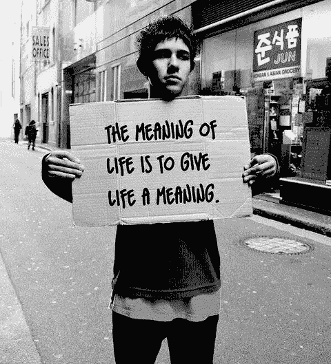

# 我既富又穷后对金钱的思考

> 原文：<https://medium.com/swlh/my-thoughts-on-money-after-being-both-rich-and-poor-634c75c93734>

我经历过连披萨都买不起的财务状况。

我知道钱多得花不完是什么感觉。我知道看着自己的目标变成冰冷的现金是什么感觉。

通过贫穷和富有的这两个极端，我对金钱有了一点了解。

# 你的头脑构建了金钱

你是否觉得富有与你的思想有关。

你可以在银行账户里存 100 美元，感觉自己是加州最富有的人。你觉得自己有多富有取决于你的内在程序。如果你练习感恩，你会发现自己已经很富有了。你可以拥有这个世界上所有的钱，但仍然感到贫穷。

> “我觉得最穷的时候是我最有钱的时候，但我的生活毫无意义”

在我生命中的这个时候，我总是觉得我需要更多。我总觉得自己不够。当我经历人生的整个个人发展转变阶段时，突然之间，有钱买一杯热巧克力的感觉太棒了！

小心这个世界告诉你的关于金钱的事情。你可以决定富人和穷人的区别。你银行账户里的钱并不能为你回答这个问题。

# 意义与金钱

当我发现生命的意义时，突然之间，金钱变得不那么重要了。

愚蠢的是，钱又开始进入我的生活，而我却没有注意到它。

人们被我为生活创造的意义所吸引，这给我带来了更多。

我给所有阅读这篇文章的人的建议是专注于寻找你生命的意义。如果你想不通，那就创造一个。想想你崇拜的人和他们对自己生活的意义，给自己创造一些类似的东西。

如果你想激励人们，那就去做吧。
如果你想创建一个回报社会的企业，那就去做吧。
如果你想写这样的博文来帮助生活中的人，那就去写吧。

在那段时间里，我的钱多得不知道该怎么花，我不知道自己来到这个世界上是为了做什么。我会导入小部件 A，赚些钱，导入小部件 B，然后再从头开始。我觉得自己就像一个重复模式的机器人。在这个过程的最后，我的银行账户又多了两个零。

**我的网上银行屏幕上的那些零很快变得很无聊。**

一旦我找到了让我振奋和帮助他人的东西，在我的网上银行屏幕上看到更多零的焦点就消失了。

# 我不是说钱不重要

如果你刚读到蒂姆·丹宁认为钱不重要，那你就没明白我的意思。

钱确实很重要，但它不应该是你的主要关注点。你的主要焦点应该是找到能让你自我激励的意义。这种自我激励的活动可以转化为金钱，给你生活所需的资源，比如食物、住所，或者偶尔去度假。

我想让你感受到的是，你的关注点在钱以外的东西上。

> "既富又穷，我在两个极端都没什么感觉"

# 意义也可以在生活的简单快乐中找到

我记得我读《无限的力量》时的感受。我还记得我第一次恋爱时的感觉。我还记得我第一次出国度假是多么的酷。

所有这些记忆给了我生命的意义，让我有所感悟。每次回忆都产生了各种各样的情绪，当我回忆起这些娱乐时，我仍然记得这些情绪。

通过最简单的快乐，我找到了意义。**我不需要价值百万美元的兰博基尼来让我感觉自己站在世界之巅。和朋友们一起躺在沙滩上，不花钱，给我的收获远远超出我的想象。**

如果你五年前告诉我这些，我会说你是个骗子。既富又穷，我现在明白了钱给我的意义:不多。

# 关于钱的最后一句话…

专注于你能成为什么样的人。寻找或创造超越金钱的人生意义。

超越社会对金钱的认知。大部分都是谎言。金钱不会给你意义，也不会让你快乐。

只有你能为自己创造幸福和意义。

【Addicted2Success.com】原帖

# *行动呼吁*

*如果你想提高你的工作效率，学习一些有价值的生活窍门，那就订阅我的私人邮件列表吧。你还将获得我的免费电子书，它将帮助你成为改变游戏规则的在线影响者。*

*[**点击这里马上订阅！**](http://timdenning.net/free-ebook)*

**

## *这个故事发表在 [The Startup](https://medium.com/swlh) 上，这是 Medium 最大的创业刊物，拥有 295，232+人关注。*

## *在这里订阅接收[我们的头条新闻](http://growthsupply.com/the-startup-newsletter/)。*

**