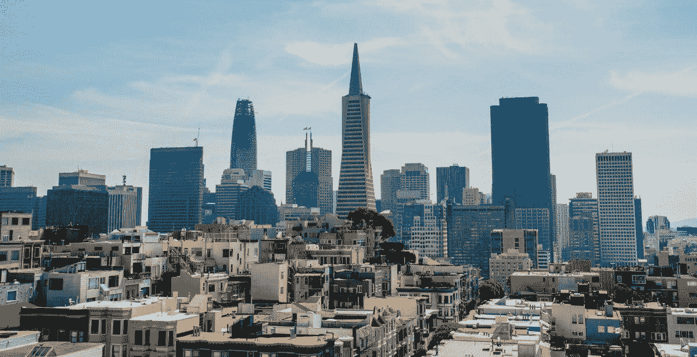
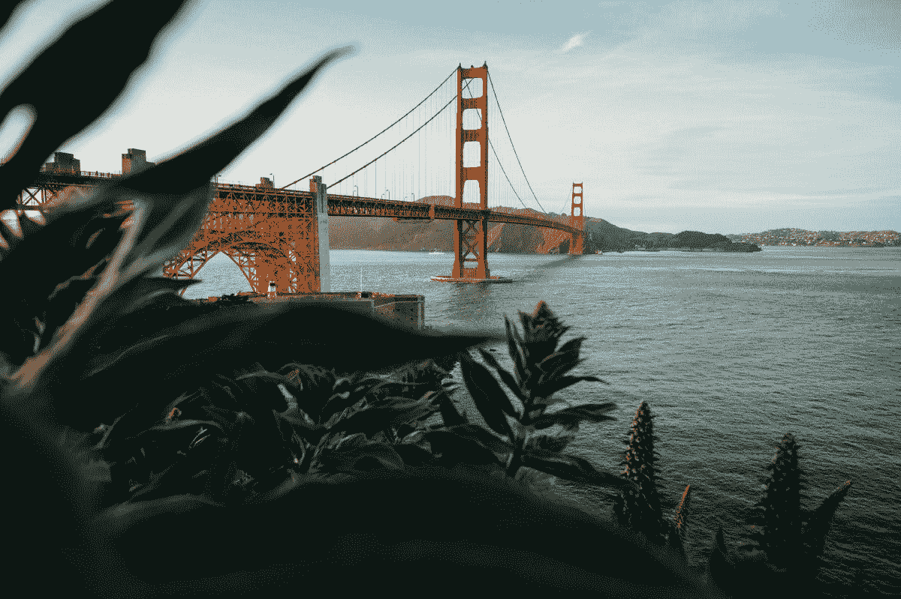

# 我在旧金山的时光

> 原文：<https://medium.com/swlh/my-time-in-san-francisco-a591bae641bb>

2015 年，我在旧金山实习，在那里住了五个月。也许你已经读过我的 [*网络博客*](https://ye-chen.com/about/) 关于我是多么幸运地在最后一刻收到一封来自社会企业的电子邮件，以及准时完成文书工作的所有“值得”麻烦。

> “那么，为什么是旧金山？”

我没有做任何研究，也不打算去那里。我只知道我想出国获得独特的经历，就像我在 [*冰岛*](https://ye-chen.com/my-hunger-for-crazy-led-me-iceland/) 那样。我下定决心要出国，我周围的人也意识到了这一点。我最初打算去欧洲实习，直到一个同学找到我，告诉我旧金山这座美丽而又令人敬畏的城市。

当我的心态从欧洲的某个地方转移到旧金山时，我没有想太多。于是，我上了 LinkedIn，点击了工作标签，看到一家社会企业在寻找一名沟通和发展实习生，写了一封很棒的激励信，打了一个 Skype 电话，得到了这个职位，获得了我的 J-1 签证，然后就上路了。

在这篇博客中，我强调的是我的旅行经历，而不是我的实习经历。在这篇博客中，你可以期待在旧金山旅行的体验。

# 抵达旧金山

我在八月底到达旧金山。想到要在一个比荷兰大得多的新地方开始新的生活，我很兴奋，也许还有点焦虑。尽管如此，我还是很高兴能在那里。每当我闭上眼睛，我仍能回想起我走出飞机，走进阳光明媚、多风的旧金山的那一刻。

所以，从旧金山机场，我打车去了我住的地方。在整个骑行过程中，我尽可能地向外看，以吸收每一种形状和颜色。风景让我无语。

# 在旧金山

在我逗留期间，我意识到旧金山是所有事物的发源地。每座山上都有深远的风景，美丽的海滩，全年免费的音乐会，令人惊叹的公共公园，以及该国最好的食物、音乐和艺术。人们很容易被旧金山的迷人歌声所吸引，这是一个令人惊叹的、富有创意的、有机的、时髦的和狂野的城市。

> "这是一个疯狂的城市，住着完全疯狂的人，他们的女人都非常美丽。"—拉迪亚德·吉卜林

旧金山有它的风景、建筑、标志，尤其是它独特的个性。当我看到人们穿着瑜伽服装随意地走来走去，啜饮着他们的有机的、可持续的、从蓝色瓶子里滴入“只为你”的咖啡时，这种个性向我展示出来。同样的人格问我在城市里找不到路的时候是否需要帮助。同时，当我走在市场街上时，这种人格可能是一个无缘无故说话的疯子。

我了解到，在过去，旧金山是从对黄金的渴望和对更好生活的渴望中成长起来的。它支持平等，不仅在宽容的意义上，而且在庆祝的意义上。 真是个多元化的城市。你可以在一个晚上去城里一家受人尊敬的餐馆就餐，第二天去唐人街品尝最新鲜的点心。你可以白天穿西装，晚上穿便装去参观城市美术馆。

我爱上了旧金山。因为不管我是谁，我总有一部分能融入这里。这是一个非常美丽的城市，这里不存在无聊，有无限的可能性，每个人都被接受。 ***无论是当时还是现在，三藩都是响亮而骄傲的。***

# 旧金山的味道

每当有人问我三藩市，我就会想到金门大桥、阿卡特兹和渔人码头。这些都是消磨时间的好地方，但还有更多地方值得探索。在渔人码头，你可以对着 39 号码头的一些海狮吠叫。当你在那里的时候，一定要尝尝一碗蛤蜊杂烩面包和一只邓杰内斯蟹。

阿卡特兹超出了我的预期。它的音频游览是世界一流的，你可以从水上看到旧金山的壮丽景色。雾天的金门大桥气势磅礴，神秘莫测。从桥下走过，可以看到令人惊叹的景色。

说到风景，如果你想要旧金山的一些令人惊叹的景色， ***科伊特塔、双峰和阿拉莫广场是你应该去的地方。***

穿过费尔波特街，找到通往 Coit Tower 的路，如果运气好的话，你可以看到或听到成群的野生彩色鹦鹉在那里安家。如果想要一些魔力，可以在日落时去双峰镇，看着城市在金融区的阳光反射下闪闪发光。哦，别忘了去阿拉莫广场，看看 19 世纪 90 年代维多利亚时代的贵妇和旧金山令人惊叹的天际线的对比。

当阳光明媚的三藩市上空， ***穿上一双球鞋，因为你需要去多洛雷斯公园开始徒步旅行*** 。从那里，沿着巴伦西亚街一直走到第 24 街，你会看到曾经完全是西班牙裔和拉丁美洲人的街区在中产阶级化的艰难中剩下的元素。这个地区的美丽和砂砾没有消失，壁画和街头艺术一如既往地活跃。

***金门公园是一个探索*** 的好地方，尤其是在周日，因为它对汽车交通有些封闭。从滚轴迪斯科到草地保龄球，这里应有尽有。周四晚上，体验科学院的夜生活，在史诗博物馆里喝一杯，看宇宙或者和大猩猩交朋友。

当然，我们不要忘记周六早上在渡口大楼的农贸市场。与当地农民聊天，享受美食，等等。

*如果您想了解更多旧金山的旅游信息，请告诉我。*

# 离开旧金山

尽管旧金山是一次奇妙的经历，但我确实渴望回到荷兰的家。然而，有一个原因让我很难离开旧金山: ***我在那里遇到了我的女朋友。***

是的，我现在已经异地恋两年多了。起初，我对此持怀疑态度，但事实证明异地恋是可行的。在我的下一篇博客中，我将分享我的异地恋经历，谈谈我能从中得到什么。

*原载于 2018 年 5 月 5 日*[*ye-chen.com*](https://ye-chen.com/my-time-in-san-francisco/)*。*

## 这篇文章发表在 [The Startup](https://medium.com/swlh) 上，这是 Medium 最大的创业刊物，有 321，672+人关注。

## 在这里订阅接收[我们的头条新闻](http://growthsupply.com/the-startup-newsletter/)。

