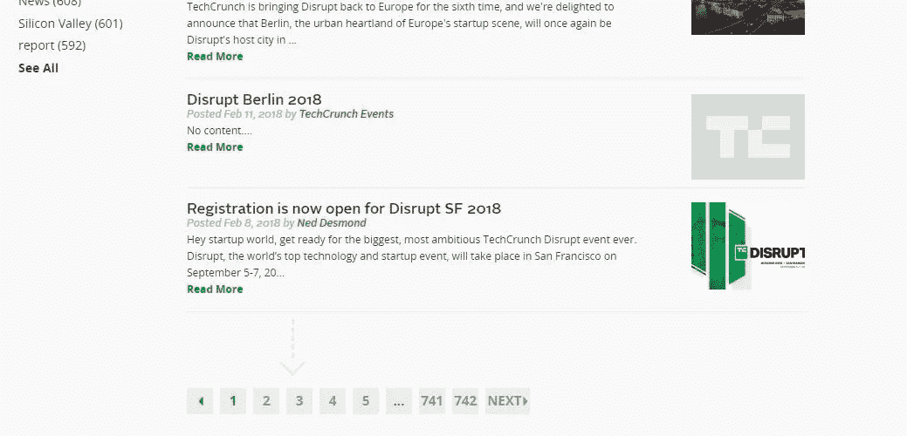

# 取代“破坏性”的六大选择——它不再破坏任何东西。

> 原文：<https://medium.com/swlh/my-top-6-picks-to-replace-disruptive-c8d1ad7d3352>

Disrupting the washing machine cycle. Photo by [Nik MacMillan](https://unsplash.com/photos/qyvm0zXdKYE?utm_source=unsplash&utm_medium=referral&utm_content=creditCopyText) on [Unsplash](https://unsplash.com/search/photos/funny?utm_source=unsplash&utm_medium=referral&utm_content=creditCopyText)

在内心深处，我们都知道真相。“颠覆性”现在已经停止颠覆一段时间了。这个词的定义已经被它在 startup copy 中的过度使用否定了。

在 2018 年使用“破坏性”让我想起了那次我爷爷把我奶奶做的菜称为“炸弹”。这让她的烹饪看起来绝对不是炸弹**，标志着一个时代的结束,“炸弹”是一个尖锐的现代形容词的选择。

“Disruptive” produces 742 pages of results on [Tech Crunch](https://techcrunch.com/). #[SMH](https://www.urbandictionary.com/define.php?term=shaking%20my%20head).

但是你阅读《媒介》,它会自动将你提升到名副其实的语言影响力的地位。因此，为了口语化的进步，我邀请你从我的半开玩笑的列表中挑选一个，并使用它:

# **取代“颠覆性”的前六名人选**

1.  **狂野**
2.  **无法无天**
3.  [**游侠**](http://www.dictionary.com/browse/arrant?s=t)
4.  [**爱迪生**](https://en.wikipedia.org/wiki/Thomas_Edison)**——就像**(“我们的创业是 d̶i̶s̶r̶u̶p̶t̶i̶n̶g̶ **走上爱迪生**的宠物兔产业”)
5.  **(“我们的创业是 d̶i̶s̶r̶u̶p̶t̶i̶n̶g̶ **把麦克风**放在宠物兔行业”)**

**6.**_ _ _ _ _ _ _ _ _ _ _ _**。换句话说，任何事情。在这一点上，任何事情都比‘颠覆性’这个词更具颠覆性。**

*** *虽然我不能让它被称为“炸弹”，但我祖母做的菜*非常好吃。***

**___**

**[**Shoshana Rubli**](http://medium.com/@shoshanarubli/latest)**在中本聪和葛塔诺·多尼采蒂之间无法抉择。****

********

## ****这篇文章发表在 [The Startup](https://medium.com/swlh) 上，这是 Medium 最大的创业刊物，拥有 306，072+读者。****

## ****在这里订阅接收[我们的头条新闻](http://growthsupply.com/the-startup-newsletter/)。****

********