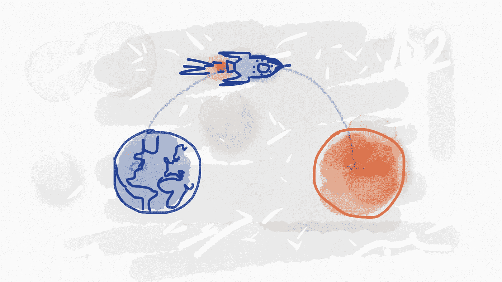
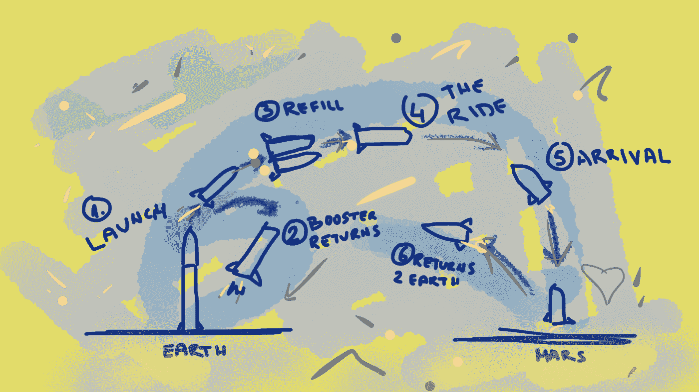
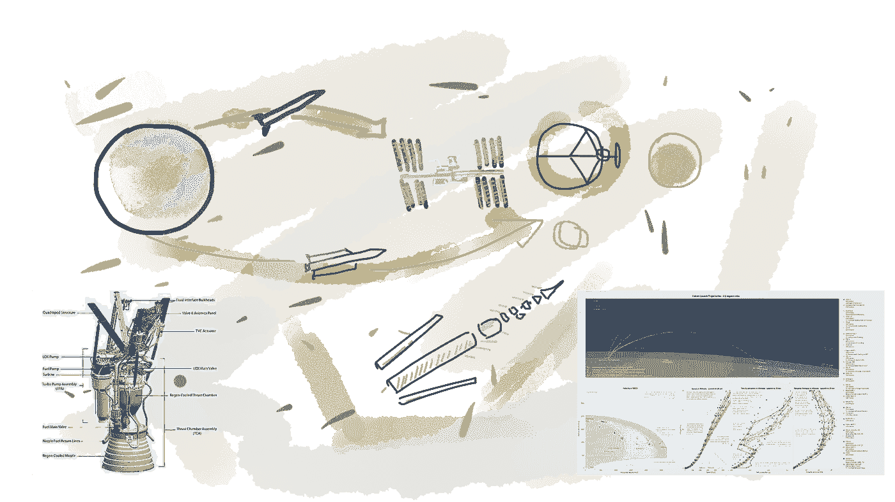

# 我对愿景、战略和战术的理解

> 原文：<https://medium.com/swlh/my-understanding-of-vision-strategy-and-tactics-bfe208e3a0c6>

如果你不知道你要去哪里，任何一条路都会把你带到那里但是，如果你想走上成功之路，你必须有一个强大的愿景，制定一个战略，将你带到那里，并采取行动。

当今商界有很多流行词汇。有些是有用的和有成效的，有些只是为了让你听起来更好，有些会引起混乱。尤其令人困惑的是，当使用多个词来表达相关但独立的主题时。例如，企业家经常在与战略和战术相同的背景下谈论他们的愿景。或者他们定义实际上是目标的策略，反之亦然。让我们来看看这三者中的每一个:它们是什么，它们的主要区别是什么，以及它们是如何结合在一起的。

# 视力

眼光是长远的思考。它应该说你(你的公司)想成为什么。远景应该回答“[为什么是](https://www.amazon.com/Start-Why-Leaders-Inspire-Everyone/dp/1591846447)？”问题，每一个成功企业的核心。当你弄清楚你的“为什么”时，客户和员工都会理解你的最终目标和他们在你的生态系统中的角色。愿景应该代表你的最终目标。一个愿景必须足够清晰和简洁，组织中的每个人都能理解它，并充满热情地接受它。

定义这一愿景需要付出巨大的努力。如果愿景没有被恰当地定义，一个淡化的声明可能会赶走人们，不管你脑子里有多么巧妙的想法。

> 除非远见能指导行动，否则它毫无用处。

为了指导行动，愿景:

*   必须既有挑战性又可以实现，
*   无论技术如何变化，都必须保持相关性，
*   必须与你的员工和顾客产生共鸣，
*   必须经常传达给所有员工。

*举例:*

假设你有一家公司想成为第一大火星运输公司(*这个想法可能听起来很熟悉*)。你想定居红色星球，并把一些人类从地球运送到火星。为了分享你的想法，并吸引未来的乘客，你必须制定一个反映你的愿景的声明。听起来可能是这样的:“*通过建立可靠和负担得起的运输方式，成为前往火星的头号运输公司。*”

High-level vision illustration

这一愿景具有挑战性，但却是可以实现的。仅仅因为问题的规模，你很可能会吸引世界上最优秀的人才。潜在的乘客也会跳上宣传列车。这个故事很有趣，是一种前所未有的冒险，但你强调它是可靠的(*不会在平流层*爆炸)。此外，它说“*运输方式*，这并没有暗示所使用的技术。不管技术如何，这使得这一愿景具有相关性，并且不排除未来的突破性发现，如[浓缩暗物质](http://rickandmorty.wikia.com/wiki/Concentrated_Dark_Matter)。

# 战略

如果我们有无限的资源，无限的时间，没有竞争，每个目标最终都会实现。但是现实有一点不同。团队成员不足、激烈的竞争和紧迫的期限是我们每天面临的紧迫问题。战略将目标(愿景)与当前现实联系起来。按照这些思路，对战略的正确商业定义应该是引导你的可用资源在尽可能短的时间内实现目标。通过制定你的战略，你正在把你的资源引向你的最终目标。你的战略是一个或多个计划，你将使用它来实现你的愿景。战略着眼于组织内部，但也着眼于外部的竞争、环境和商业气候。

该战略适用于整个公司，并回答了这样一个问题:“给定当前的市场条件、市场预测、竞争等，我们将如何实现我们的愿景？?"

> 这个策略应该为你的北极星(最终目标)设定一条路线，但是在细节的层面上要允许战术的改变和适应。

该战略应该:

*   勾画出通向最终目标的道路，
*   沿途设置检查点和里程碑，
*   被限制在太多的细节上以允许灵活性，
*   触及技术点，但把细节留给战术部分，
*   确定团队可以实现的目标。

*示例续*:

此前，我们已经确立了我们的愿景:“*通过建立可靠且价格合理的运输方式，成为前往火星的头号运输公司。*”。现在，我们要制定实现这一目标的策略。这个策略有点复杂，不能用一句话来概括。所以，为了达到我们的最终目标，我们不得不:“*开发一种可重复使用的火箭，尽可能使用内部生产以降低整体成本。解决加油问题。确定最佳轨迹，计算旅行的预计到达时间，并尝试考虑沿途的任何意外情况。在可靠性上下功夫，但也要注意美观——有人会在那里住上至少六个月。*

The strategy defines a path to the ultimate goal

这个策略听起来可能是这样的。我知道，它听起来可能更好，它需要一点额外的工作。但重要的是，这一愿景现在被分解为几个目标——建造火箭、加油、轨道、航天器娱乐等。这应该足以激发你队友的想象力。他们肯定会尽力为每个目标提供最先进的解决方案。在这样的环境中，人才会在这里茁壮成长，人们也会在这里茁壮成长。

(*这个地球 2 火星奋进的范围远远超出了本文的范围，所以让我们假设这个幼稚的故事足以把某人送上火星*

# 战略

你不直接执行战略；战略通过战术变成现实。该战略使您的愿景更加明确，但它没有足够的细节让团队去执行。这是理所应当的。作为一名优秀的领导者，你应该让你的团队来决定正确的策略以及如何执行它们。策略是技术领导、高级开发人员和其他有实践经验的人的领域。只需为他们提供一个清晰而富有挑战性的愿景，制定策略，以最短的路径引导他们，团队就会创造奇迹。说真的，他们会踢屁股。

你的策略是具体的行动，行动的顺序，以及你用来实现你的战略的时间表。策略通常被划分为目标，这样团队就可以逐步实现最终的结果。

> 战术是你在追求与战略相关的目标时使用的一种工具。

策略是:

*   交付长期战略的短期实施计划，
*   一份详细具体的日常活动计划，
*   一套达到目标的工具，
*   一个渐进的步骤让你更接近你的愿景。

*举例*:

所以你已经确定了几个目标——建造火箭、加油、轨道、宇宙飞船娱乐等。你将让你的团队实现这些目标。他们必须为每一个目标制定一个策略，使他们保持在正确的轨道上。请记住，战术是实现长期战略的短期实施计划。因此，为了建造一个火箭，你可能应该首先运行一些模拟。然后，可以建立一个原型并进行测试。您将从原型失败中收集重要的见解，并在下面的版本中实现它们。进行第一级分离。为第一级回收着陆开发导航软件。调查在月球轨道上给火箭补充燃料的可能性。我是说，这个名单可以一直列下去。战术是任务、实验、概念验证……一切有助于实现目标或获取对潜在破坏重要的知识的东西。

Tactics — actions that lead to success

# 结论

到目前为止，您可能已经理解了定义这三个部分的重要性。

你的**视野**规划出一个**目的地**。

你的**目的地**指引着你的**策略**。

而**策略**选择**动作**。

是**行动**导致**成功**！

## 这篇文章发表在 [The Startup](https://medium.com/swlh) 上，这是 Medium 最大的创业刊物，拥有+400，714 名读者。

## 在这里订阅接收[我们的头条新闻](http://growthsupply.com/the-startup-newsletter/)。

# 想了解更多？

学习如何将你的想法转化为成功的业务。

这本书为你提供了创建一个成功企业的整个过程的全面指导。它旨在为你展示整个[商业计划](https://treasureroadmap.com/)，让你的开始变得更加容易。整个过程归结为它的要点，使步骤简单易懂。

如果你遵循我在这本书里揭示的公式，很有可能你可以通过把一个想法变成一个成功的生意来谋生。

 [## 宝藏路线图——如何将你的想法转化为成功的业务——企业家的最佳书籍…

### 如果你选择遵循我在这本书里揭示的公式，很有可能你可以通过转行谋生…

treasureroadmap.com](https://treasureroadmap.com/) 

点击下面的图片获取您的免费图书摘要:

