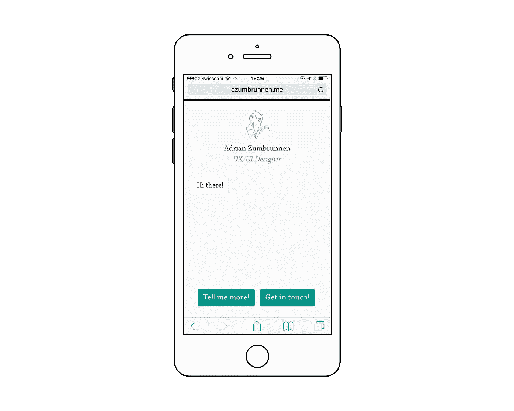

# 我的网站现在是对话式的。因为为什么不。

> 原文：<https://medium.com/swlh/my-website-is-now-conversational-because-why-not-46e1d8a369>

我的[网站](http://azumbrunnen.me)现在可以对话了。它可以向你推荐 UX 的作品。

Let my better half know if you’re a UX designer, and “I” will send you reading suggestions.

请确保你时常回来。

如果你喜欢这篇文章，点击推荐。🤗我也在[推特](https://www.twitter.com/azumbrunnen_)上发布关于设计和 UX 的微博。