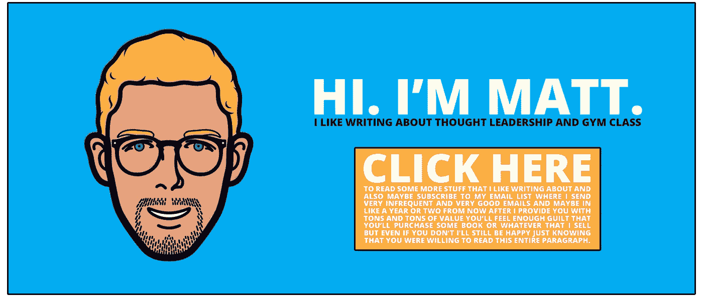

# 我对思想领导的深思熟虑的想法

> 原文：<https://medium.com/swlh/my-well-thought-out-thoughts-on-thought-leadership-2e15ef3b0313>

至少我认为是在 T1。

当我在高中的时候，我非常擅长数学。那大约在大学开始的时候结束了，但是在 11 年级解二次方程式是我的*狗屎。*

我不太擅长的是 ***Vodgkey*** (发音为*vawj**kee*)——这是我那位精神错乱的高中体育老师发明的一种疯狂竞争且危险的排球、躲避球和曲棍球的组合。

在一个决定命运的周三下午，苏桑先生选举我为沃德基队队长，让我负责挑选我的队友，并在 55 分钟的扔躲避球、砸排球、曲棍球守门员混乱中给他们灌输积极向上的士气。

不用说，我的队输了。很糟糕。我再也不会被任命为沃德基队的队长了。

**说到 Vodgkey，我不是领导。**

其实……说到 ***很多*** 的事情，我都不是领导。你也不是。

# “嗯，打扰一下？!"

哦，那很粗鲁吗？我想说的是…

**我知道你知道你不是什么都知道。但我不确定你是否知道，不知道是否可以。你知道吗？**

让我再试一次…

Photo courtesy unsplash.com

> “思想领导力”这个术语被严重误解了，它把很多人推向了内容创作的相似角落。

一个**【思想领袖】**就是把一个 ***新的*** 想法引入一个话题的人。但是内容营销生态系统已经改变了我们对这个术语的理解，不再是字面上的定义。很大一部分作家不是开拓新的想法，而是简单地加入我们已经在进行的对话，所以他们自己也可以被视为建议者。

是的，在某个时候，某个地方的某个思想领袖在 ***上写了一篇关于如何成为一个早起的人*的思想文章。那个人以全新的视角介绍了很多人都在纠结的事情。因此，它起飞了。**

现在《灵媒》被淹没在一大堆几乎难以辨认的文章中，这些文章教我们如何在早上 6 点前面带微笑地从床上跳起来。

***认为领导色情*** 是不利于内容创作的文化，因为:

*   它让人们认为他们需要了解他们所处的利基市场的一切。
*   它影响人们说绝对的话，说确定的话而不是观点，说回答的话而不是问题。(我知道我正在这篇文章中这么做。这种虚伪已经被注意到了。)
*   这导致大量的文章几乎无法区分彼此。
*   最后，**这让一些人觉得他们还没有*准备好*去分享。他们还没有足够的知识去点击发布按钮。**

# “但是马特，你难道不需要为你的观众提供价值吗？”

是的。

但这是整篇文章中最大最重要的一点:

> 成为某个领域的权威并不是提供价值的唯一途径。

还有很多其他的方式为你想接触的人提供价值。*。如果有的话，这些较少探索的内容角度可能更有价值，因为几乎没有人在其中发挥作用。*

Photo courtesy unsplash.com

如果我知道如何做这些事情，你刮一个网站或什么的，得到所有这些数据，并把它放到一个 Excel 电子表格中，像分析它得出结论， 然后我会在 Medium 上看看有多少篇关于如何成为一个早起的人的文章 我想结果会是有很多这样的人。

我们被重复的建议淹没了。适可而止。

是时候变得怪异了。

# “好吧马特，我会咬的。我怎样才能变得古怪呢？”

黑暗仅仅是没有光。同样的，怪异也仅仅是正常的缺失。

我认为，如果我们作为一个集体停止试图像其他人一样写作，我们会发现**未知的内容领域**是极其广阔和肥沃的土地。

你必须做的就是停止写你正在读的东西，向内看。忘掉人们需要听到的东西。你需要写些什么？

当我实时思考这个问题时，我脑海中会闪现出一些想法，没有特定的顺序:

*   深入的、非批判性的审视你今天每小时都做了什么，为什么
*   一个完全纯粹的初学者之旅，开始编码/写作/工作/学习/骑自行车/销售/制作/唱歌/打架/跳舞。
*   一篇题为“我如何在一分钟内建立一家公司”的文章，然后在你前进的过程中弄清楚这篇文章是关于什么的
*   展示著名历史人物周末活动的一系列文章
*   工作/不工作时听的歌曲列表
*   为什么你认为口袋妖怪会在今年卷土重来
*   未来的你在 2016 年、2020 年、2035 年写的一系列文章，作为假设的日志条目…
*   为什么你对 X 比对 Y 更有激情(就像字面意思一样，为什么你对字母 X 比对字母 Y 更有激情)
*   列出你想认识的各种类型的人，直到具体的特征
*   一系列的文章提供了深入的一步一步的指导，告诉你如何执行你的想法，但很可能永远不会真正执行

那里，那是 10。这花了我大约七分钟的时间来思考和记录。

# 现在轮到你了…

希望你和我能超越这篇文章的虚伪主题，从这些关于思想领导力的想法中汲取一些优点。

让我们通过拒绝加入思想领导文化来引领新的内容创作浪潮，真正用*我们自己的*思想和想法来引领。

你不需要成为**权威**。你只需要成为一个**作者**。

# 请推荐这篇文章…

## 如果你有一个中等账户。如果你没有，我建议你买一个。但不仅仅是因为推荐我的文章，因为它是一个有价值的平台，而且一旦你注册了，你也可以回头推荐，因为我是你注册的原因。我不认为这是过分的要求。

*发表于* **创业、旅游癖和生活黑客**

-