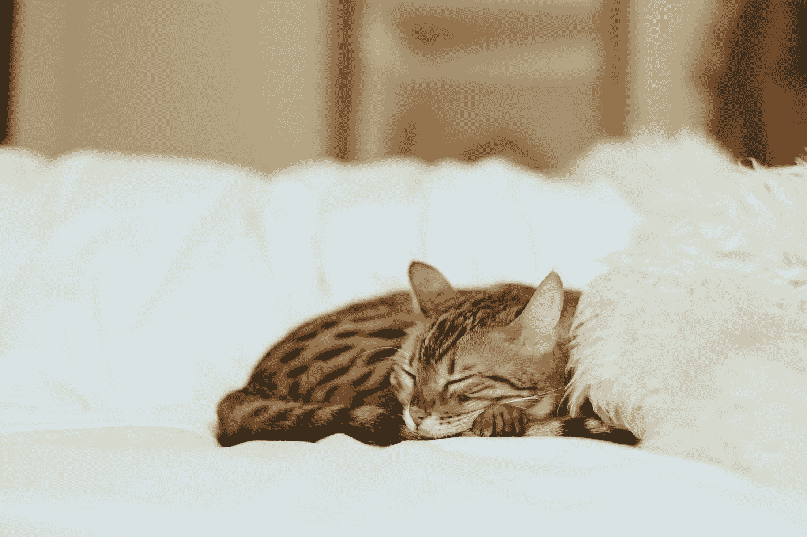

# 我的话是我的一切，所以不，我不会给你一个发光的参考

> 原文：<https://medium.com/swlh/my-word-is-all-ive-got-so-no-i-won-t-give-you-a-glowing-reference-11c2a24531c1>

## 我仍然会在晚上睡觉

“sleeping leopard kitten” by [Paul Hanaoka](https://unsplash.com/@paul_?utm_source=medium&utm_medium=referral) on [Unsplash](https://unsplash.com?utm_source=medium&utm_medium=referral)

在我之前的几篇媒体文章中，我谈到了我的第一份专业工作的重要性。22 岁时，我是一个三人向上拓展项目的项目保持和拓展协调员。