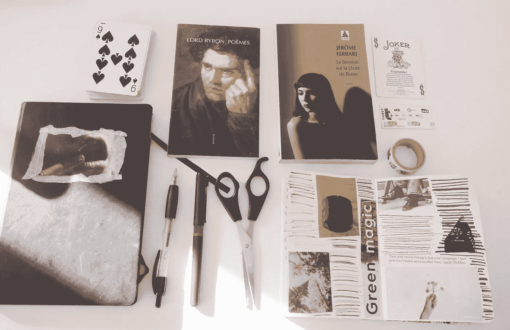

# 我的写作常规是深度聚焦(计划、心态和想法)

> 原文：<https://medium.com/swlh/my-writing-routine-for-deep-focus-planning-mindset-and-process-20d6213fbc35>

Odds and ends in a Paris Airbnb.

我同意[克里斯·盖奇](https://medium.com/u/67d9cdce33af?source=post_page-----20d6213fbc35--------------------------------)当她说[没有过程](/@krisgage/everything-about-my-writing-process-5fe048517045?source=user_profile---------20-------------------)时，你只需要他妈的写。然后写。然后写。

我写了很多。这个博客只是冰山一角。但是鉴于写作既是我的工作也是我的爱好，我已经(不由自主地)建立了某种惯例。它帮助我进入一种心态，在这种心态下，我可以关闭我的内部对话，并…