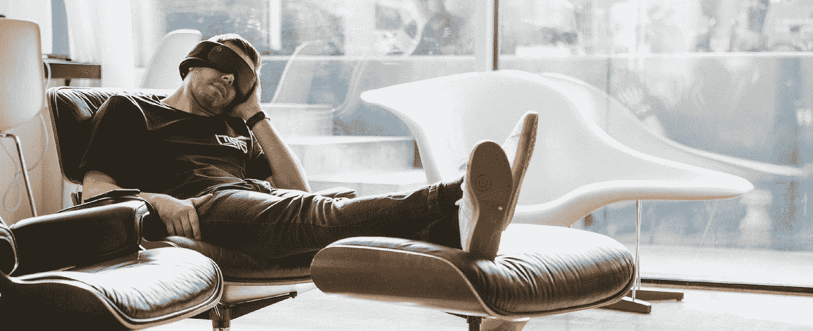

# 午睡——有些人有，有些人没有(以及你如何得到它！)

> 原文：<https://medium.com/swlh/napping-some-people-have-it-some-people-dont-and-how-you-can-get-it-55d5c2133025>

*我曾经在不到三个月的时间里成为一名亲午睡者的六大原则*

*Napping: Some people can & some people can’t! (Source: SilentmodeHQ)*

一项又一项研究表明，午睡可以提高工作效率，减轻压力，甚至可以让我们更有创造力。

但是我睡不着。

午睡是斯蒂芬·库里赛前惯例的关键。

> “当你从午睡中醒来时，你知道现在是什么时候，你知道是时候做好准备，集中注意力，去比赛了。”*斯蒂芬·库里*

是的，都很好，但我已经尽力了。

我睡不着。

我是那种晚上花很长时间才能入睡的人。当我的头碰到枕头时，我的大脑就会超速运转。我最好的思考是在晚上，在我平静的床上完成的。

如果我晚上花了一个小时才睡着…我怎样才能放松到成为一个白天打盹的人呢？

当我尝试的时候，我会花 20 分钟做白日梦。午睡过后，我会比午睡时更加兴奋。

# **通过努力工作和练习，你可以有效地午睡。**

打盹不是睡觉。但是，水平躺着的行为，以及让你的身心平静下来的意图，可以让你得到休息和恢复。

# 把午睡当成一种练习技巧——需要时间来掌握。

我致力于成为一名小睡者。受过专业训练。在 3 个月的时间里(大约 20-25 次午睡)，我自学了午睡。

# **午睡的 6 个原则**

# **#1 —拥抱休息**

*   通过持续休息 20 分钟来训练自己。
*   一开始，如果你不打算小睡——你不会失败。拥抱你与休息的关系。

# **# 2——理解人与人之间的联系非常不同**

*   衡量你在 20 分钟前/后的感受。利用学习来增加你的承诺。
*   我睡了 22 分钟。我花了 1.5-2 分钟入睡，花了 20 分钟小睡，然后开始工作。
*   测试并学习找到你的时间和理想状态。

# **#3** — **呼吸是休息的基础**

*   当我们激动或害怕时，人们告诉我们要做的第一件事是什么？呼吸
*   将休息的能量集中在你的呼吸上。你会分心——没关系。冷静地重新聚焦。
*   尝试[箱式呼吸](https://www.healthline.com/health/box-breathing)，4–7–8 方法(见下文)或者 100%注意你的呼吸。

# #4 — **设计一个方案**

*   何时何地休息很重要。同样，一致性是关键。
*   想想你在午睡时遇到的问题，并设计一些解决方法——不能午睡，试着休息。工作日没有床/沙发？试着坐在办公椅上休息 20 分钟。

# 发展你的午睡习惯

*   职业运动员寻求能给他们带来优势的最微小的成绩提升。休息和小睡时也这样做。
*   一天中的时间、午睡时间、午睡前后完成的活动、身体姿势——都是你进化的机会。

# #6 — **利用技术优化午睡物流**

*   使用 Siri/谷歌助手来设置你的午睡时间——嘿，谷歌 22 分钟后叫醒我。如此轻松流畅。
*   使用应用程序定期跟踪你的午睡。使用数据来优化和发展

# **另外两个让你入门的技巧:**

# **60 秒入睡技巧**

安德鲁·韦尔博士的 60 秒入睡技巧。他教授[4–7–8 呼吸法。正如他所展示的，这“几乎不需要时间，不需要设备，可以在任何地方进行。”](https://www.drweil.com/videos-features/videos/the-4-7-8-breath-health-benefits-demonstration/)

**一旦你掌握了它，你就可以在休息的时候使用**[**4–7–8 呼吸技巧**](https://www.drweil.com/videos-features/videos/the-4-7-8-breath-health-benefits-demonstration/) **让你的头脑准备好小睡！**

# **休息姿势和位置事项**

想想你最喜欢的睡姿。想象你的头、手臂、躯干和腿的位置。

现在想象你站在和睡觉时一样的位置，持续 6-8 个小时。

如果你和我有任何相似之处，当我的头突然转向右边时，我的脖子会痛得要命。我的躯干向相反的方向扭曲。哎哟。

Kelly Starrett 建议运动员通过运动进行休息和恢复。他对睡姿的概述是一个很好的观察。

## 提示——运动员应该用一个枕头仰卧睡觉。你也应该。

午睡的好处是显而易见的。对于任何想变得更有效率、更有创造力和更机敏的人来说。你需要小睡一下。

对于那些睡不着觉的人，请放心。只要有毅力和一点帮助，你很快就会成为一名专业的小睡者。

继续练习，祝你午睡愉快！

## 迈克尔·阿什顿是 Silentmode 公司的增长负责人，这家公司致力于开发智能放松解决方案，帮助人们减轻压力，提高表现。他们对休息的力量是认真的。

## *你可以在这里* *查看他们的休闲生态系统* [*或者通过他们的*](http://silentmode.myshopify.com/) [*Instagram 账号加入社区。*](https://www.instagram.com/silentmodehq/?hl=en)

## 这篇文章发表在 [The Startup](https://medium.com/swlh) 上，这是 Medium 最大的创业刊物，拥有 309，732+读者。

## 在此订阅接收[我们的头条新闻](http://growthsupply.com/the-startup-newsletter/)。

