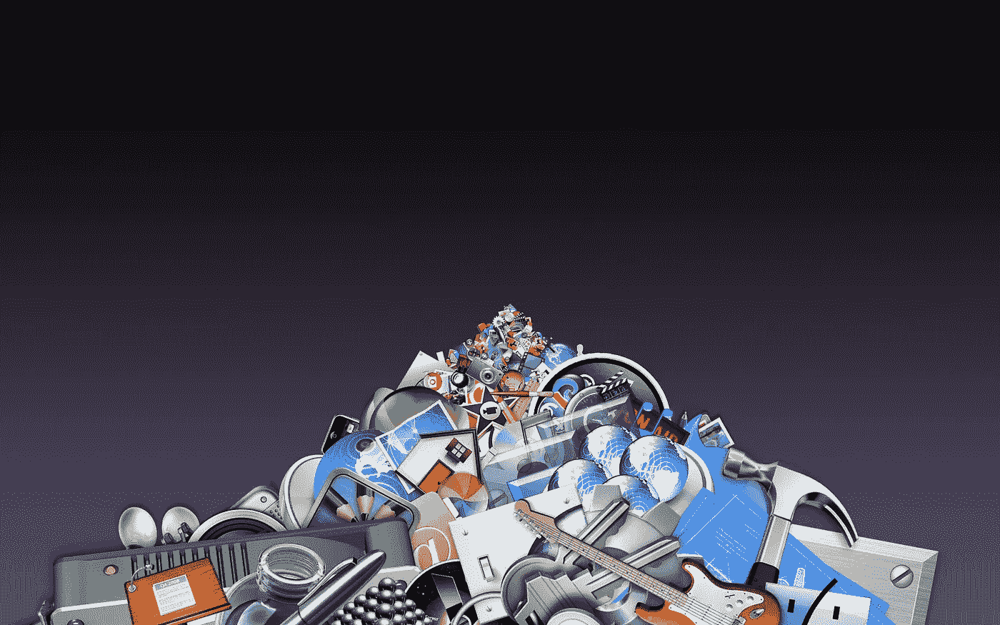
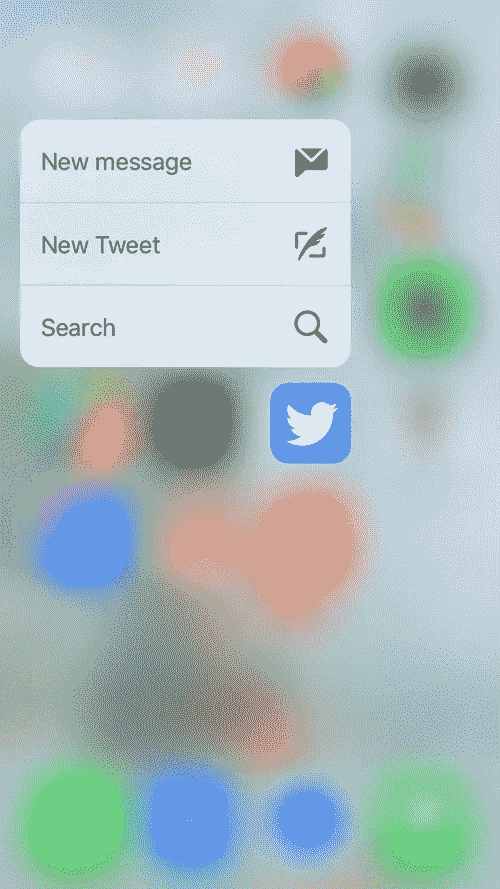
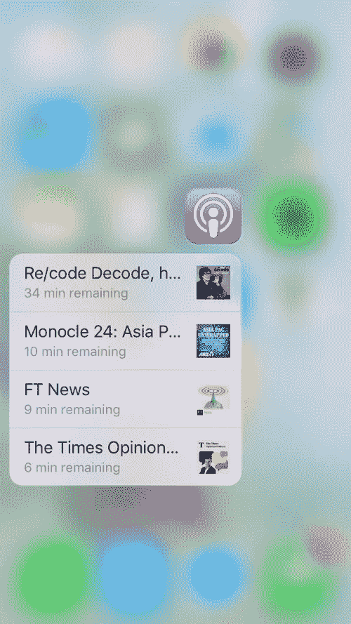
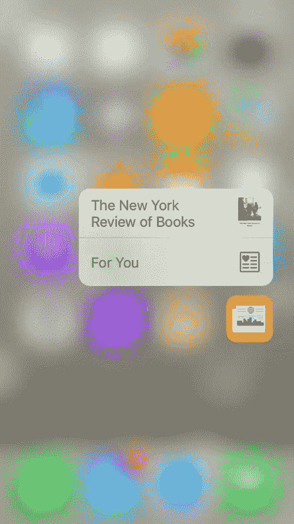
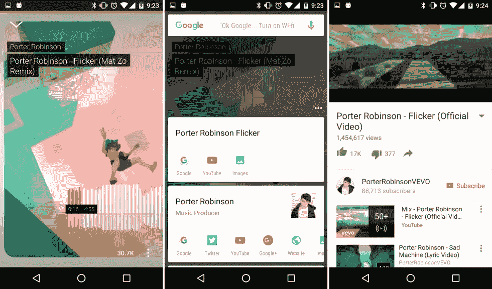

# 原生应用正在消亡

> 原文：<https://medium.com/swlh/native-apps-are-dying-55a706866052>

如果你注意苹果和谷歌在他们的操作系统上做了什么，就会发现一个非常相似的战略模式。拆分应用功能，将用户从应用转移到操作系统主屏幕和通知中心。

当然，这不会一帆风顺。应用程序不会突然消失。人们非常习惯于使用应用程序来完成单一目的的任务。当我们想要详细丰富的体验时，仍然会有漂亮的应用程序供我们探索。

然而，随着每一个新操作系统的推出，人们会开始忘记它们。为什么？因为所有的主要功能都将转移到主屏幕和通知中心。从操作系统/通知中心获得可操作的使用权。

这种趋势的几个例子是新的 3D touch、可操作的通知中心和 Google Now on Tap。

目前，我们需要应用程序来提供内容和数据。但是，想想未来，如果应用程序开始生活在“云”中，而操作系统只是从中提取数据和内容，那会怎么样？

我看到了一个未来，人们将不再考虑下载什么应用程序来完成特定的任务。相反，他们会在某种搜索框(或 Siri/Google Now/Cortana)中简单地说出他们的意图，然后立即得到他们想要的东西。

在后台，操作系统将搜索并联系所有可能有你正在寻找的“云应用”，并给你最好的结果。

因此，从更广泛的意义上来说,“战争”不是在苹果和谷歌之间，而是在脸书和操作系统之间。对脸书来说，应用就是平台，他们不想让你离开他们的“互联网”。

即使在今天，我们大部分时间已经花在通知中心了。我想象一个新的，丰富的，智能的人工智能驱动的通知中心成为一切的“枢纽”。

发表于*[**# SWLH**](https://medium.com/swlh)**(***《创业》、《流浪癖》、《生活黑客》)**

******