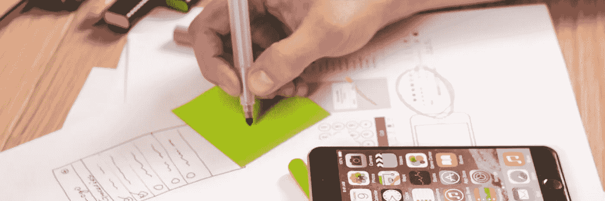
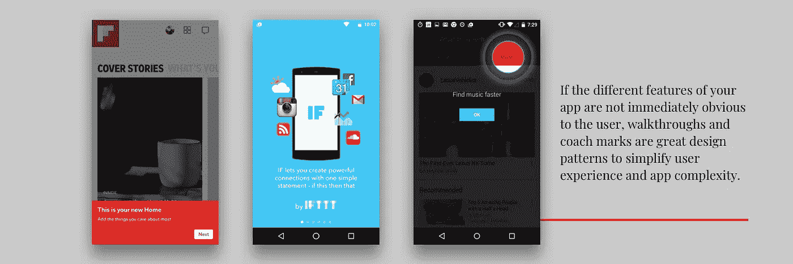
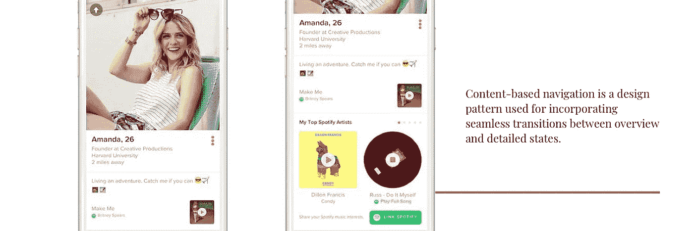
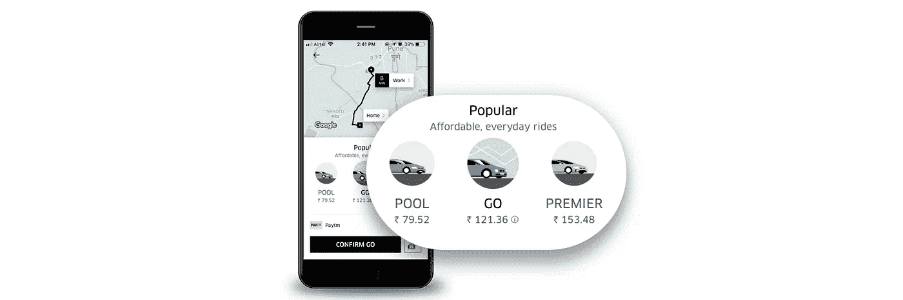
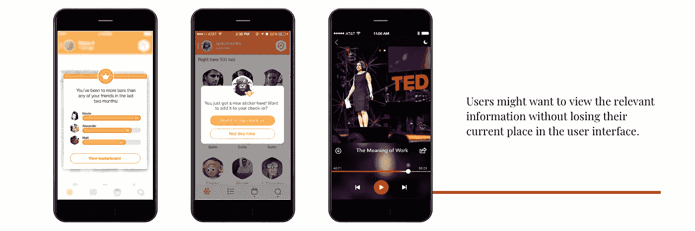

# 帮助用户导航的 5 种 UX 模式

> 原文：<https://medium.com/swlh/navigating-the-mobile-application-5-ux-design-patterns-6a43da6fe880>

也许在设计移动应用程序时，要记住的最重要的事情是确保它既有用又直观。如果 app 没有用，就没有附加价值，没有人有任何理由使用。如果它很有用，但需要很高的学习曲线，人们就不会费心去学习如何使用它。好的 UI 设计解决了这两个设计问题，解决常见设计问题的形式化的最佳实践被称为设计模式。理解和认识当今最新和最流行的设计模式可以让你在移动应用程序设计行业获得巨大的成功，这样你的下一个应用程序将会是新鲜的和有竞争力的。

这篇文章关注的是用于移动应用导航的设计模式。不管你在设计什么样的应用程序，你都需要用户有效且高效地浏览应用程序的不同功能——用户如何浏览你的应用程序可能会决定他们是否会足够喜欢它并继续使用它。

Examples of how various apps implement walkthroughs

## 1.演练和蔻驰标记

实用性是成功应用的关键。然而，有时这意味着一个相当复杂的应用程序，有许多不同类型的工具和内容。解决这个问题的一个好方法是通过一个初步的演练或教程来演示每个函数是如何工作的。Secret 和 Youtube 突出了用户界面的重要部分，并带有教练标记来解释它们的作用，而 Carousel 和 Duolingo 则展示了一个幻灯片，引导用户体验典型的用户体验。这种设计模式也可以用来从用户那里收集额外的信息，允许更容易的初始注册/注册体验和更直观的应用集成。如果你的应用程序的不同特性对用户来说不是很明显，走查和指导标记是很好的设计模式，可以简化用户体验和应用程序的复杂性。

## 2.基于内容的导航

无论你想在应用程序的设计中包含什么样的内容，你总是想让用户体验和内容的流动尽可能流畅。基于内容的导航是一种设计模式，用于整合概览和详细状态之间的无缝转换。Tinder 提供了这种模式的一个很好的例子:你可以在用户个人资料的两种状态之间切换——主要的概览状态，实际上是一张占据大部分屏幕的图片，以及一个详细的视图，使图片稍微小一点，并包括一些事实信息。您只需在任一视图中点按屏幕，就可以在两种状态之间转换，并且可以在您选择的任何状态下滑动图片。

## 3.滑块

在优步，你可以看到有四种类型的乘车服务，而不是需要四个单独的屏幕来传递必要的信息，优步使用滑块设计模式来允许在每种乘车服务之间轻松切换。这可以通过手指滑动在选项之间产生无缝转换，使这些功能的显示对用户来说非常直观。

## 4.松饼

有时，在使用应用程序的过程中，通知或附加信息可能有助于用户更好地与应用程序交互。在这种情况下，用户可能希望查看相关信息，而不丢失他们在用户界面中的当前位置。popover 设计模式可以通过几种方式解决这个问题:
popover 当用户执行某个动作或到达应用程序中的特定位置时，popover“弹出”，在 UI 中显示与该特定动作/位置相关联的相关信息/控件。

应用程序中的原始内容或位置在背景中仍然可见，但 popover 让您可以选择调整某些内容或了解接下来会发生什么。弹出窗口会引起用户的注意，并在需要的地方提供重要的通知。然而，与此同时，用户可以很容易地关闭弹出窗口，并通过简单地点击或滑动屏幕来返回到他们最初正在做的任何事情

在官方的 TED 应用程序中可以看到 popover 的一个例子，它有一个 popover 播放控件，可以淡出背景，允许用户与该控件进行交互，而不会失去他们在内容浏览器中的位置。Secret 和 Swarm 使用 popovers 来解释如果用户继续某个动作，接下来会发生什么。

## 5.幻灯片、边栏和抽屉

与电脑和电视相比，手机的屏幕相对较小，这意味着手机设计的挑战之一是在一个小 UI 上容纳大量信息。为了避免一次在一个屏幕上显示大量信息，您可以使用幻灯片、边栏和抽屉在应用程序的不同部分之间导航。这些模式是应用程序的次要部分，如地图、聊天、用户资料等。，藏在可折叠的“汉堡菜单”、滑出式箭头按钮或侧抽屉中。这样，用户可以通过从这些隐藏的面板中选择焦点部分来与每个屏幕上最重要的信息进行交互。

你使用过我们上面提到的模式吗？它们有助于增加你的每日活跃用户数吗？让我们知道。

*您可以关注我们的* [*脸书*](https://www.facebook.com/monsoonfish)*/*[*LinkedIn*](https://www.linkedin.com/company/13404751/)*/*[*Twitter*](https://twitter.com/monsoonfishy)

*原载于 monsoonfish.com***。**

**

## *这个故事发表在 [The Startup](https://medium.com/swlh) 上，这是 Medium 最大的企业家出版物，拥有 277，994+人。*

## *在这里订阅接收[我们的头条新闻](http://growthsupply.com/the-startup-newsletter/)。*

**