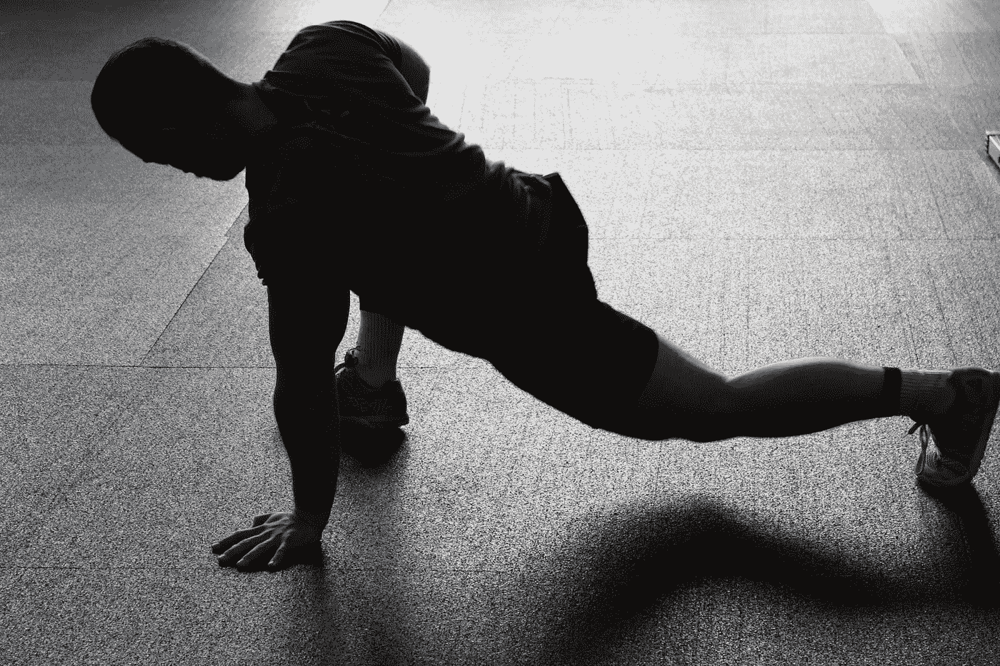

# 需要一些清晰度和创造力？不要忽视你的身体。

> 原文：<https://medium.com/swlh/need-some-clarity-and-creativity-dont-neglect-your-body-41aab441656>

Photo by [Pixabay](https://www.pexels.com/de/@pixabay) on [Pexels](https://www.pexels.com/de/foto/athlet-dehnen-mann-person-209969/).

在我的职业网络中，我注意到的一个最突出和有害的趋势是忽视大脑的外壳——身体。

特别是在早期，几乎每天的每一秒钟都用来学习广告、研究会计法、完成订单、提供服务，以及从事其他工作，任何之前对身体健康的投入都随着其他休闲活动而消失了。我们以“全力以赴”的名义这样做，有时是无意的。

实际上，通过牺牲你的身体健康，你只能做到一半。

> “我动，故我在。”
> 
> —村上春树

作为一名运动科学家，我可以列举出睡眠、营养和锻炼的好处。

*   睡眠增强你的免疫系统，提高记忆力，可以减轻压力，提升你的情绪，治愈身体以减轻疼痛，并加强许多其他重要系统。
*   健康的饮食也有助于免疫力、体重控制、大脑健康，并全面帮助身体在日常工作中发挥最佳功能。
*   锻炼会释放体内的化学物质来减轻压力，改善情绪，甚至增强创造力，并通过增强体质来抵御疾病。

如果你在小学的时候关注过，或者在去年去看了医生，你可能已经知道这些事情了。如果没有，请访问你们国家卫生组织的网站或者[约翰·福克斯](/personal-growth/the-30-best-websites-for-learning-about-health-and-fitness-1a33dbe0e525)的这篇文章来获取更多信息。只是请不要听奥兹医生或者 Instagram。

这些影响很大，但这不是重点。

当我们忽视睡眠、营养、健康和某种程度的生活平衡时，我们就忽视了自己的一半。50%的人做任何事都不会有最佳表现。

你在牺牲情绪。专注。生产力。创造力和创新。你错过了重要的事情，因为你的大脑从来没有选择清除。

对于我采访过的许多高管来说，问题在于时间。没有人愿意开车 30 分钟去健身房，锻炼一个小时，开车 30 分钟回家，淋浴，然后做饭 30 分钟，同时试图早点上床睡觉。

连我都可以认同这是不现实的！

## 适应性强、现实的策略。

如果你能每周三次抽出 15 分钟，在你的房子或工作场所周围，花时间去锻炼。也就是说，一周总共有 45 分钟*时间*用于提高你的个人表现。在第一周，第一天和第三天去慢跑或骑自行车。第二天，做一个短体重力量循环。在第二周，交换日期，这样你就有两个力量训练日和一个慢跑日。然后交替你的周。

当你选择食物时，跟着你的良心走，选择更健康的食物。但是请记住，有时一顿大餐或一份甜点对灵魂有好处。

晚上，试着调暗你的屏幕或者投资一些蓝光电脑眼镜。喝额外的水或茶。让你的身体自然进入睡眠状态，目标是每周平均每晚至少六小时。

请记住，这种个人健康的方法不是强制或限制。这不是最大的输家也不是你的医嘱。

这只是关于优化。

这是关于优化*你*的表现，这样你就可以付出 100%的努力，而不是因为勉强过得去而表现平平的 50%的努力。这是为了提高你的创造力，你的情绪，你的注意力，你的信心，并减轻你的压力，痛苦和愤怒。

**无论如何，你都想长期参与其中，对吗？**

试一试，让我知道进展如何！其他人有过为了工作而优化自己健康的经历吗？

**感谢阅读！如果你从这篇文章中受益，请鼓掌或分享，这样它可以帮助别人。我非常感谢你的反馈和回应，比你知道的还要多！——朱莉娅**

**想了解更多关于教练、表演心理学和体育行业创业的信息，请查看** [**狮子的鬃毛博客**](http://www.whitelionperformance.com/blog) **。**

## 这篇文章发表在 [The Startup](https://medium.com/swlh) 上，这是 Medium 最大的创业刊物，拥有 318，120 多名读者。

## 在这里订阅接收[我们的头条新闻](http://growthsupply.com/the-startup-newsletter/)。

