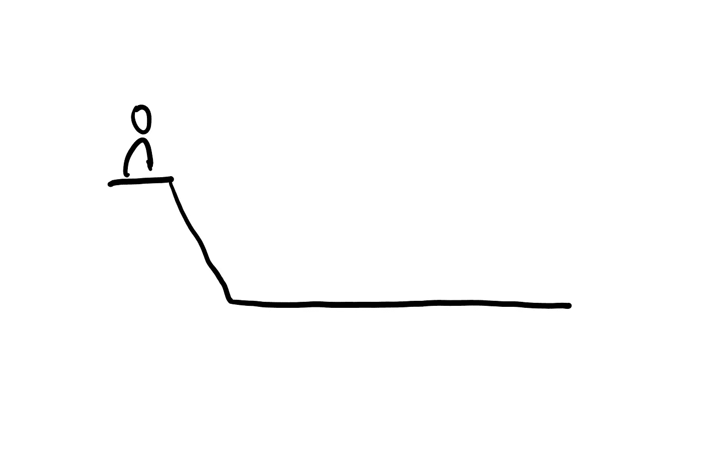
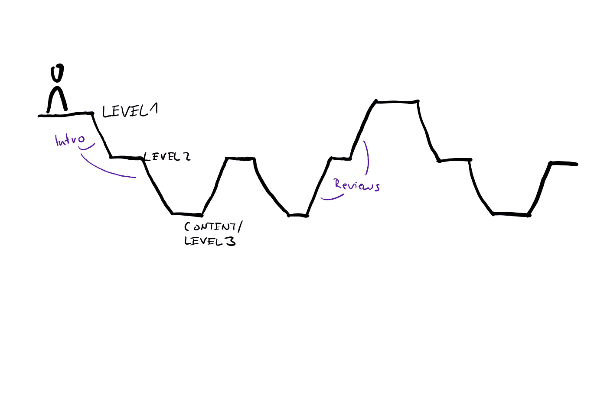

# 需要做个演讲吗？开始使用“缩放原则”来增加听众的参与度

> 原文：<https://medium.com/swlh/need-to-give-a-talk-start-using-the-zoom-principle-to-increase-your-listener-engagement-a4daf9784519>

Photo by [Roman Mager](https://unsplash.com/photos/5mZ_M06Fc9g?utm_source=unsplash&utm_medium=referral&utm_content=creditCopyText) on [Unsplash](https://unsplash.com/?utm_source=unsplash&utm_medium=referral&utm_content=creditCopyText)

## 通过提供层次和参考点，你的听众会更好地理解你的信息。

在上周一的帖子中，我关于更好地解释事情或给出更好的推销的理论都是关于正确的上下文，也就是:给你的听众关于情况、人物、话题等的额外信息。这样他们就能更好地跟踪你。

**这个想法可以更进一步。给你的听众(在你的演讲、讲座或推销中)参考点将会保持听众的参与并增进理解。**

工作原理是这样的:把你的主题想象成具有多层次的复杂性。第一个层次是一个宽泛的概述——你演讲的目录。有时，这种概述在开始时就像一个议程(这很好)，但之后就再也没有提到过(不太好)。

**大多数时候，没有更高的层次，讲师只是深入主题，只是在最后出现更高的层次。**

Diving into a topic — overview only once, at the beginning

为了更好地吸引听众，引入额外的层次和副主题是很有用的，这将有助于你的听众将所有信息放入更小的片段中——这有助于更好地保留数据。

你可以在书中找到这个原则，所有的文本都被分成章节和段落。然而，与书籍不同的是，演讲中的听众无法回头重读任何文本，因为演讲是严格线性的。作为演讲者，你必须把你的信息分成章节和段落。

Zooming in and out of the information, always coming back to the overviews

“缩放原则”是这样工作的:

*   在开始，给你的演讲，你的章节一个高层次的概述。既然是高层次的，就把要点限制在八个话题左右。
*   首先要明确地交流你接下来要谈的是哪一个层次，以及它包含了什么。我们现在从第一章开始，太空旅行的基础知识。在这里，我们将看看自 20 世纪初以来的历史发展和一些基本的技术概念。”正如你所注意到的，我把这一章分成了两个更小的层次。
*   现在，您可以详细了解这些章节了。告诉你的听众你在哪里开始:*“让我们从历史发展开始…”*
*   当你读完一章时，也告诉你的听众:*“这是历史方面的结论，接下来是技术概念”。*
*   当您完成一个级别时，请一直向上进入总体概述:*“我们已经讨论了历史和技术概念，第一章到此结束。第二章是关于现有的项目和我们可以从中学习到什么。它分为三个部分……”*

这就是我称之为“缩放原则”的原因:你不断地放大和缩小你的观点，这样，每当你开始或结束一个小节，听众都知道他们在哪里。

但这一切是不是有点多余？我需要不断地告诉听众他们在哪里吗？正如我上面所说的，在线性谈话中，没有可能回过头去重新阅读信息。就像高速公路上的标志一样，你的章节和层次会引导你的听众通过你的演讲。

**结构化的信息更容易被听众记住和理解。**

当然，对此要有所保留:没有必要介绍和回顾你演讲中只包含一句实际信息的章节。再次，想想书:你不会想只用一句话写一章，就像你不会想只用一章写一本书一样。这确实需要一些练习，我向你保证你的听众会很高兴听到你讲话。

PS:一个很好的替代幻灯片演讲的方法是使用 [Prezi，](http://www.prezi.com)一个在线工具，使用缩放原理来组织信息。

## 这篇文章发表在 [The Startup](https://medium.com/swlh) 上，这是 Medium 最大的创业刊物，有 282，454+人关注。

## 订阅接收[我们的头条新闻](http://growthsupply.com/the-startup-newsletter/)。

