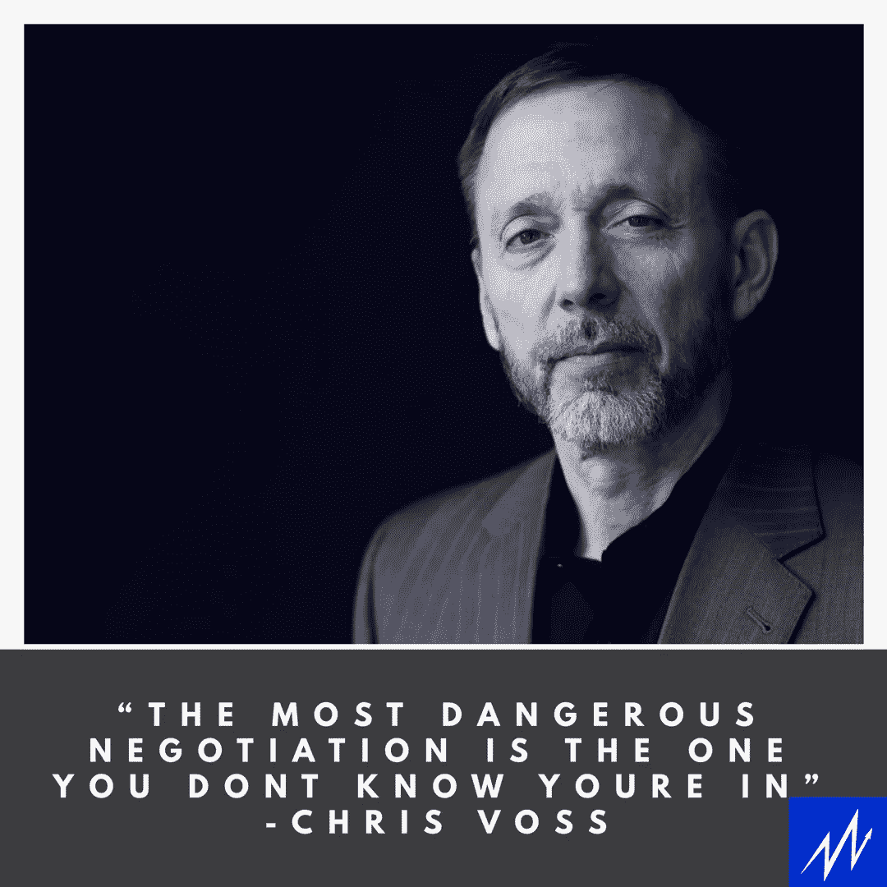

# 谈判就好像你的生命取决于它

> 原文：<https://medium.com/swlh/negotiating-as-if-your-life-depended-on-it-29293ce5b243>

Unsplash.com

# 一位前联邦调查局特工的建议

谈判是一项需要掌握的重要技能。无论是你的工作薪水，你正在做的一笔生意，还是想在下一次买鞋时获得额外 10%的折扣，生活中的一切都是谈判。

可能没有人比克里斯·沃斯更了解谈判。

在 2008 年之前，克里斯是联邦调查局的首席国际绑架谈判代表。在他 24 年的联邦调查局生涯中，他处理过 150 多起绑架案。换句话说:当一个坏人抓住一个美国人时，克里斯是第一个被叫来安全处理这一情况的人。

他还获得了司法部长执法优秀奖和联邦调查局特工协会杰出和模范服务奖。

现在，克里斯经营着黑天鹅咨询集团，并在南加州大学和乔治敦大学教授谈判。

克里斯写了畅销书:《永远不要分割分歧:谈判，就好像你的生命取决于此》。这是很多人向我推荐的，也是任何想要掌握谈判技巧的人的必读书目。

在这一集中，我们谈论他与恐怖分子的谈判过程，一个企业或销售人员如何在你下次的工资谈判中使用这些策略和技巧。

> "最危险的谈判是你不知道自己正在进行的谈判。"

Listen to the full interview here!

# 关于作者

汤姆·阿莱莫 *是一名充满激情的 B2B 销售人员。他目前是* [*千禧一代动力播客*](https://soundcloud.com/ryan-warner-799706255) *的主持人，在这里他帮助千禧一代快速跟踪他们的个人发展。Tom 也是 TechTarget 的客户经理，住在旧金山。*

[网站](http://tomalaimo.com/) | [播客](https://soundcloud.com/ryan-warner-799706255) | [邮箱](mailto:thomasalaimo7@gmail.com) | [推特](http://twitter.com/tommytahoe)|[LinkedIn](https://www.linkedin.com/in/tom-alaimo-573a1878/)*|[脸书](https://www.facebook.com/thomas.alaimo.12) | [Instagram](http://instagram.com/tommytahoe) | [媒体](/@TomAlaimo_TTGT) |*

**

## *这篇文章发表在 [The Startup](https://medium.com/swlh) 上，这是 Medium 最大的创业刊物，拥有+ 378，330 名读者。*

## *订阅接收[我们的头条](http://growthsupply.com/the-startup-newsletter/)。*

**