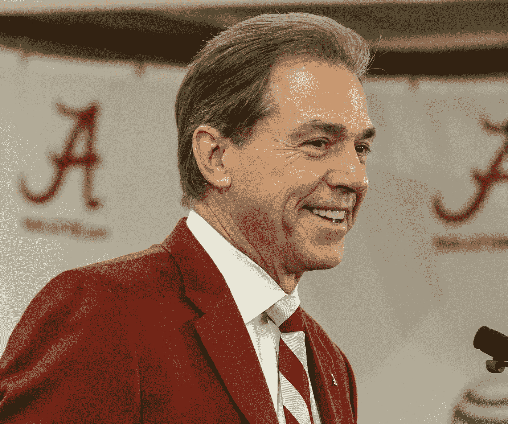

# 谈判:尼克·萨班

> 原文：<https://medium.com/swlh/negotiation-nick-saban-aa668ee9ce59>

场内场外获得最佳交易的艺术。

Source: [**(Vasha Hunt / Associated Press)**](http://www.latimes.com/sports/sportsnow/la-sp-sn-nick-saban-alabama-salary-20140603-story.html)

## 《丛林奇兵》

目前，尼克·萨班已经成为大学橄榄球赛中薪酬最高的教练之一，他最近的薪酬达到了惊人的[约 1100 万美元](https://www.forbes.com/sites/monteburke/2017/05/02/nick-saban-will-make-11-million-next-football-season-and-he-is-worth-every-penny/)，这是他担任阿拉巴马大学主教练的结果。围绕萨班目前合同的更令人惊讶的事实是…