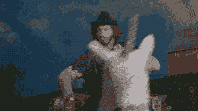

# 2018 年，网飞没有扼杀我对书籍的热爱！

> 原文：<https://medium.com/swlh/netflix-hasnt-killed-my-love-for-books-in-2018-8b1505a579c3>

Photo by [Janko Ferlič](https://unsplash.com/@thepootphotographer?utm_source=medium&utm_medium=referral) on [Unsplash](https://unsplash.com?utm_source=medium&utm_medium=referral)

在这里，我们将分享我们对书籍的热爱，并列出 34 本你应该加入 2019 年阅读清单的书籍。

今年，我读了一些鼓舞人心的书，想和大家分享一下。如果你也能和我分享你的清单，我会很高兴的！

# **对书籍的热爱**

如果你觉得你读的书永远不够，获得新的理论技能和知识给你带来了深深的满足感，这篇文章就是为你写的。

除了作为风投的日常工作之外，我还有一个自己的创业项目，我觉得对于我所处的每个发展阶段，都有一本相关的书籍来指导我，提供有见地的想法和建议。有时候，当我情绪低落时，这只是重新调整我的想法和心态。

当然，埋头读书就像在车库里自己制造产品，而不与潜在客户交谈。这不是正确的方法。你做的每件事都需要在理论和实践之间保持良好的平衡。

> 因此，通过学习放松是一个很好的方法！

# 在书中寻找答案

今年，我觉得我需要在营销和产品方面变得更强。目前，我有一种直觉，我正在努力为我的创业公司打造品牌。在接下来的一年里，我可能应该专注于阅读这方面的书籍。这可能包括挖掘与神经科学相关的领域，以便**更好地了解我的潜在用户**(希望我会得到很多用户)**开发一条贴纸沟通线**。

最后，当我经历某种与工作相关的存在危机时，就像我的大多数 Y 一代人一样，我很可能会寻找我所做事情的更深层次的意义。退一步，反思一下有抱负的独角兽们兴旺发达(或者不兴旺)的社会和经济贡献。事实上，自从我读了《四大巨头:亚马逊、苹果、脸书和谷歌隐藏的 DNA》之后，这个问题就一直困扰着我。

我只是想确保我在做一个有意义的项目，并且我所做的不会助长任何不可持续和贪婪的野心。

# **大师写的书**

读一本书就像退一步，听一个特定专业领域的大师讲课。这就好像在通勤或漫长无聊的旅程中，那位大师总是能以你需要的确切速度教你。

虽然重点不是在你读完一本书几个月后对它进行总结，但我发现，当需要的时候，人脑总是能够拿出你从书中获得的合适的工具包和框架。

今年我读了 35 本书，离我的目标还差 17 本书！我肯定买了更多，所以越积越多。每周一本书绝对是理想的。比尔·盖茨就是这么做的。所以，如果我想赶上进度，我可能应该早点起床，读另一本关于快速阅读的书，或者坚持读 120 页的书！

> 你明白了，我爱书，所以如果你分享这份爱，请容忍我。:)

# UX/用户界面和产品

*   唐·诺曼的日常用品设计
*   被尼尔·埃亚尔钩住
*   Ryan Levesque 提问
*   史蒂夫·克鲁格的《不要让我思考》

# 营销

*   有效演讲的捷径
*   马克·w·谢弗的《内容代码》
*   菲尔·m·琼斯到底要说什么
*   从西蒙·西内克的《为什么》开始
*   塞斯·戈丁的许可营销
*   罗伯特-文森特·焦耳和让-莱昂·博瓦的《操纵人类习惯的小把戏》
*   赛斯·戈丁的《部落》
*   罗伯特·恰尔迪尼的预先劝说
*   哈利根和沙阿的集客营销

# 商业

*   相信我，我在说谎
*   奥普拉·温弗瑞的《我所确定的》
*   克里斯·沃斯的《永不分离》

# 企业家精神、生产力和增长

*   兰迪·斯特里特和杰夫·斯马特的《谁是招聘的方法》
*   奥利维亚·福克斯·卡巴内的魅力神话
*   把事情做好——大卫·艾伦的《无压力生产的艺术》
*   去它的，让我们做理查德·布兰森
*   艾米·卡迪出席
*   肖恩·埃利斯和摩根·布朗的《黑客成长》
*   钱德勒·博尔特新书发布会
*   作者杰西·沃伦·特韦洛
*   约翰·杜尔登《衡量什么是重要的》
*   J . F . Caillard 和 T. Paris 的《创业工厂》
*   德克莱尔、丁和杜蒙特的 La 25e Heure

# 技术

*   奥利维尔·西奥博尔德的《机器学习》
*   四:亚马逊、苹果、脸书和谷歌隐藏的 DNA
*   艾米莉·张的《布罗托皮亚》

# 哲学

*   弗吉尼亚·马里斯的《生物多样性哲学》
*   由 Yukari Mitsuhashi 创作的 Ikigai
*   兰迪·波许的最后一课

# 探索与摄影相关的新视野

*   《时尚世界》，马克·汤盖特的《大品牌战略》
*   迪克西·迪克逊的时尚与生活方式

2017 年最好的书:**精通——罗伯特·格林**

2018 年最受欢迎的:**克里斯·沃斯**

后者是迄今为止我读过的关于谈判技巧的最精彩的书。Chris Voss 是一位世界级的著名 FBI 谈判专家，他解释了如何将在现场学到的调解技巧应用到商业中。

**2018 年最差的书:**奥普拉·温弗瑞《我确定知道的事》……对不起，奥普拉……我以为这么成功的女士写的书会鼓舞人心、丰富多彩。就像理查德·布兰森写的一样。可惜的是，恰好完全平淡无味。完全是浪费时间。虽然这是一本很短的书，但我还是没能看完。

这是去年榜单的链接。

无论如何，我对我 2019 年的阅读清单感到兴奋，如果你有一些推荐分享，请通过评论让我知道，新年快乐！

*希望这篇文章对你或者你认识的人有所帮助。请随意给我 50 个掌声，如果你喜欢，请跟我来，谢谢！*

## 这篇文章发表在[《创业](https://medium.com/swlh)》上，这是 Medium 最大的创业刊物，拥有+405，714 人关注。

## 订阅接收[我们的头条新闻](http://growthsupply.com/the-startup-newsletter/)。

