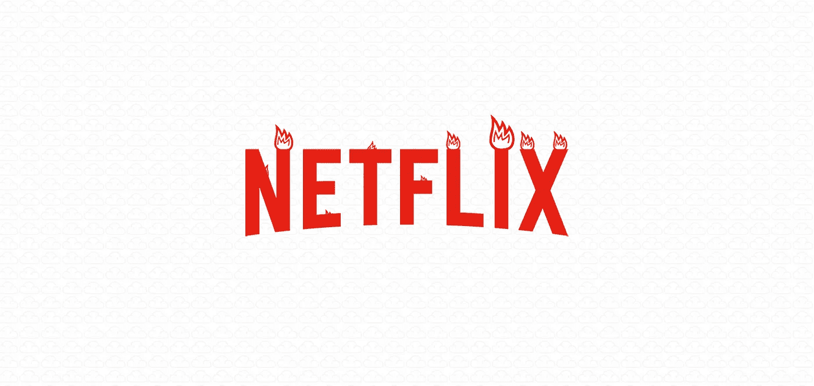
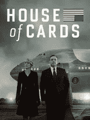
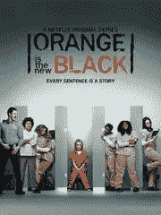
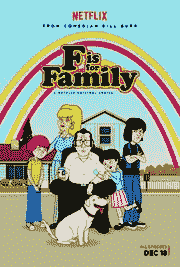

# 网飞着火了

> 原文：<https://medium.com/swlh/netflix-is-on-f-ing-fire-1675d47e722>

传统电视行业应该处于恐慌模式。网飞在全球大约有 6900 万用户，而且还在增加，这也许没什么大不了的。也许 netflixers 每天在该服务上观看 1 亿小时的视频甚至是一件小事。

“是的，但是他们没有足够的‘向分销商收取高额费用’有价值的内容。大电视扼住了他们的咽喉！”

你猜怎么着？根据烂番茄的调查，网飞现在制作排名前五的视频系列中的三个:

猜猜另外两个是谁的？只是小小的亚马逊。你不会想让我从亚马逊开始的。

一度流行的说法是，网飞将受到好莱坞和大型电视网络用来维持其对优质内容的控制的艰难交易的限制。然后网飞宣布将制作原创节目，《纽约客》问道，[网飞是不是要完蛋了？](http://www.newyorker.com/culture/culture-desk/is-netflix-doomed)注定我告诉你！注定的！

现在这个笑话是关于电视行业的:

"制作观众喜欢的原创内容是如此艰难！"

“有多难，詹姆斯？”

“太难了，网飞每年都制作一部新节目，观众的收视率达到 85%或更高！每年都是！这比《我是如何遇见你的母亲》和《生活大爆炸》等剧集的收视率都高，这两部剧的粉丝评分都只有“微不足道的 81%”。别忘了他们在过去两年里制作的所有伟大的[喜剧特辑](http://www.pastemagazine.com/articles/2015/09/the-25-best-stand-up-comedy-specials-on-netflix-in.html)！哦，让我们不要忘记他们的新的奥斯卡热门电影，像没有国家的野兽与未来的导演凯瑞·福永。"

抱歉，这里没有“哈哈”笑话。除非你认为网飞向大电视提供大量数据驱动的谦逊馅饼很有趣。大电视真的知道甚至关心观众想要什么吗？

真正的十亿美元的问题是，当网飞和亚马逊等公司倒闭时，传统电视行业还能生存多久。艾尔继续掠夺和掠夺各种类型的电视和电影？

有多少原本可能成功但被电视和电影高管扼杀的节目或电影现在将在网飞重见天日？

流媒体行业完全取代电视还有多久？

“我们能做得更好”的苹果和“我们能做得更便宜”的谷歌还要多久才能杀光剩下的掉队者？

离我们的英雄被超级豪华的死亡射线一分为二还有多久！？！？下周请继续收听，了解详情！

附注:以下是网飞创作的其他一些原作:

House of Cards — 89%

Orange is the New Black — 87%

Marco Polo — 92% (Fun Fact: Critics rated it 24%. How’s that for incongruity?)

Marvel’s Daredevil — 96%

Narcos — 94% (Another crazy disconnect as critics only rated it 78%)

F is for Family — 90%