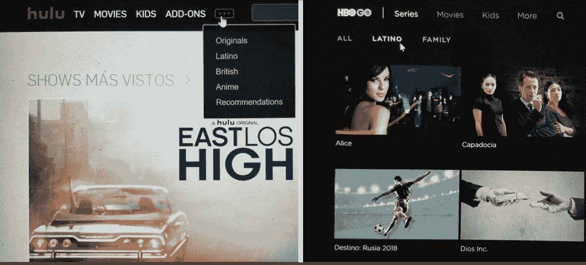

# 网飞正在消除语言障碍，吸引观众

> 原文：<https://medium.com/swlh/netflix-is-tearing-down-language-barriers-and-attracting-viewers-992690e46e45>

广受欢迎的《网飞》展示了缉毒警察、T2、3%和 T4 的金钱抢劫已经克服了语言障碍。 *3%* 是 2017 年第二大[最受关注的网飞秀](https://media.netflix.com/en/press-releases/2017-on-netflix-a-year-in-bingeing)。*金钱大劫案*是截至 2018 年第一季度网飞上观看人数最多的非英语剧集[。网飞是怎么做到的？无缝技术、战略性品牌产品和应对消费者行为的变化。](https://s22.q4cdn.com/959853165/files/doc_financials/quarterly_reports/2018/q1/FINAL-Q1-18-Shareholder-Letter.pdf)

**无缝技术**:消除语言障碍有助于采用。一个朋友看了《网飞》系列节目，音频默认为英语，她喜欢整个第一季，却没有意识到该节目原来是葡萄牙语的。辅助音频(配音)和隐藏字幕(字幕)技术在网上获得了新生。这项技术扩大了观众的节目选择，并允许内容提供商找到新的观众。网飞并不限制网飞原创作品的配音和字幕。《怪物史莱克》、《国王的演讲》、《T21》和《七磅》等电影在网飞有多种语言版本。

Examples of Netflix dubbed audio options for movies and shows in the U.S.

战略性品牌标题:只有当浏览者点击标题时，提供语言选项才有效，为此你需要智能品牌。网飞选择了在美国和海外都相关的节目名称。毒品这个名称在西班牙语和英语中引起了很大的共鸣。 *3%* 全球理解。甚至*金钱大劫案*在美国开播，第一季的原片名为 *Casa de Papel* ，到了第二季就改成了英文片名。标题改为英文可能吸引了以前可能忽略外语标题的新观众。当用户不能阅读标题时，很难推动采用。目前[网飞正在测试个性化艺术作品以提高收视率](/netflix-techblog/artwork-personalization-c589f074ad76)。网飞会使用类似的技术来优化他们在当地市场的原创剧集的名称吗？

**多任务处理**:根据脸书的说法，[观众只花 53%的时间关注电视屏幕](https://www.facebook.com/iq/articles/mobile-and-tv-between-the-screens)，我也是其中之一！我试着看带字幕的电视剧【T4 3%】，然后很快切换到配音，因为我在做饭、网购或回复信息时会看《网飞》。如果你需要阅读字幕来跟随故事情节，你就不能一心多用。如果网飞、Hulu 或亚马逊想让观众疯狂观看外语连续剧，期望全神贯注地阅读 8 集以上的字幕是不现实的。

网飞正在最大化他们内容的潜在利益。亚马逊可能已经采取了类似的策略。在 Telemundo 上看世界杯的时候，我看到了亚马逊即将推出的原创系列*杰克·瑞恩*的宣传广告。整个视频预告片是用西班牙语配音的。另一方面，HBO 和 Hulu 在拉丁美洲内容上进行了大量投资，但没有向订户提供在线音频选项。

Hulu and HBO dedicated Latino content offering.

Hulu and HBO GO language features. Hulu only offers subtitles. HBO has an alternative audio feature available but currently does not offer dubbed audio.

其他在线视频提供商还要多久才会步网飞的后尘？你认为配音和片名对推动在线观看很重要吗？下面分享一下你的想法。

Leslie Heredia 是 Robledia 咨询公司的首席顾问。**。**

**

## *这个故事发表在 [The Startup](https://medium.com/swlh) 上，这是 Medium 最大的企业家出版物，拥有 348，974+人。*

## *在这里订阅接收[我们的头条新闻](http://growthsupply.com/the-startup-newsletter/)。*

**