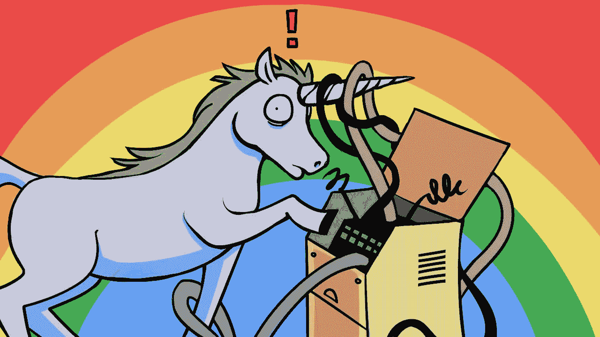

# 永远不要让机会从你身边溜走——这是一个非常有效的快速方法。

> 原文：<https://medium.com/swlh/never-let-an-opportunity-pass-you-by-a-super-quick-hack-that-works-1a4960c8ae57>

今天我想和你分享一个非常有效的超级快速的方法。

你的头脑总是会想出绝妙的主意。问题是，除非你立即采取行动，否则你会忘记这个想法是什么。即使你记得这个想法，你可能以后也不会对它产生共鸣或热情。

这就是为什么每当我有一个好主意时，我会立即采取行动。让我给你举几个例子:

–昨天我认为加入健身房会有所帮助。我在 30 分钟内就报名了
——我很害怕做公开演讲，但第一次被叫到名字时才起床
——自己预订我的第一个海外假期很可怕。一小时内我就付了钱。

# 你可能看起来像个神经病，但这是值得的。

一半时间我看起来像个疯子。让我告诉你原因:

当我有一个惊人的想法变成了一个潜在的目标时，我不会不采取行动就离开这个目标。这个习惯意味着我会沉迷于采取行动，并在那一刻忽略其他一切。有时候，这让我看起来像个神经病。

**我脸上这种奇怪的表情是由于避免分心和一接到通知就采取行动所带来的巨大专注。我痴迷于立即采取行动，因为我不相信我的大脑会记住未来的新目标。**

这是我唯一一次可以容忍你粗鲁的低头看着你那不太好的智能手机。如果与一个全新目标的第一步行动相关，在手机上做笔记、发电子邮件或打电话都没问题。

# 永远不要没有下一步就离开。

如果你在追逐一个目标，永远不要在没有迈出下一步的情况下进入下一个任务。

如果你遇到了某人并做了推销，在他们离开你的视线之前，马上开始下一步。如果事情感觉正确，不要害怕说“是”,而不是回头再做决定。

永远不要说“我明天再做”，因为你会忘记，明天与你的行动相关的能量会更少。

> *“趁你还有精力和心情，现在就行动吧”*

# 抓住机会很难。

我们都面临着不可思议的机遇，而最具挑战性的是答应。

我们通常会延迟做决定，或者根本不做决定。要避免这个问题，最好在当下做决定。抓住现在的机会。

如果机会感觉正确，那么它很可能是正确的。相信你的直觉，不要满足于浪费机会和永远不去做对你来说重要的事情的生活。

> 做任何事都没有好时机。你总是可以说是，然后稍后中止"

# 我对你的承诺。

如果你遵循这个小窍门，致力于抓住当下的机会，而不是把一切都推迟到未来，你会体验到更多的生活。

你会成为一个行动导向的人，他们是最好的类型。行动导向型的人有目标并取得成功。

这些同样成功的人从不放过任何机会。他们抓住给予他们的机会，避免遭受疾病和过度思考的新时代流行病的折磨。

没有比现在更好的机会了。
碰碰运气。快点。
抓住机会。

【Addicted2Success.com】原帖

# *行动呼吁*

*如果你想提高你的工作效率，学习一些有价值的生活窍门，那就订阅我的私人邮件列表吧。你还将获得我的免费电子书，它将帮助你成为改变游戏规则的在线影响者。*

*[**点击这里马上订阅！**](http://timdenning.net/free-ebook)*

**

## *这个故事发表在 [The Startup](https://medium.com/swlh) 上，这是 Medium 最大的创业刊物，拥有 307，871+人关注。*

## *在这里订阅接收[我们的头条新闻](http://growthsupply.com/the-startup-newsletter/)。*

**