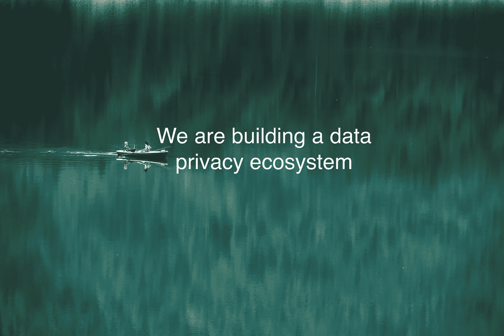
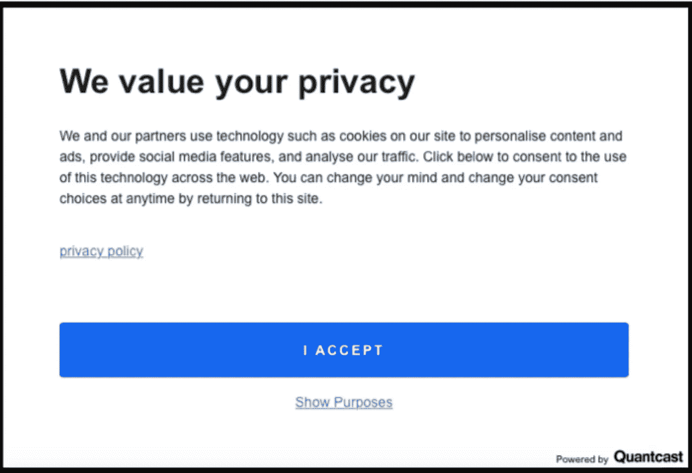
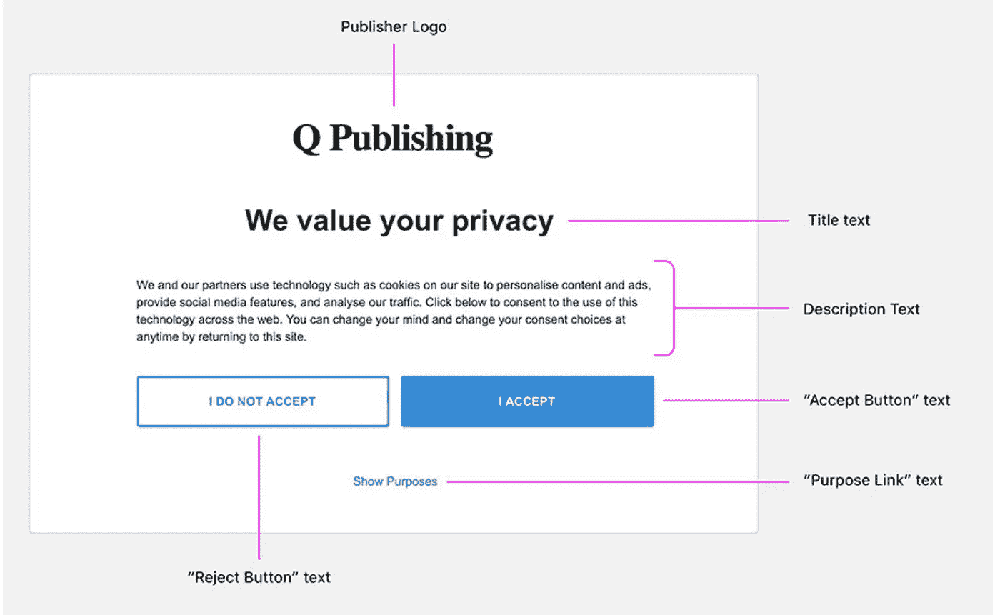

# 新技术标准:将数据隐私视为人权

> 原文：<https://medium.com/swlh/new-tech-standard-respect-data-privacy-as-human-rights-777f2ad58b89>

# "美国公民应该得到比欧洲人更少的数据隐私保护吗？"

2018 年 9 月，康涅狄格州民主党参议员理查德·布卢门撒尔在参议院数据隐私法听证会上问道。没有一个硅谷巨头同意。这发生在《欧洲通用数据保护条例》( GDPR)生效几个月后。

与此同时，苹果公司首席执行官蒂姆·库克公开称赞欧洲通用数据保护条例(GDPR ),并要求美国制定更严格的数据保护法。微软首席执行官塞特亚·纳德拉宣称要“尊重并把数据隐私视为人权”。

虽然数据隐私运动正在向前发展，但科技巨头们似乎都同意数据隐私的重要性，尽管合规率很低——根据一项独立研究，截至 2018 年 6 月，只有 [20%](https://info.trustarc.com/Web-Resource-2018-07-12-GDPR-ResearchReport_LP.html) 的公司完全完成了 GDPR 实施。

事实上，当 GDPR 教最初被采用时，它并没有被广泛接受。GDPR 被认为是另一个不方便的监管合规，科技公司反对采用它。

是什么推动了科技领袖演讲的变化？又是一个公关策划？有一点是肯定的:数据隐私保护不仅仅是合规性。

# 数据隐私保护是用户信任的基础

2012 年，塔吉特在一名少女及其父母不知情的情况下，曝光了这名少女怀孕的事情。这个故事第一次在很大程度上提高了 grand public 对定向广告和数据隐私的关注。通过简单地跟踪顾客的购物项目，Target 预测了怀孕，并使用这些信息进行有针对性的广告宣传。

那时候各种追踪技术都是默默的安装在整个互联网上。一大批数据交易商(数据经纪人、广告技术人员、信用机构……)迅速涌现并在幕后扩张。一方面，大数据热潮是由人们无意识地共享个人数据推动的。另一方面，人们确实关心他们的数据隐私。没有人希望陌生人知道他/她的个人信息，并最终使用它来做任何伤害。那这是怎么发生的？

*   *缺乏透明度*:很少提供关于数据收集和使用的解释。大多数时候，同意书往往具有欺骗性。总部位于旧金山的广告技术公司 Quantcast 在数百万个网站和应用程序上安装了追踪器。他们自豪地宣称，在使用他们框架的网站上，他们有 [90%](https://www.quantcast.com/about-us/press/press-release/quantcast-choice-powers-one-billion-consumer-consent-choices/) 的同意率。这是一个在 GDPR 之前在一个随机网站上的 Quantcast 同意书的例子(见图 1)。使用通用语言“我们和我们的合作伙伴”，“个性化内容和广告”，“提供社交媒体功能”，“分析我们的流量”，这听起来像互联网上任何其他免责声明一样正常。巨大的“我接受”按钮坚持用户点击它，这使得用户几乎默认同意。相反，用户不可能知道如何拒绝/撤回同意。一切都是为了在用户没有注意到的情况下获得他们的同意。在 GDPR 之后，Quantcast 更新了 cookie 横幅，增加了“拒绝按钮”(见图 2)。然而，大多数美国网站仍然是传统的横幅，如图 1 所示，因为它们不受 GDPR 的约束，或者它们在欧盟的存在微不足道。

图 1:GDPR 之前的饼干横幅，来自一个使用 Quantcast 的随机网站

图 2:根据 GDPR 的要求制作的饼干横幅

*   知识差距:人们不知道信息会被用来侵害他们的利益或以不良的方式使用。Quantcast 上也有同样的例子。大多数点击“我接受”按钮的人不知道，他们同意允许广告公司收集他们的浏览数据，与线下数据(大多是从数据经纪人或信用机构购买的)匹配，然后卖给营销人员进行定向广告。
*   放弃数据换服务:“不付费，你就是产品”。人们被欺骗，为了更便宜更方便的服务而放弃数据。如果这项服务从一开始就是付费的，谷歌和脸书可能会有竞争对手，人们可能会有更多的选择，并在放弃数据隐私以获得免费服务之前做出更明智的决定。
*   无辜的信任:人们相信科技公司对他们的个人数据负责，直到数据泄露和社交骗局的爆发。

人们的信任是脆弱的，尤其是建立在容易破碎的基础上。如今，随着越来越多的数据泄露事件发生，越来越多的人开始质疑科技公司的可信度和责任。

2017 年，Equifax 数据泄露影响了 1.43 亿消费者，姓名、地址、社会保险号和出生日期被泄露。

2018 年，脸书-剑桥分析公司丑闻干涉了 2016 年总统选举。

2018 年，雅虎为 2013 年发生的影响 30 亿用户账户的数据泄露支付了 8000 万美元。雅虎直到 2016 年才向公众公布数据泄露事件。

正如我们在最近的数据泄露事件中所看到的，后果不仅仅是电子邮件。这可能是经济损失，因为你的身份被盗；可以是名誉伤害，因为你的私密信息暴露了；这可能是政治影响，因为选民被操纵了……被破坏的不仅仅是我们的个人数据，还有作为公民和消费者的基本权利。

今天，人们逐渐恢复了对数据隐私的意识，开始停用他们的脸书账户，使用谷歌搜索的替代品，请求访问他们的个人数据，并了解 GDPR……我们看到了革命浪潮的开始。

# GDPR 终结对数据隐私无知的开始

GDPR 是这场革命浪潮的催化剂。它还消费者个人数据的权利——透明、公平、负责、不歧视、被遗忘的权利。

此外，通过严格的通知要求和严厉的处罚，公司无法隐藏数据泄露或在任何数据收集或使用中欺骗消费者。他们对数据安全负有最终责任。

*   72 小时通知
*   2%或 1000 万英镑罚款/ 4%或 2000 万英镑罚款——对于任何违反义务的行为，以金额较大者为准

像面对其他新法规一样，公司开始慢慢实施 GDPR。“等着瞧”的态度相当普遍。但有远见的领导者已经注意到，数据隐私不仅仅是合规性的问题，在不久的将来，它应该成为他们业务的中心。

# 数据隐私保护是新的技术标准

技术的发明是为了更好的服务和效率。安全和生产率是需要遵循的黄金标准。任何未能做到这一点的公司都将被淘汰。通用电气、柯达、摩托罗拉、雅虎……以及许多其他公司都是如此。

随着大数据和人工智能的兴起，数据隐私变得比以往任何时候都更加重要——这无疑是科技行业的另一个标准。所有科技公司都需要立即采用数据隐私标准，以保护你的用户并重新得到他们的信任。

发明有益的技术，尊重数据隐私的人权！

关于我们:Inpooling 的使命是建立一个数据隐私生态系统，在这个生态系统中，消费者隐私和业务增长得到很好的平衡，并一起激增！在 Twitter 上关注我们，了解更多关于我们数据隐私项目的信息。

*原载于 2018 年 11 月 26 日*[*【inpooling.com*](https://inpooling.com/blog/new-tech-standard-respect-data-privacy-as-human-rights/)*。*

## 这篇文章发表在 [The Startup](https://medium.com/swlh) 上，这是 Medium 最大的创业刊物，有+393，714 人关注。

## 订阅接收[我们的头条新闻](http://growthsupply.com/the-startup-newsletter/)。

