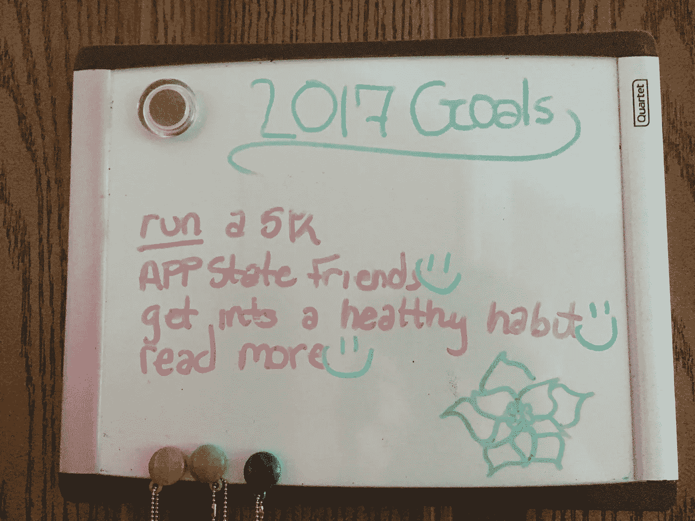
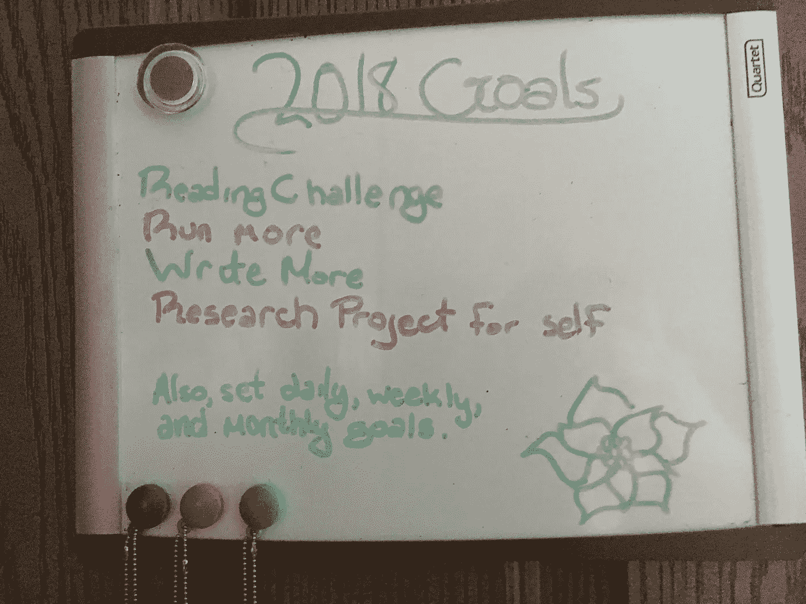

# 新的一年新的目标

> 原文：<https://medium.com/swlh/new-year-new-goals-d28bc78a5ec8>

年底通常会让我和许多其他人处于一种反思的状态。我们围坐在一起，思考着新的一年要做什么样的决定(当然，其中之一就是减肥)。2016 年底，我哥哥在其中一家健身精品店开始了新工作。他在自己工作的脸书页面上发布了一段视频，质疑为什么人们要等到一月份才变得身体健康并努力减肥。尽管这一年快结束了，但这不应该阻止任何人去健身房，开始实施他们的计划。我不太清楚为什么，但那真的让我难以忘怀。

2017 年，我给自己定了几个目标；有四个目标，我知道只要我下定决心，年底就能实现。是的，他们中的一半都是为了塑身。到了年底，我已经完成了四个中的三个。

这篇文章将反思我 2017 年的目标，并开始接近我为 2018 年设定的目标。

首先，我只为自己设定了一小部分要达到的目标，因为我想专注于这些目标，而不是因为年底有太多要达到的目标而不知所措。这是我向其他人强烈推荐的，如果他们经常被自己设定的决心数量所淹没的话。

The goals I had written down for 2017

我清单上的第一个目标是我唯一没有完成的目标。我希望能在年底前跑完 5 公里(3.1 英里)。高二的时候，我报名参加了南瓜主题的 5k。让我告诉你，这是残暴的。我找到了一个沙发到 5000 米的计划，我打算在比赛前遵循它。它持续了八周，我坚持到了第三周。这个计划包括在跑步机上锻炼，我应该每周做三次，同时以其他方式锻炼，无论是骑自行车还是举重。

我没有完成八周训练的部分原因，以及我的懒惰和拖延，是因为我放学后的大部分时间都在学校的剧院里度过，因为我是我参加过的最奇怪的戏剧之一的一部分。大多数时候，我都是晚上很晚才回家，而且还得完成作业。当我完成的时候，我不想在跑步机上跑了。

到了比赛日，我知道我完全没有准备好。我只想在一小时内完成比赛。我的时间大约是四十五分钟。很接近了，但是我仍然能够达到那个目标。比赛前几天，雨一直下个不停。这场比赛是在一个玉米迷宫中进行的，所以当然非常泥泞，非常糟糕。多次差点摔倒，多次差点丢鞋。尽管如此，我还是完成了比赛。

从那时起，我就想从头到尾完成这个八周计划，因为我知道我完全有能力这样做。这些锻炼并不十分困难。它们有助于培养我的耐力，使我能跑得更快更久。尽管我过去说过，其他许多人也说过，但我不介意跑步。有时候我真的很享受。可怕的东西，我知道。

到了 2017 年底，我只想证明给自己看，我可以跑一个 5k，不用停下来走路或者喘口气。即使这没有发生，我也不会对自己失望。我知道我会继续努力让我的屁股离开沙发，到跑步机或别的什么上，这样我就能最终建立起跑 5 公里的耐力，即使不是在今年年底。跑 5000 米很有趣，我想再跑一次。我一直告诉自己，我会报名参加另一场比赛，但我们都知道会发生什么。

我清单上的第二个目标是在我去上大学的时候结交新朋友。我知道这不是不可能做到的，但我知道这对一些人来说很有挑战性。整个高中时期，我很容易交到朋友。我只是不确定会是怎样，考虑到有多少人向你灌输大学和高中是完全不同的。是的，别误会。大学和高中绝对不一样。

交朋友对我来说很容易。我不能到处吹嘘我在大学里交了这么多新朋友。在过去的一个学期里，我遇到了这么多优秀的人，这绝不完全是因为我。我很幸运能成为我就读的大学的寄宿学院的一员。这意味着我和同样的人在同一栋楼里生活和学习。我的一个班级就在我宿舍下面一层。对我的室友来说，她的班级就在我们房间的走廊尽头。作为这个住宿学院的一部分(这肯定是我最喜欢的部分之一)，我们在周二和周四一起吃午饭。我们被迫花很多时间在一起，我们住在一起。我情不自禁地结识了所有这些人，并结交了新朋友。

我对结交新朋友的想法犹豫不决，是因为我认为有些人上了大学，住在校园里，却几乎不认识同楼层的人。我不是说这是其他人。我只是说，我假设这种情况发生在一小部分大学生身上，我害怕成为他们中的一员。然而，谢天谢地，我没有遇到结交新朋友的麻烦。

毫无疑问，我的第三个目标是养成健康的习惯。我没有明确地说要减肥或吃得更健康。年初的时候，我不知道我这么说是什么意思，但是我知道当我达到那个目标的时候我就会知道了。

2017 年春天，我早上参加了一个力量和调节课程。我认真对待这门课，而不是试图通过做最低限度的练习来漂浮。我每天都有时间来锻炼，我决定好好利用它，因为我知道如果它不在我的时间表中，我可能不会锻炼。

夏天一到，你猜对了，我就停止了锻炼。这是我遇到的一个障碍。我一直告诉自己，我会去找一个健身房会员，或者绕着街区跑一圈什么的。夏天很快就结束了，我一次也没去健身房。

然而，这并不是我在培养健康习惯时所想的。我是什么意思？我还是不知道。我是在大学第一学期中途才发现这一点的。

这个学期开始的时候，我比以前睡得更晚，然后起床，在去上课之前有足够的时间做好准备。我比过去更经常在白天心情不好。我想早起，在去上课之前努力提高效率(关键词 try)，尤其是当我一天的第一节课是在 11 点。有几天，我醒得足够早，可以在去上课前做些事情，与不去上课时相比，我的情绪有了很大的改善。

意识到这一点后，我决定开始每天在同一时间起床。我甚至会在周六早早醒来。即使我只是看了一集《网飞风云》，我也很开心。对我来说，这是我养成的健康习惯。

每天早起(我知道，很恐怖。我从来没有想过我会是一个早起的人)让我心情愉快，我能够建立一个睡眠时间表。这花了我将近年底的时间，但我明白了建立健康习惯的含义，并实现了这个目标。我养成的健康习惯确保了我保持一致的睡眠时间表以及精神上的快乐和健康。我计划在 2018 年继续这样做。

我给自己设定的最后一个目标是多读书。2016 年，我开始为了乐趣而阅读更多，因为我没有被我的班级的大量阅读轰炸(或感觉我被轰炸)。我下载了一个应用程序来帮助我记录我读了多少，读了什么。很有趣的是，通过输入页码，看到一个百分比弹出来，就可以看到我在一本书中读到了多少。当 2017 年到来时，我登录了应用程序，它问我这一年想读多少本书。我打了 15，心想一个月看一本书不难，一个月看两本书就太多了。

随着时间的推移，我开始读书。春天，我会花时间坐在沙发上，放学后读完一本书。夏天有几天我会坐在外面看书。然而，当我秋天开始上大学时，我再次感到了阅读的轰炸。我仍然将它们添加到我正在使用的应用程序中，因为它仍然被视为朝着我的目标阅读。

我能够在今年的最后一周内达到我的目标。我焦急地等待着新的一年，这样我就可以为 2018 年设定目标。既然我从 2017 年就能达成目标，我决定在 2018 年增加我想读的书的数量。虽然只有一个，但对我来说仍然是进步。

至于 2018 年，我决定建立四个我想在年底前完成的决心。他们中的一半离开了我 2017 年的生活。

My goals for 2018.

我设定的第一个目标源于我提到的最后一个目标。除了想在 2018 年继续多读书，我还找到了一份今年要读的不同类型书籍的清单。这是一个包含 12 个不同标准的列表，所以每个月都会有一本书。我认为这应该可以和我在课堂上必须做的阅读一起完成。在学期结束时，我能够很好地管理我的时间，所以我应该能够把它带到即将到来的这个学期。

我设定的第二个目标是从 2017 年开始偏离我的第一个目标。总的来说，我想让自己多跑步。可怕的东西，我知道。我喜欢跑步，它有助于我保持体形。我是否能在年底前跑完 3.1 英里(5 公里)对我来说并不重要。我只是想多跑跑步，即使这意味着去椭圆机上而不是跑步机上。这可能不被认为是跑步，但我会骗自己建立一个类似的耐力，就好像我真的在跑步一样。另外，当夏天我(希望)在户外跑步时，不会像我现在的状态那样困难。

我给自己定的第三个目标是多写。不管是一篇 25 页的研究论文，还是一首我为娱乐而写的诗，我都喜欢写作。在我高中的最后一年，我被要求修两门英语课:一门写作和一门阅读。我的写作课程是以学习写小说和诗歌为基础的。在那堂课上，我们得到的第一个提示是“为什么要写作？”我们为此看了一场 Ted 演讲。在学期结束时，我在网上(在朋友的帮助下)查找了一个提示，找到了一些可以用来帮助我为一个小故事集思广益的东西。我由此写的短篇小说是我最自豪的作品之一(直到那时)。

我多次尝试开博客，但大多数时候都失败了。我年轻的时候，迷上了当地的各种乐队，试图写同人小说。我认为我写得很好。然而，我有点害怕回去读它。我一直梦想着写一部小说或者成为一名著名的博客写手。

具体到我 2018 年的目标，我想每个月都有一篇新的博客。为了帮助自己，如果我不知道该写些什么，我想写一篇反思或评论或任何你想叫它的东西，关于我这个月选择阅读的书(参考我今年关于阅读更多的目标)。因为我每个月都会阅读不同类型的书，这将帮助我产生写作的想法。即使我一年中所有的帖子都在我读过的书上，至少我每个月都会发些东西。

我今年设定的第四个也是最后一个目标是为自己参加一个研究项目。对于这一点，我的意思是找到我感兴趣的东西并研究其中的奥秘。我已经想这么做很久了，我和我最好的朋友打算为莎士比亚做这个，因为我们有了一个关于莎士比亚小说的想法。

我一直是莎士比亚作品的粉丝。英语课上的莎士比亚单元一直是我最喜欢的。我喜欢钻研他的戏剧，了解他的生活。我也一直是文森特·梵高的粉丝。他在画中创造的质感令我着迷。我不想成为那种只触及表面，然后说“哦，是的，我是你的超级粉丝”的人。我希望能够更深入地研究某样东西，不管是莎士比亚还是梵高。我还没决定今年要研究谁，也不知道自己有没有动力两者兼顾。此外，我还没有决定是否要写一篇研究论文，无论我决定研究什么。这肯定会让我的研究更有意义。

总的来说，今年我想变得更有条理。在秋季学期，我经常使用我的计划。当我用得最多的时候，我确实看到了自己的进步。我计划(没有双关语)继续使用我的计划器。除此之外，我还想为自己设定每天、每周和每月要完成的目标。我每天的目标将会是一些事情，比如这周晚些时候要交的作业(因为我真的很擅长在学期结束时不要拖拖拉拉)，或者一些家务，比如洗衣服或者倒垃圾。我的每周目标是更大的任务，比如完成一篇论文，或者只是我想在一周内完成但没有特定日期去做的事情。对于我的每月目标，我真的不知道。可能只是吃得更健康，或者在某个周末去看看山(因为我在山上上学，这很酷)。

我对自己感到惊喜，我能够完成 2017 年四个目标中的三个。显然，我希望完成我为 2018 年设定的所有目标。当我年轻的时候，我会列出尽可能多我能想到的我想在一年内完成的事情，但几乎没有完成任何一件。

为新的一年制定计划不一定是你能想到多少。它更多的是关于你真诚地认为你能完成什么，然后尽你所能努力去完成它。在一年中的这个时候，看到美食网上所有的节目都在谈论吃得更健康，这有点滑稽。如果我说我没想过做他们展示的任何一种食谱，那我就是在撒谎。(前几天我试用了一款，它美味可口，令人惊叹，而且令人害怕的是，它没有负罪感。)

诚然，这是得到张贴晚于我想要它，但至少它仍然是一月！无论谁读到这篇文章，我希望你能够坚持你所有的新年决心。不要害怕在新的一年挑战自己。去年当我说我想读更多的书时，我做到了，我很高兴我做到了。也不要害怕在你的清单上写一些简单的东西。只要走出去，解决这个世界，一天一次。2018 快乐。

## 这个故事发表在 [The Startup](https://medium.com/swlh) 上，这是 Medium 最大的创业刊物，有 292，582+人关注。

## 订阅接收[我们的头条新闻](http://growthsupply.com/the-startup-newsletter/)。

