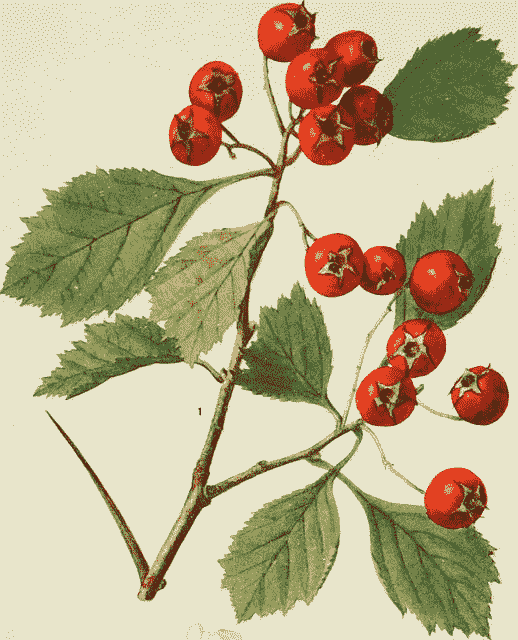
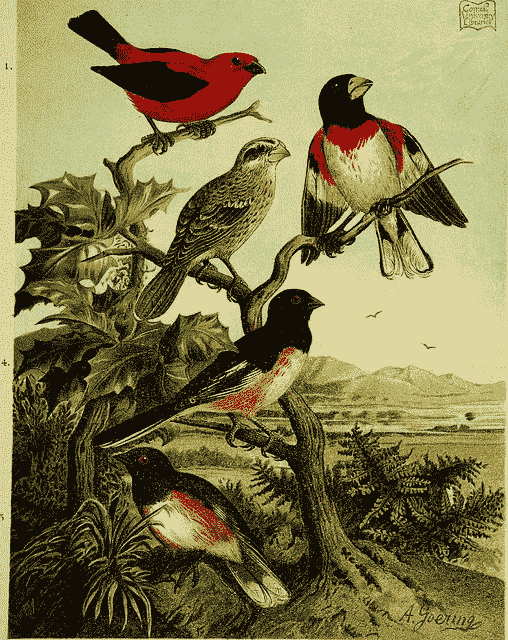
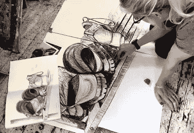
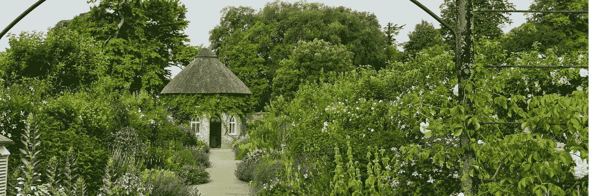
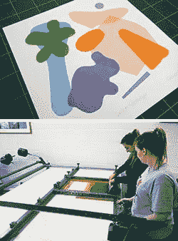
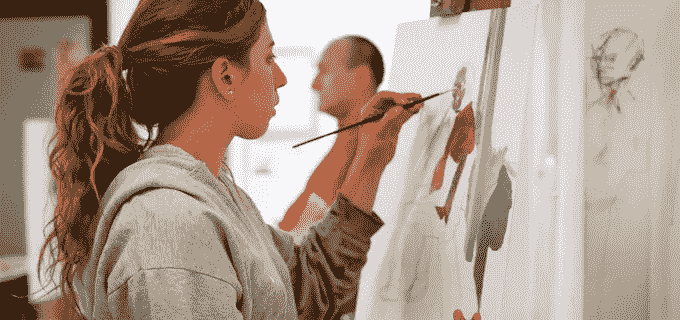

# 新年。现在怎么办？

> 原文：<https://medium.com/swlh/new-year-new-you-582fc1f8b25c>

每年的这个时候，我们的屏幕上和报纸上似乎都会出现没完没了的“新年，新的你”的标题和文章。

**更健康！吃得更好！少喝点！冥想，做瑜伽，学一门语言，尝试园艺，预定一个洞穴旅行。**这种自我提升的文化融入了我们每年制定新年计划的奇怪习惯，但众所周知，坚持这些计划很有挑战性。那么我们为什么年复一年地这样，&我们能怪谁呢？你可以从古巴比伦人开始。**如果做不到，那就坚持到底&看看今年你能从哪里学到一些新的有创意的东西。**

大约 4000 年前[在巴比伦](http://www.history.com/topics/holidays/new-years)，有记载的最早庆祝新年的活动开始了。这些集体仪式被称为秋日节，持续了 11 天。庆祝活动致力于太阳神马杜克的重生，巴比伦人做出承诺，以寻求他们的神的青睐。他们觉得这将有助于他们在新的一年有一个良好的开端。罗马人继续坚持这一决定，直到今天，这一传统还在世界各地延续。

没错。说了这么多，我必须承认，一旦我度过了“犯罪边缘”，我就开始思考未来的一年&它可能带来的可能性。我怎样才能把事情搞混一点呢？去年的这个时候，我迈出了一大步&报名参加了数字妈妈社交媒体管理课程。我在九月份完成了学业，毕业了，现在我作为一名自由职业者在 SMM 为我的第一批客户工作。近 15 年来，我在工作中从未如此开心过，但如果我没有受到激励去尝试新事物

前几年，我报名参加了丝网印刷课程、陶瓷工作坊&我还预定了机票去远方看望老朋友。今年呢？我还没决定。但是不管是一月还是八月，一年中的任何时候都是尝试新事物的好时机。

我不能帮你推荐壶穴，但是如果你想在明年释放你内心的创造力，这里是我挑选的你可以这样做的地方。

**新年快乐。**

[**南泰晤士学院，嘟嘟**](https://www.south-thames.ac.uk/courses/art,-craft-and-design.html)

自 1895 年成立以来，该学院经历了许多变化&规模有所扩大，但所提供的课程仍保持不变。职业课程旨在提供优秀的培训，最大限度地发挥学生寻找新技能的潜力；包括时装设计、花艺和艺术史以及木工、砖瓦和管道工程。

[**莫利学院，**](https://www.morleycollege.ac.uk/) **SE1**

莫利学院是美国历史最悠久、规模最大的成人教育专业机构之一。创建之初，它是为了满足滑铁卢和兰贝斯的学习需求，当时这是一个非常贫困的地区，它是莫利纪念学院，面向劳动男女，是同类学院中第一个平等接纳男女学生的学院。

如今，他们提供大量的成人学习课程，包括制陶、印刷、素描、珠宝制作、音乐、歌唱等等。

[**西汀学院，Susse**](https://www.westdean.org.uk/) **x**

几年前我发现了西迪恩，当时我对植物学插图非常着迷。该学院位于苏塞克斯郡，因其保护和创造性艺术而获得国际认可，并拥有向公众开放的最大的修复花园之一。这是一个独特的学习、旅游或住宿的地方，是一个卓越、创意和宁静的中心。你可以找到各种短期课程、文凭和学位课程，从摄影和插图到园艺、纺织和木工。

[**伦敦雕塑学院**](http://londonsculptureworkshop.org/)

LSW 是第一家总部位于伦敦的非营利性社区利益公司，为艺术家和对 3D 作品感兴趣的人提供卓越的设施。他们提供装备精良的金属和木材车间，另外还有模具制作和陶瓷区，以及陶瓷、青铜、铸件、混凝土的铸造课程、&制造、&焊接课程。

[**东伦敦版画制作者**](https://www.eastlondonprintmakers.co.uk/)

东伦敦版画家为有经验的版画家和初学者开办课程和讲习班。他们位于 Mile End，提供从丝网印刷、Mokulito &蚀刻到 lino &日本乙烯基印刷的所有产品。还提供开放式访问会话。

[**艺术学院，区**](https://artacademy.org.uk/)

艺术学院成立于 2000 年，是一所小型独立艺术学校，提供独特的美术教育方式。他们为所有年龄和所有技能水平的人提供一系列艺术教育课程。大量的课程，包括兼职和周末/晚上，包括绘画，雕塑，数码，绘画和印刷。

## 这篇文章发表在 [The Startup](https://medium.com/swlh) 上，这是 Medium 最大的创业刊物，有 277，994+人关注。

## 订阅接收[我们的头条](http://growthsupply.com/the-startup-newsletter/)。

