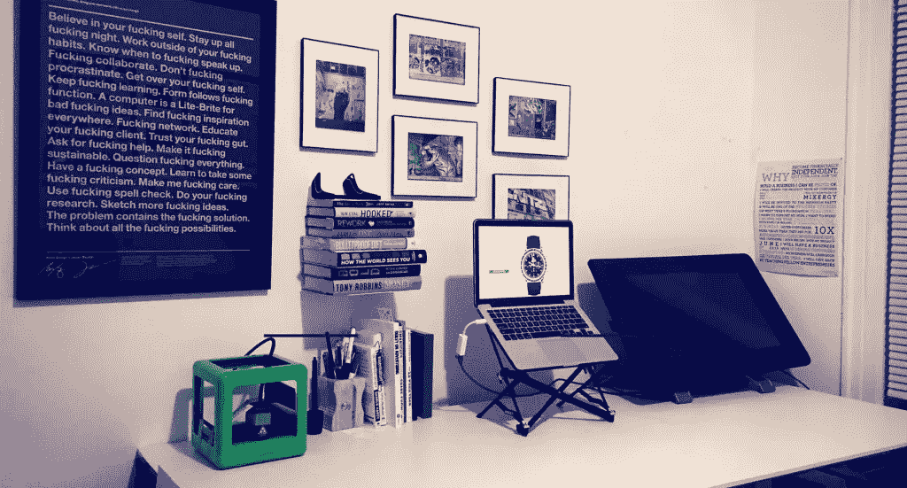
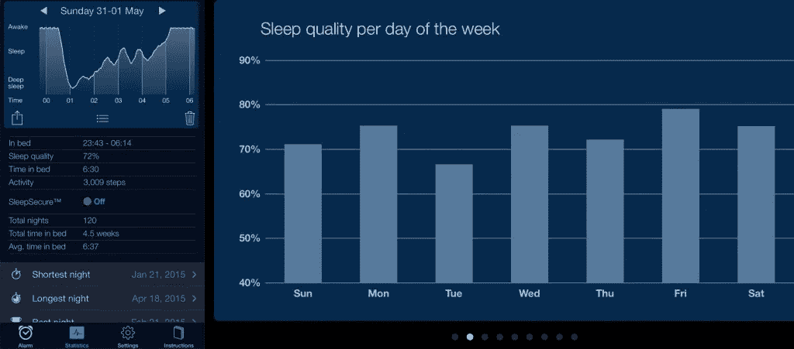
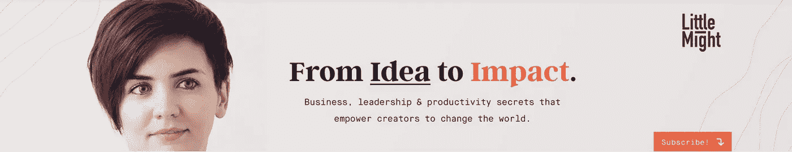
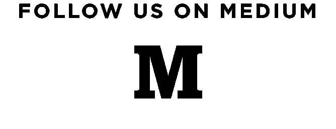

# 每晚的作息时间和如何睡觉让你的早晨富有成效

> 原文：<https://medium.com/swlh/nightly-routines-and-how-to-sleep-hack-your-way-to-a-productive-morning-d341d58f3c3c>

拥有一个晚上的作息和你早上的作息一样重要。这样你可以得到你需要的休息，你将为充满活力和专注的明天做好准备。晚上的例行公事不需要和早上一样长——我的只有 15 分钟左右；然而，我醒来感觉神清气爽，准备好粉碎这一天。

在最近写了一篇关于我的[晨间惯例](/life-learning/how-creating-a-meaningful-morning-routine-will-make-you-more-successful-1b7372655938)的帖子后，我被你们中的一些人问到，如果我早上 5:30 起床，我什么时候睡觉。**为了获得我们被建议的平均 8 小时睡眠，我是否每天晚上 9:30 上床睡觉？**

号码

研究证明，睡眠的质量比睡眠时间的数量更重要。你是否曾经睡了 9 个小时，但醒来后仍然感到疲倦和昏昏沉沉？这就是缺乏睡眠质量的原因。我平均每晚睡 6-7 个小时，我已经将一些实践/睡眠技巧应用到我的日常生活中，帮助我获得最高质量的睡眠。

# 睡前 5 件事:

1.  反射
2.  明天的优先事项
3.  视窗网际网路名称服务
4.  感谢
5.  干净的桌子=干净的头脑
6.  睡眠黑客

## 1.反射

本杰明·富兰克林以他的日常生活和不断努力自我完善而闻名。每天结束的时候都会问自己，

> “我今天做了什么好事？”

重要的是回顾你的一天，思考哪些事情进展顺利，你取得了哪些成就。如果我度过了糟糕的一天，我会写下 1-3 件我本可以让这一天变得更好的事情，这样我就为“下一次”做好了准备。

## 2.明天的优先事项

当我在建筑学校的时候，我每天都会写一个绝对的“待办事项”清单——一个我永远也不可能完成的清单，即使我夜以继日地工作。这是相当愚蠢的。我会在一天快结束的时候，尽管已经工作了一整天，但还是觉得没有成就感，不知所措。不太好。

这些天，我试着用更积极的方式来结束我的一天。晚上，我总结我一天的工作，以及我是如何度过的。首先，我已经停止写不可能完成的任务清单，并且我把自己限制在每天 3 个优先任务，这是我在每晚例行公事中设定的，这样我第二天醒来就知道需要完成什么。

这并不意味着我一天只做三件事。这意味着**我深入到重要的事情**——那些如果那天我什么也没做*我仍然会有成就感的事情。*

## 3.视窗网际网路名称服务

我们通常是自己最糟糕的批评家。花几分钟时间欣赏你做得好的事情，不要再为你本可以做得更好而自责。随意地向自己吹嘘那天你完成了什么，无论是健身课、销售电话，还是最后清理你的衣柜。养成对自己积极乐观的日常习惯会增强你对自己和自己能力的信心。

## 4.感谢

南希·迪格登最近的一项研究显示了感激的想法是如何帮助你睡眠的，因为积极的想法比消极的想法多，更容易入睡。花几分钟时间写下你感激的事情，你会关注积极的一面。

我写下那天发生的 3 件让我感激的事情。再说一次，它不一定是深刻的想法或一些不真实的东西。不是给任何人看的，除了你自己。

## 5.桌面整洁=头脑清晰

This was my desk when I woke up this morning.

每天晚上当我结束工作或睡觉前，我整理我的桌子，清理一天中积累的任何杂物。有一个清晰的工作区域，可以让我们的大脑集中精力，提高工作效率。这并不意味着我公寓的其他地方是整洁的(我们的秘密)，但我确保我的工作空间是整洁的。

如果你创造了一个让你有充分发挥空间的环境，那么你会更容易高效地完成工作。

**我目前正在完成一款** [**产品的开发，这款产品可以优化你的一天，让我们有意识地做好每一件事**](http://theselfjournal.com/?utm_source=medium&utm_medium=nightly-routines&utm_campaign=kickstarter) **，让你轻松实现目标。我们昨天刚刚在 Kickstarter 上推出了******。****

## **6.睡眠黑客**

**我学到的大多数睡眠技巧都来自防弹食谱和其他生物黑客资源。为了更好的睡眠，你今天可以做一些快速而免费的事情:**

****1。睡在漆黑的房间里(停止褪黑激素抑制)****

**褪黑激素是一种调节我们睡眠-觉醒周期的生化物质，只有在黑暗的时候才起作用。即使是少量的光线也能被我们的眼睛和皮肤感知到，从而停止褪黑激素的分泌，导致睡眠中断。[这里有一篇很棒的文章，详细解释了为什么褪黑激素如此重要](http://io9.com/why-we-need-to-sleep-in-total-darkness-1497075228)。我最近购买了一些[遮光窗帘](http://amzn.to/1S7fCvR)，它们对此有所帮助，我已经注意到了不同之处。**

****2。跟踪你的睡眠，让你在最佳时间醒来****

**我使用一个名为[睡眠周期](http://www.sleepcycle.com/)的应用程序来跟踪我每晚的睡眠。该应用程序最好的部分是它的智能闹铃功能，它只在浅睡眠阶段唤醒我，以避免我过去醒来时的昏昏沉沉的感觉。**

****

**Here’s the type of stats you get:**

****3。将您的手机设置为飞行模式，以避免电磁辐射****

**手机暴露在电磁场(EMF)中会阻碍褪黑激素的产生，所以要养成将手机设置为机场模式的习惯来防止这种情况。**

****4。下午两点后停止喝咖啡** (我并不总是很擅长这个)**

****5。避免强光照射，尽量减少蓝光照射****

**手机屏幕、电脑屏幕和电视发出的蓝光会让我们的大脑误以为现在是白天，从而抑制褪黑激素，影响我们的睡眠-觉醒周期。这里有两种方法可以帮助避免这种情况:**

1.  **在你的电脑上安装 [F.Lux](https://justgetflux.com/) 。这将使您的屏幕适应您的环境。当太阳下山时，它会使你屏幕上的蓝光变暗，并在白天恢复正常。它在后台工作，所以你只需设置一次就可以忘记了。(确保不要在晚上做任何涉及色彩选择的图形工作，否则你的项目在早上看起来会有点怪怪的。)**
2.  **晚上睡前 1 至 3 小时使用[防蓝光眼镜](http://amzn.to/1S7j5dD)。是的，正如你从链接中看到的，它们非常迷人。更多关于蓝光和睡眠的详细信息，请点击[这里](http://authoritynutrition.com/block-blue-light-to-sleep-better/)。**

**6。在你计划睡觉的两小时内不要锻炼**

**7。避免睡前大餐**

## **睡眠补充剂**

**遵循 80/20 法则，如果你做了以上所有的事情，你将会看到睡眠质量的巨大改善，并且可能不需要其他任何东西。就我个人而言，除了上面的东西，我还会在睡前服用一些补充剂，以获得更高质量的睡眠。以下是我采取的措施和原因:**

****–镁****

**镁是人体内超过 325 种不同酶的成分。它在水合作用、肌肉放松、能量产生和肾上腺素失活中起着重要作用。也就是说，由于食物中的维生素 e 含量很低，大多数人都缺乏维生素 e，除非他们服用补充剂。关于它的更详细的文章和它在睡眠中的作用[在这里](http://drhyman.com/blog/2010/05/20/magnesium-the-most-powerful-relaxation-mineral-available/)。**我服用镁补充剂，** [**自然镇静**](http://amzn.to/1AIWe3y) **，大约在睡前 30 分钟。由于天然的镇静和放松效果，这让我睡得更安稳。也挺好吃的。****

****–一勺生蜂蜜****

**你的大脑使用大量的能量来推动它在夜间进行的所有过程。一种有效的能量来源于储存在肝脏中的糖。一勺[生蜂蜜](http://amzn.to/1B4QgdG)已经通过 [Seth Roberts](http://blog.sethroberts.net/2013/11/05/honey-at-bedtime-improves-sleep/) 和[的严格自我实验证明了蜂蜜革命](http://amzn.to/1HuXqJr)通过保持肝糖原充足来改善睡眠。然而，重要的是，你通常在杂货店找到的是生蜂蜜，而不是熟蜂蜜。**

****–磷虾油****

**磷虾油是 Omega-3 的重要来源，Omega-3 被证明可以减少焦虑和抑郁，同时还可以改善肌肉生长和胰岛素敏感性。睡前 2 小时服用一粒磷虾油药丸。**

****–氨基丁酸****

**我只在旅行或为产品发布疯狂工作的时候服用 GABA，我知道我需要长时间的睡眠。它是一种神经抑制性递质，是你的大脑需要关闭的。比起安眠药，我绝对推荐这个。**

**现在你知道了——我晚上的作息时间和我如何控制自己的睡眠。自从我开始做决定以来，它一直在帮助我缓解早晨的决策疲劳(通过知道我一天的优先事项)，它给了我一个更加宁静的睡眠，所以我一整天都有更多的精力。**

**你晚上有作息时间或睡眠习惯吗？我一直在不断进步，努力成为最好的自己，所以任何建议和技巧都很感谢。**

***凯瑟琳·拉威利是一位连续创业者，致力于帮助他人成为最好的自己。***

****想听凯瑟琳的话，看看她的** [**YouTube 频道 little powery**](http://littlemight.com)**；商业，生产力和领导思想，让创造者改变世界。****

****

***如果你喜欢这篇文章，请点击下面的推荐。谢谢！:)***

****

***发表于* **创业、旅游癖和生活黑客****

************

**-**