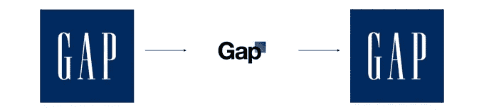
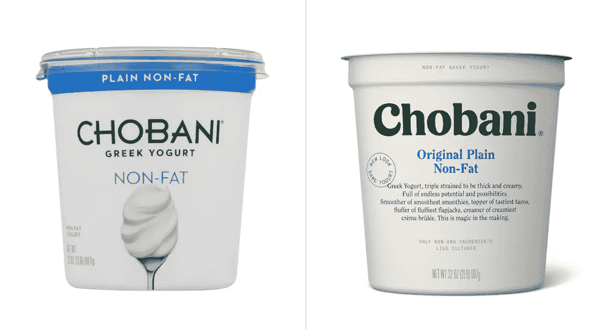
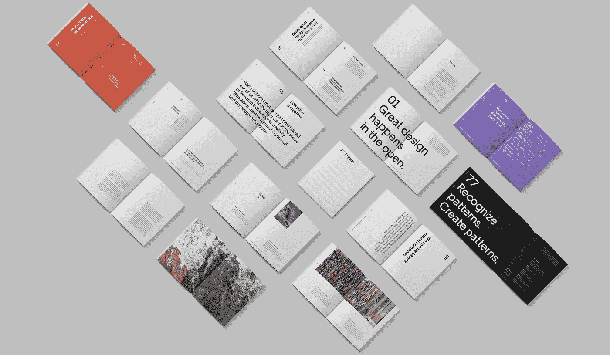
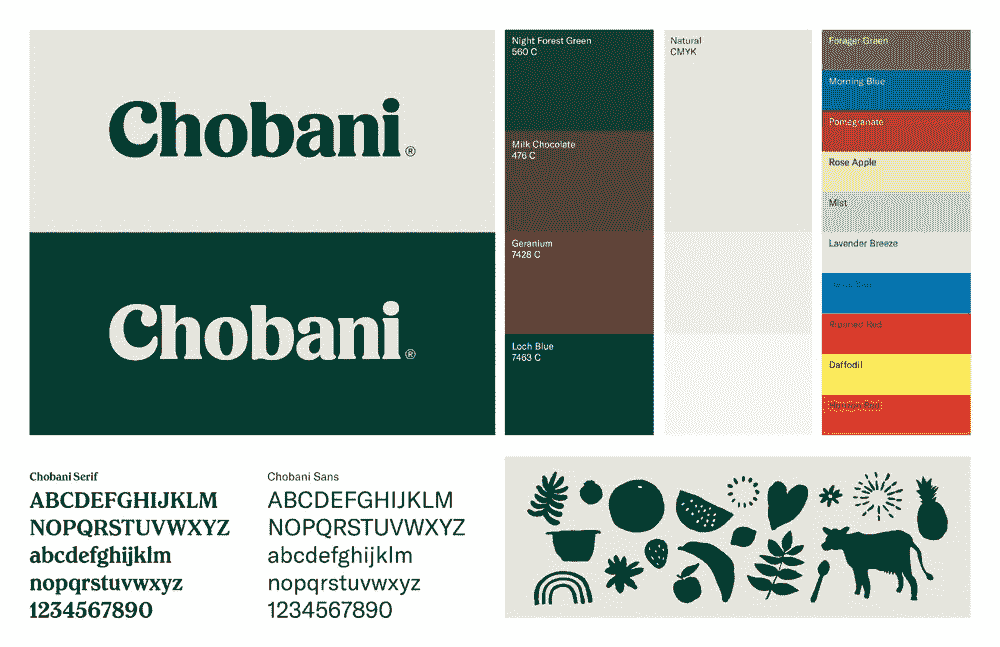
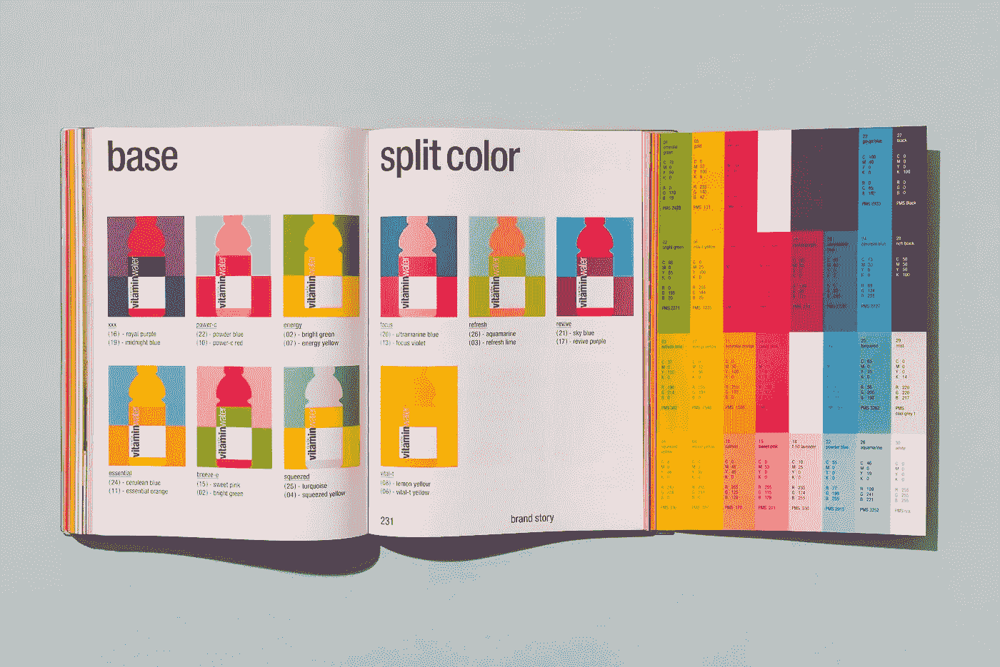
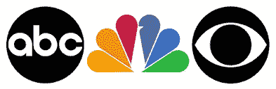
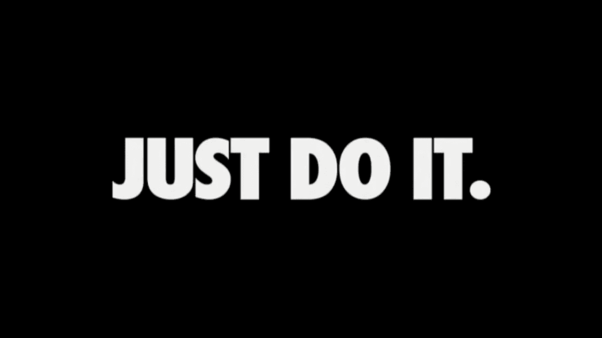
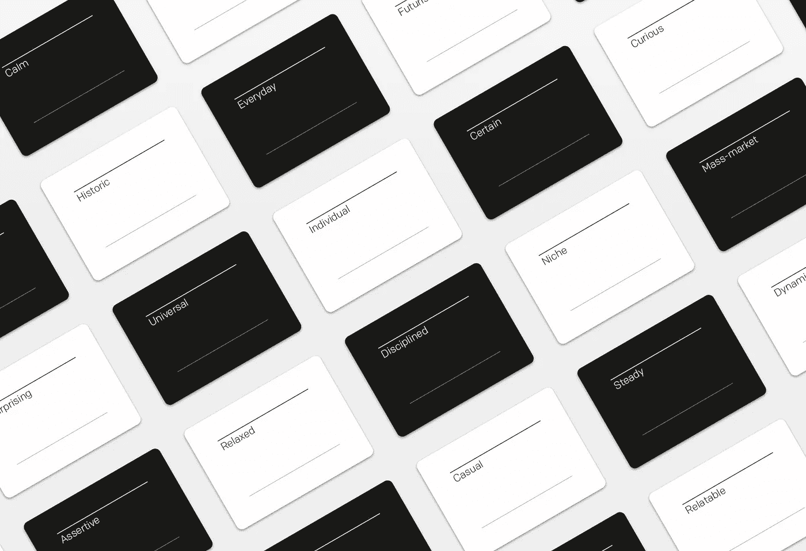

# 你的公司正在犯的九个品牌错误

> 原文：<https://medium.com/swlh/nine-branding-mistakes-your-company-is-making-d9c9f417880c>

## 你是否忽略了商业成功的一些最重要的关键因素？

你的公司是否在努力与观众沟通？您在收取额外费用或保持客户忠诚度方面有困难吗？在过去的几年里，收入下降了吗？你公司的品牌(或缺乏品牌)可能是罪魁祸首。

W 无论你是刚刚开始创业，还是已经创业多年，持续监控你的信息将确保你向目标受众传达的故事符合你公司的使命和愿景。为了正确地做到这一点，你的公司需要一个强大的品牌。(如果您不熟悉品牌的优势，请点击此处。)更重要的是，你的公司需要一个用心发展，有明确战略的品牌。如果你不完全确定你的品牌是否被正确使用，或者你是否真的有一个品牌，请继续读下去，这篇文章是为你准备的。

**以下是你的公司可能会犯的九个品牌错误。**

# 1.不了解品牌的力量

许多企业主根本不了解品牌的[优势，但忽视一个成熟品牌的重要性会让你错过巨大的财务收益、认可和竞争优势，以及无数其他优势。](/@bentenwoodring/seven-ways-to-grow-your-business-with-branding-3c653643a225)

强大的品牌会提高客户忠诚度和参与度，并创造信任。消费者更有可能从有清晰品牌故事的公司购买产品，因为他们更容易与该品牌建立情感联系。一个精心策划的品牌还能提高消费者对质量的感知和认可。消费者更有可能为某些产品支付额外费用，因为它们来自某个品牌。这反过来又让你的公司获得更高的价格，保持更大的利润空间，增加总收入。广告成本也会受到影响——忠于你的品牌的消费者更有可能向他人推荐你的品牌，从而减少客户获取和广告成本。

*The Gap’s failed crowdsourced logo update. The company reverted to the old logo within six days, after increasing backlash from customers and the design community.*

*Chobani’s recent facelift is an example of a strategic and* [*effective rebrand*](https://www.underconsideration.com/brandnew/archives/new_logo_identity_and_packaging_for_chobani_done_in_house.php)*.*

# 2.没有制定严格的品牌指导方针或执行这些方针

一旦创建了一个品牌，关键是要有适当的指导方针，以及一个专门管理品牌的团队。创建一个小团队，即使只是一个兼职工作组，来回答与品牌相关的问题，并监控整个公司的品牌使用情况，可以防止代价高昂的错误，并加强品牌价值。正确的品牌使用应该在整个组织内进行沟通。让您的品牌指导方针和品牌资产，包括徽标文件、颜色和版式，在您的组织内部和公开场合都随时可用。这可以很简单，只要有一个简单的网页，专门用于交流品牌的使用，并提供对品牌资产的轻松访问。没有什么比未能妥善维护品牌更能削弱品牌的力量和效力了。

从低层员工到高管，公司各个层面的认同也非常有价值。在推出品牌时，与员工快速集会，分享品牌背后的愿景以及公司的未来。教育他们正确使用品牌，让他们在与品牌互动时，从品牌指南到标准模板，轻松获取所需的信息和资产。在员工中合理使用奖励制度，确保你的品牌始终如一，让你的公司赢得客户的信任。

大多数品牌工作室和代理机构在推出最终品牌后将继续担任顾问。利用这一点。让他们的团队定期进行品牌审计，以监控品牌使用情况，并找出贵公司标识中任何明显的漏洞。

*Uber’s new brand made waves, especially after their last ineffective rebranding attempt. Their* [*website*](https://www.uber.design/case-studies/rebrand-2018) *includes a great example of properly executed brand guidelines, including layout, tone of voice, custom type, and photography standards.*

*Part of Chobani’s new brand guide.*

*Vitamin Water’s* [*brand book*](https://www.wearecollins.com/work/vitaminwater-brandbook/)*.*

# 3.让你的品牌过于复杂

创建品牌时，避开当前的设计趋势或时尚。试图追逐最新最棒的设计会导致你的品牌很快过时。专注于创造一个独立于最新潮流的身份，开发一些简单的东西，并以清晰简洁的方式传达你的信息。

选择你雇佣的品牌工作室会让这个过程更容易。通过回顾案例研究和投资组合来研究潜在的工作室，并向其他拥有强大品牌影响力的企业寻求建议。

像耐克、壳牌、可口可乐、哥伦比亚广播公司和 IBM 这样的品牌都有永恒的标志，其中大多数几十年来都没有改变过。所有这些标志都有一个共同点——简单。通过不跟随潮流或试图使他们的品牌过于复杂，这些公司创造了经受住时间考验并拥有无与伦比的认知度的品牌。

*ABC went on-air in 1944\. Paul Rand updated the ABC logo in 1962, which has remained unchanged since. The NBC ‘Peacock” was introduced by Steff Geissbuhler of Chermayeff & Geismar in 1986\. The CBS logo has not been altered since it was created in 1951.*

# 4.没有与你的品牌传达清晰的信息

你们公司到底是做什么的？是什么让它独一无二？你为什么经商？你是如何让人们的生活变得更好的？

如果你不能用一两句话回答所有这些问题，也许是时候重新思考你的信息了。试图解释你提供的每一项服务，而不是简单地专注于你公司提供的一两项核心服务或产品，这很容易导致过多的沟通。消费者必须清楚地了解你的公司是做什么的，以及它将如何使他们受益，否则他们可能会变得不感兴趣，并转向一个拥有类似产品或服务的竞争对手。

花时间提炼你的企业的核心使命和价值观，以及你的服务产品将在未来很好地服务于你的公司。一个经验法则是保持你的广告服务最多三个。这有助于潜在的消费者很容易理解你实际上在做什么，并把你定位为你所在领域的专家。

# 5.不一致的身份

当你的营销材料或网站过时或不一致时，会造成潜在客户的困惑。老企业经常遇到这个问题。从设计的角度来看，该公司的名片、网站、宣传材料和社交媒体账户似乎完全没有关联。这可能会导致客户怀疑你公司的诚信和诚实，失去兴趣，并选择一个有清晰信息和品牌形象的竞争对手。

> 如果你不相关，人们将不再关注你。当今世界充斥着各种视觉噪音，正确执行和维护品牌是脱颖而出并吸引客户注意力的少数方法之一。

即使你有合适的品牌，糟糕的品牌变化也会损害你品牌的完整性。品牌有许多方面和接触点，从徽标和网站到名片、传单、营销材料、标牌、内部文档、社交媒体账户等等。如果你的品牌在所有平台上都不一致，潜在客户会很快失去兴趣，转向你所在行业的下一个业务。

你品牌的每一个方面都必须有一个集中的、独特的、清晰的信息。视觉效果应该反映公司的核心价值，并以目标受众易于理解的方式传达。

如果你最近没有这样做，让品牌工作室对你的品牌进行一次全面的审计。他们将收集所有当前的材料和资产，搜索你的在线资产和社交媒体账户，并梳理你品牌的任何其他方面。他们将审查你的品牌的语气，信息，愿景，使命和价值观，甚至你提供的服务，以确定整个公司的一致性。这是一种成本相对较低的方法，可以快速找到你品牌的漏洞，并制定出纠正它们的策略。

# 6.没有利用现有客户来帮助传播新品牌

许多公司在推出或更新品牌时未能利用他们最大的资产——现有客户。回头客，尤其是那些对你的产品或服务评价很高的人，是展示你公司品牌的绝佳渠道。

利用这种高价值的口碑营销，给你最好的客户和品牌倡导者皇家待遇。对一份适时的节日礼物、一项个性化服务，甚至是一个简单的推荐代码的小额投资，都可以对产生新业务大有帮助。

# 7.没有吸引眼球和可信的标语

如果你很难快速总结你的品牌代表什么，也许是时候重新审视你公司的口号了。

你的标语应该简单明了，令人难忘，独一无二。最有效的标语将品牌的精髓浓缩成三到六个词。你在口头禅或座右铭中使用的词语应该是可信的，并准确地代表你是一家公司。

最好的标语简短易记，但不要过于具体。例如:

*   苹果:换个思路。
*   可乐:开放的幸福。
*   迪士尼:地球上最快乐的地方。

*Nike’s tagline, Just Do It, is one of the most recognizable taglines today.*

许多公司都在为过于普通或者根本不可信的标语而苦苦挣扎。如果有疑问，请不要使用。看起来过于做作的标语实际上会损害你的品牌，而不是帮助它。

# 8.不知道成功的品牌从哪里开始

成功的品牌塑造始于公司内部，始于你的核心价值观。为了成功推出一个新品牌，首先需要在公司内部进行推广和测试。员工应该明白公司代表什么，它的语气，如何处理不同的情况，等等。品牌认同始于高层，只有通过实例展示才能奏效。员工是最好的品牌大使——利用他们。制定指导方针，在消费者和员工面前始终如一地使用贵公司的品牌声音，以便贵公司能够随着时间的推移始终如一地建立品牌完整性。

# 9.不知道你的公司为什么存在

最后，但同样重要的是，不知道你的公司为什么存在。作为一家小型偏远品牌工作室的所有者，我有过与一些企业合作的经历，这些企业对他们做什么、为什么做和如何做有着深入的了解，也有一些企业主在被问及他们的公司为何存在时无法给出明确的答案。

不言而喻，如果你不明白你的公司真正存在的原因，你将无法开发一个有效的或代表你的组织的使命、愿景和价值观的品牌。有许多机构会很高兴地在一个企业上打上一个标志或半心半意的品牌，而并不真正理解该公司的目的，只是因为企业主会为此付钱。但是，开发一个漂亮的设计而不从“为什么”开始就是试图治疗而不是首先诊断。一个真正的品牌工作室总是会在动笔之前问一些重要的、有挑战性的问题。

*Selecting brand attributes as part of a brand discovery workshop.*

如果你最近几年没有这样做，那就联系一个品牌工作室，一起参加一个品牌发现研讨会。如果你清楚地了解你的企业存在的原因，这通常会很快显现出来。

> *从发现开始，制定清晰的战略，*你的公司将获得难以置信的竞争优势，超过其他没有这样做的公司。

概括一下，这里有一些你的公司可能会犯的品牌错误:

1.  **不了解品牌的力量**
2.  **没有制定严格的品牌指导方针或执行这些方针**
3.  **让你的品牌过于复杂**
4.  **没有与您的品牌传达清晰的信息**
5.  **身份不一致**
6.  **没有利用现有客户来帮助推广新品牌**
7.  **没有吸引眼球且可信的标语**
8.  **不知道成功的品牌从哪里开始**
9.  **不知道你的公司为什么存在**

花一分钟来回顾这九个品牌错误。你的公司正在制造哪一个？你解决这些问题的策略是什么？请在下面的评论中告诉我。

-

*本文最初与* [*HolaBrief 社区*](https://www.holabrief.com/community) *合作发表。*

*原载于 2018 年 12 月 17 日*[*http://attractinghighqualityclients.com*](http://attractinghighqualityclients.com/2018/12/17/nine-branding-mistakes-your-company-is-making/)*。*